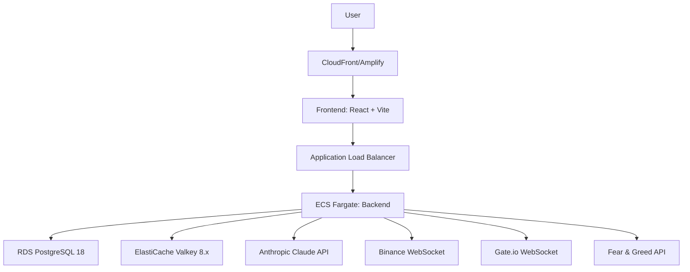
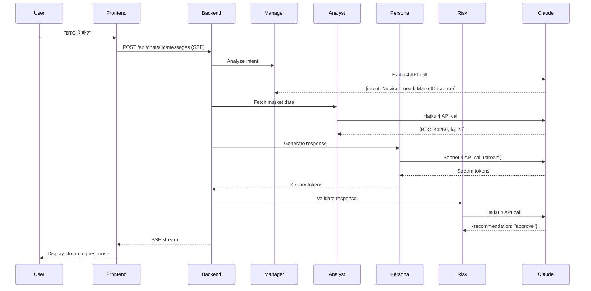

# Sage.ai System Architecture Overview

> Version: 1.0
> Last Updated: 2026-01-05
> Repository Structure: Multi-repository

---

## Repository Structure

Sage.ai는 4개의 독립 레포지토리로 구성됩니다:

### 1. sage-docs (Documentation)
- **Purpose**: Single Source of Truth for all documentation
- **Repository**: `https://github.com/5010-dev/sage-docs`
- **Contents**:
  - Technical specifications (backend, frontend, infrastructure)
  - Business and product documents
  - Architecture documentation
  - GitHub Wiki synchronization

### 2. sage-front (Frontend Application)
- **Purpose**: React-based web application
- **Repository**: `https://github.com/5010-dev/sage-front`
- **Tech Stack**: React 18.3, Vite 5, TypeScript, Zustand, TanStack Query
- **Deployment**: AWS Amplify
- **Key Features**:
  - Chat interface with SSE streaming
  - Shadow portfolio management
  - Market data visualization

### 3. sage-back (Backend API)
- **Purpose**: Nest.js-based API server
- **Repository**: `https://github.com/5010-dev/sage-back`
- **Tech Stack**: Nest.js 10.x, Prisma 5.x, PostgreSQL 18, Valkey 8.x
- **Deployment**: ECS Fargate
- **Key Features**:
  - Agent Pipeline (Manager → Analyst → Persona → Risk)
  - SSE streaming endpoints
  - Real-time market data integration

### 4. sage-infra (Infrastructure)
- **Purpose**: Infrastructure as Code
- **Repository**: `https://github.com/5010-dev/sage-infra`
- **Tech Stack**: Pulumi 3.x (TypeScript)
- **Resources**: ECS Fargate, RDS, ElastiCache, ALB, Amplify

---

## System Architecture Diagram



---

## Communication Patterns

### Frontend ↔ Backend

**SSE Streaming (Chat)**:
- User sends message: `POST /api/chats/:id/messages`
- Backend streams AI response via SSE (Server-Sent Events)
- Token-by-token display for smooth UX
- Automatic reconnection with exponential backoff

**REST API (Data Queries)**:
- Market data: `GET /api/market/prices`
- Portfolio: `GET /api/shadow-trades`
- User profile: `GET /api/users/me`

### Backend ↔ External Services

**Anthropic Claude API**:
- Manager Agent: Claude Haiku 4
- Analyst Agent: Claude Haiku 4
- Persona Agent: Claude Sonnet 4 (Warren Buffett character)
- Risk Agent: Claude Haiku 4

**Market Data WebSocket**:
- Primary: Binance WebSocket (BTC, ETH, SOL, BNB, DOGE, XRP)
- Fallback: Gate.io WebSocket
- Cache: Valkey (5-min TTL)

---

## Agent Pipeline Architecture



---

## Data Flow

### 1. User Message Flow
```
User Input
  → Frontend (React)
  → POST /api/chats/:id/messages
  → Backend (Nest.js)
  → Valkey (fetch last 20 messages)
  → Agent Pipeline
  → PostgreSQL (save messages)
  → SSE Stream Response
  → Frontend Display
```

### 2. Market Data Flow
```
Binance WebSocket
  → Backend MarketService
  → Valkey Cache (5-min TTL)
  → API Response
  → Frontend Display
```

### 3. Proactive Alert Flow
```
Price Change Detection
  → BullMQ Job
  → Discord Webhook
  → PWA Push Notification
  → User Action
```

---

## Tech Stack Summary

### Frontend
- **Framework**: React 18.3 + Vite 5
- **State**: Zustand 4.x (client), TanStack Query 5.x (server)
- **Styling**: Tailwind CSS 3.x + shadcn/ui
- **Real-time**: SSE client (EventSource API)
- **PWA**: Vite PWA Plugin

### Backend
- **Framework**: Nest.js 10.x
- **ORM**: Prisma 5.x
- **Database**: PostgreSQL 18
- **Cache**: Valkey 8.x
- **Queue**: BullMQ 5.x
- **AI**: @anthropic-ai/sdk
- **Auth**: Auth.js with Google OAuth

### Infrastructure
- **IaC**: Pulumi 3.x (TypeScript)
- **Compute**: AWS ECS Fargate
- **Database**: AWS RDS PostgreSQL 18
- **Cache**: AWS ElastiCache Valkey 8.x
- **CDN**: AWS Amplify (Frontend), CloudFront
- **Load Balancer**: AWS ALB
- **Monitoring**: Sentry + CloudWatch

---

## Performance Targets

| Metric | Target | Measurement |
|--------|--------|-------------|
| SSE First Token | < 2s | Time from POST to first token |
| Context Load | < 0.5s | 20 messages from PostgreSQL |
| API Response | < 200ms (P95) | REST endpoint latency |
| Cache Hit Rate | > 80% | Valkey hit/miss ratio |
| Hallucination Rate | < 1% | Risk Agent rejection rate |

---

## Security Architecture

### Authentication
- **Provider**: Google OAuth (Auth.js)
- **Session**: JWT stored in HTTP-only cookies
- **Refresh**: Automatic token refresh

### Authorization
- User can only access their own chats and portfolio
- Admin endpoints require admin role

### Data Protection
- **Encryption at Rest**: RDS encryption enabled
- **Encryption in Transit**: TLS 1.2+ only
- **Secrets**: AWS Secrets Manager
- **CORS**: Whitelist app.sage.ai only

---

## Scaling Strategy

### Horizontal Scaling
- **Frontend**: CloudFront CDN (global distribution)
- **Backend**: ECS Auto Scaling (2 → 10 tasks)
- **Database**: RDS read replicas (future)
- **Cache**: ElastiCache cluster mode (future)

### Vertical Scaling
- **ECS Task**: 0.5 vCPU, 1GB RAM (MVP) → adjustable
- **RDS Instance**: db.t4g.micro (MVP) → db.r6g.large (production)

---

## Monitoring & Alerting

### Metrics
- **Application**: Sentry (errors, performance)
- **Infrastructure**: CloudWatch (CPU, memory, network)
- **Custom**: SSE latency, Agent Pipeline duration

### Alerts
- **Discord Webhook**:
  - SSE first token > 5s
  - Error rate > 1%
  - Database connection failures
- **Slack Integration**: Future

---

## Documentation Links

- [Backend Specification](../specs/backend-spec.md)
- [Frontend Specification](../specs/frontend-spec.md)
- [Infrastructure Specification](../specs/infrastructure-spec.md)
- [Product Specification](../product/product-spec.md)
- [MVP Definition](../business/mvp-definition.md)

---

## Repository Links

- **Documentation**: [sage-docs](https://github.com/5010-dev/sage-docs)
- **Frontend**: [sage-front](https://github.com/5010-dev/sage-front) (to be created)
- **Backend**: [sage-back](https://github.com/5010-dev/sage-back) (to be created)
- **Infrastructure**: [sage-infra](https://github.com/5010-dev/sage-infra) (to be created)

---

**Last Updated**: 2026-01-05
**Next Review**: When Phase 2 features are planned
