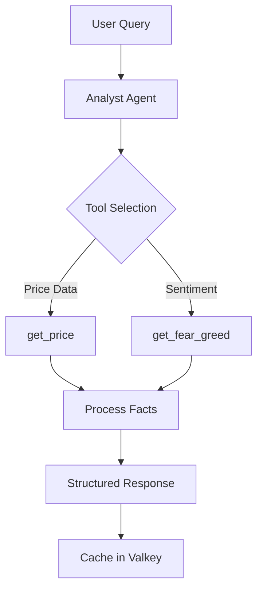

# Backend Development AI Guide

> **Version**: 3.0
> **Last Updated**: December 26, 2025
> **Author**: Sam
> **Target Audience**: Backend Developers, Claude Code

---

## 1. AI-Powered Backend Development

### 1.1 Development Tools

```typescript
interface DevelopmentTools {
  claudeCode: {
    purpose: string[];
    useCases: string[];
  };
  githubCopilot: {
    purpose: string[];
    useCases: string[];
  };
}

const tools: DevelopmentTools = {
  claudeCode: {
    purpose: ["Complex logic design", "Architecture planning", "CRUD generation"],
    useCases: ["Module creation", "AI agent implementation", "Database optimization"]
  },
  githubCopilot: {
    purpose: ["Code review", "Real-time suggestions"],
    useCases: ["Inline code completion", "Test generation", "Refactoring"]
  }
};
```

### 1.2 Development Workflow


---

## 2. Common Development Tasks

### 2.1 Creating a New Module

**Context Setup**:
```typescript
interface ModuleRequirements {
  name: string;
  endpoints: RestEndpoint[];
  prismaModel: string;
  validation: boolean;
  testing: boolean;
  pattern: string;
}

interface RestEndpoint {
  method: "GET" | "POST" | "PUT" | "DELETE";
  path: string;
  description: string;
}
```

**Prompt Template**:
```
Create a Nest.js module for shadow portfolio management with the following:

Requirements:
- Controller with REST endpoints (POST /api/shadow-trades, GET /api/shadow-trades)
- Service with business logic
- Prisma integration (ShadowTrade model)
- DTOs with validation (class-validator)
- Unit tests (Jest)
- Follow existing patterns in src/modules/chat

Tech Stack:
- PostgreSQL 18 (5-year LTS, JSON 30% faster)
- Valkey 8.x for caching (Redis-compatible)

Prisma Schema:
enum RiskProfile {
  CONSERVATIVE
  MODERATE
  AGGRESSIVE
}

model User {
  id          String       @id @default(uuid())
  email       String       @unique
  riskProfile RiskProfile? // Use ENUM for type safety
  createdAt   DateTime     @default(now())
}

model ShadowTrade {
  id        String   @id @default(uuid())
  userId    String
  symbol    String
  action    String
  price     Decimal
  createdAt DateTime @default(now())

  user      User     @relation(fields: [userId], references: [id])
}
```

**Expected Output Structure**:
```typescript
interface GeneratedFiles {
  module: "portfolio.module.ts";
  controller: "portfolio.controller.ts";
  service: "portfolio.service.ts";
  dto: "dto/create-trade.dto.ts";
  tests: "portfolio.service.spec.ts";
}
```

---

### 2.2 Implementing AI Agent

**Agent Architecture**:


**Prompt Template**:
```
Implement the Analyst Agent for Sage.ai Agent Pipeline:

Agent Purpose: Fetch and analyze market data

Tech Stack:
- PostgreSQL 18: Store user conversations and context
- Valkey 8.x: Cache market data (5-minute TTL for prices, 30-minute for Fear & Greed)

Tools to use:
1. get_price(symbol: string) → { price: number, change24h: number }
2. get_fear_greed() → { value: number, classification: string }

Requirements:
- Use @anthropic-ai/sdk
- Model: claude-haiku-4-20250303
- Force tool use (tool_choice: "required")
- Return structured facts (JSON)
- Handle tool errors gracefully
- Cache responses in Valkey to reduce API calls

Example input: "What's happening with Bitcoin?"
Example output: { facts: { BTC: { price: 43250, change_24h: -5.2 }, fear_greed: 25 }, summary: "..." }
```

**Expected Implementation**:
```typescript
// ai-agents/analyst.agent.ts
import Anthropic from '@anthropic-ai/sdk';
import { Injectable } from '@nestjs/common';
import { CacheService } from '../cache/cache.service'; // Valkey wrapper

interface AnalystResponse {
  facts: MarketFacts;
  summary: string;
}

interface MarketFacts {
  [symbol: string]: {
    price: number;
    change_24h: number;
  };
  fear_greed?: number;
}

@Injectable()
export class AnalystAgent {
  private client: Anthropic;

  constructor(private cacheService: CacheService) {
    this.client = new Anthropic({ apiKey: process.env.ANTHROPIC_API_KEY });
  }

  async analyze(query: string): Promise<AnalystResponse> {
    // Check Valkey cache first
    const cacheKey = `analyst:${query}`;
    const cached = await this.cacheService.get<AnalystResponse>(cacheKey);
    if (cached) return cached;

    const response = await this.client.messages.create({
      model: 'claude-haiku-4-20250303',
      max_tokens: 500,
      tools: [
        {
          name: 'get_price',
          description: 'Get current price and 24h change for a coin',
          input_schema: {
            type: 'object',
            properties: {
              symbol: { type: 'string', enum: ['BTC', 'ETH', 'SOL', 'BNB', 'DOGE', 'XRP'] }
            },
            required: ['symbol']
          }
        },
        {
          name: 'get_fear_greed',
          description: 'Get current Fear & Greed Index (0-100)',
          input_schema: { type: 'object', properties: {} }
        }
      ],
      tool_choice: { type: 'any' },
      messages: [{ role: 'user', content: query }]
    });

    // Process tool calls and return facts
    const result: AnalystResponse = { /* ... */ };

    // Cache for 5 minutes (market data TTL)
    await this.cacheService.set(cacheKey, result, 300);

    return result;
  }
}
```

---

### 2.3 Adding Validation

**Validation Requirements**:
```typescript
interface ValidationRules {
  symbol: {
    type: "enum";
    values: ["BTC", "ETH", "SOL", "BNB", "DOGE", "XRP"];
  };
  action: {
    type: "enum";
    values: ["buy", "sell"];
  };
  price: {
    type: "number";
    constraints: ["positive"];
  };
}
```

**Prompt Template**:
```
Add validation to this DTO using class-validator:

export class CreateTradeDto {
  symbol: string;
  action: string;
  price: number;
}

Requirements:
- symbol must be one of: BTC, ETH, SOL, BNB, DOGE, XRP
- action must be: buy or sell
- price must be positive number
- Add API documentation annotations (@ApiProperty)
```

**Expected Implementation**:
```typescript
import { ApiProperty } from '@nestjs/swagger';
import { IsIn, IsNumber, Min } from 'class-validator';

export class CreateTradeDto {
  @ApiProperty({
    description: 'Coin symbol',
    enum: ['BTC', 'ETH', 'SOL', 'BNB', 'DOGE', 'XRP'],
    example: 'BTC'
  })
  @IsIn(['BTC', 'ETH', 'SOL', 'BNB', 'DOGE', 'XRP'])
  symbol: string;

  @ApiProperty({
    description: 'Trade action',
    enum: ['buy', 'sell'],
    example: 'buy'
  })
  @IsIn(['buy', 'sell'])
  action: string;

  @ApiProperty({
    description: 'Trade price',
    example: 43250.50,
    minimum: 0
  })
  @IsNumber()
  @Min(0)
  price: number;
}
```

---

### 2.4 Writing Tests

**Test Structure**:
```typescript
interface TestRequirements {
  framework: "Jest";
  coverage: ">80%";
  scenarios: {
    happyPath: boolean;
    errorCases: boolean;
    edgeCases: boolean;
  };
  mocking: {
    prisma: boolean;
    externalServices: boolean;
  };
}
```

**Prompt Template**:
```
Write Jest unit tests for this service:

class PortfolioService {
  constructor(private prisma: PrismaService) {}

  async createTrade(userId: string, dto: CreateTradeDto) {
    return this.prisma.shadowTrade.create({
      data: {
        userId,
        symbol: dto.symbol,
        action: dto.action,
        price: dto.price
      }
    });
  }

  async getTrades(userId: string) {
    return this.prisma.shadowTrade.findMany({
      where: { userId },
      orderBy: { createdAt: 'desc' }
    });
  }
}

Requirements:
- Mock PrismaService
- Test happy path
- Test error cases
- Coverage > 80%
```

**Expected Implementation**:
```typescript
// portfolio.service.spec.ts
import { Test } from '@nestjs/testing';
import { PortfolioService } from './portfolio.service';
import { PrismaService } from '../prisma/prisma.service';

describe('PortfolioService', () => {
  let service: PortfolioService;
  let prisma: PrismaService;

  const mockPrisma = {
    shadowTrade: {
      create: jest.fn(),
      findMany: jest.fn()
    }
  };

  beforeEach(async () => {
    const module = await Test.createTestingModule({
      providers: [
        PortfolioService,
        { provide: PrismaService, useValue: mockPrisma }
      ]
    }).compile();

    service = module.get<PortfolioService>(PortfolioService);
    prisma = module.get<PrismaService>(PrismaService);
  });

  describe('createTrade', () => {
    it('should create a shadow trade', async () => {
      const dto = { symbol: 'BTC', action: 'buy', price: 43250 };
      const expected = { id: '123', userId: 'user-1', ...dto, createdAt: new Date() };

      mockPrisma.shadowTrade.create.mockResolvedValue(expected);

      const result = await service.createTrade('user-1', dto);

      expect(result).toEqual(expected);
      expect(mockPrisma.shadowTrade.create).toHaveBeenCalledWith({
        data: { userId: 'user-1', ...dto }
      });
    });
  });

  describe('getTrades', () => {
    it('should return user trades', async () => {
      const expected = [{ id: '123', symbol: 'BTC', action: 'buy', price: 43250 }];

      mockPrisma.shadowTrade.findMany.mockResolvedValue(expected);

      const result = await service.getTrades('user-1');

      expect(result).toEqual(expected);
      expect(mockPrisma.shadowTrade.findMany).toHaveBeenCalledWith({
        where: { userId: 'user-1' },
        orderBy: { createdAt: 'desc' }
      });
    });
  });
});
```

---

### 2.5 Optimizing Database Queries

**Performance Issues**:
```typescript
interface PerformanceProblems {
  nPlusOne: {
    description: "Multiple sequential queries in a loop";
    impact: "High latency, database overload";
    solution: "Use Prisma include/select or aggregation";
  };
}
```

**Query Optimization Flow**:


**Prompt Template**:
```
Optimize this Prisma query that has N+1 problem:

Database: PostgreSQL 18 (improved query optimizer)
Cache: Valkey 8.x (for frequent queries)

async getChatsWithMessageCount(userId: string) {
  const chats = await this.prisma.chat.findMany({
    where: { userId }
  });

  for (const chat of chats) {
    chat.messageCount = await this.prisma.message.count({
      where: { chatId: chat.id }
    });
  }

  return chats;
}

Requirements:
1. Rewrite using Prisma's include/select to avoid N+1
2. Add Valkey caching for user's chat list (30-second TTL)
3. Leverage PostgreSQL 18's improved JSON aggregation if needed
```

**Optimized Implementation**:
```typescript
// Solution 1: Using _count with Valkey cache
async getChatsWithMessageCount(userId: string) {
  const cacheKey = `chats:${userId}`;
  const cached = await this.cacheService.get(cacheKey);
  if (cached) return cached;

  const chats = await this.prisma.chat.findMany({
    where: { userId },
    include: {
      _count: {
        select: { messages: true }
      }
    }
  });

  // Cache for 30 seconds
  await this.cacheService.set(cacheKey, chats, 30);
  return chats;
}

// Solution 2: Using select for specific fields (better performance)
async getChatsWithMessageCount(userId: string) {
  const cacheKey = `chats:${userId}`;
  const cached = await this.cacheService.get(cacheKey);
  if (cached) return cached;

  const chats = await this.prisma.chat.findMany({
    where: { userId },
    select: {
      id: true,
      title: true,
      createdAt: true,
      _count: {
        select: { messages: true }
      }
    }
  });

  // Cache for 30 seconds
  await this.cacheService.set(cacheKey, chats, 30);
  return chats;
}

// Solution 3: PostgreSQL 18 JSON aggregation (for complex cases)
async getChatsWithDetails(userId: string) {
  // PostgreSQL 18's improved JSON processing (30% faster than v16)
  return this.prisma.$queryRaw`
    SELECT
      c.id,
      c.title,
      c.created_at,
      COUNT(m.id) as message_count,
      json_agg(
        json_build_object('content', m.content, 'createdAt', m.created_at)
        ORDER BY m.created_at DESC
      ) FILTER (WHERE m.id IS NOT NULL) as recent_messages
    FROM chats c
    LEFT JOIN messages m ON c.id = m.chat_id
    WHERE c.user_id = ${userId}
    GROUP BY c.id
  `;
}
```

---

## 3. AI-Assisted Code Review

### 3.1 Review Checklist

```typescript
interface CodeReviewCriteria {
  security: {
    checks: [
      "SQL injection vulnerabilities",
      "XSS risks",
      "Auth bypass",
      "Secrets exposure"
    ];
  };
  performance: {
    checks: [
      "N+1 queries",
      "Memory leaks",
      "Inefficient algorithms"
    ];
  };
  codeQuality: {
    checks: [
      "SOLID principles",
      "Naming conventions",
      "Error handling",
      "Type safety"
    ];
  };
  testing: {
    checks: [
      "Test coverage",
      "Edge cases",
      "Mocking best practices"
    ];
  };
}
```

### 3.2 Code Review Prompt

```
Review this code for:

1. Security:
   - SQL injection vulnerabilities
   - XSS risks
   - Auth bypass
   - Secrets exposure

2. Performance:
   - N+1 queries
   - Memory leaks
   - Inefficient algorithms

3. Code Quality:
   - SOLID principles
   - Naming conventions
   - Error handling
   - Type safety

4. Testing:
   - Test coverage
   - Edge cases
   - Mocking best practices

Provide specific line numbers and suggestions for improvement.

Code:
[Paste your code here]
```

---

## 4. Debugging with AI

### 4.1 Bug Analysis Process


### 4.2 Bug Analysis Prompt

```
I'm getting this error:

Error: Cannot read properties of undefined (reading 'id')
  at PortfolioService.createTrade (portfolio.service.ts:15:30)

Code context:
async createTrade(userId: string, dto: CreateTradeDto) {
  const user = await this.prisma.user.findUnique({ where: { id: userId } });
  return this.prisma.shadowTrade.create({
    data: {
      userId: user.id,  // Line 15
      symbol: dto.symbol,
      action: dto.action,
      price: dto.price
    }
  });
}

What's the issue and how to fix it?
```

### 4.3 Expected AI Response

```typescript
// Problem: user can be null if not found

// Fix Option 1: Add null check
async createTrade(userId: string, dto: CreateTradeDto) {
  const user = await this.prisma.user.findUnique({ where: { id: userId } });

  if (!user) {
    throw new NotFoundException(`User ${userId} not found`);
  }

  return this.prisma.shadowTrade.create({
    data: {
      userId: user.id,
      symbol: dto.symbol,
      action: dto.action,
      price: dto.price
    }
  });
}

// Fix Option 2: Use userId directly (recommended)
async createTrade(userId: string, dto: CreateTradeDto) {
  return this.prisma.shadowTrade.create({
    data: {
      userId,  // Use directly
      symbol: dto.symbol,
      action: dto.action,
      price: dto.price
    }
  });
}
```

---

## 5. Best Practices

### 5.1 Effective Prompting

```typescript
interface PromptQuality {
  bad: {
    example: "Create a service";
    issues: ["Too vague", "No context", "No requirements"];
  };
  good: {
    example: "Create a Nest.js service for portfolio management with Prisma integration, following the pattern in src/modules/chat/chat.service.ts";
    strengths: ["Specific", "Contextual", "References existing patterns"];
  };
}
```

### 5.2 Context Provision

```typescript
interface RequiredContext {
  existingPatterns: string;  // e.g., "Follow src/modules/chat structure"
  techStack: string;         // e.g., "Using Nest.js 10.x + Prisma 5.x"
  requirements: string[];    // e.g., ["Must include validation", "tests", "API docs"]
}
```

### 5.3 Iterative Development


**Iteration Example**:
```
Prompt 1: "Create a basic service"
Prompt 2: "Add error handling"
Prompt 3: "Add tests"
Prompt 4: "Optimize this query"
```

---

## 6. PostgreSQL 18 & Valkey Best Practices

### 6.1 Why PostgreSQL 18?

**선택 근거**:
- **5-year LTS support**: 2030년까지 장기 지원 보장
- **JSON processing 30% faster**: 시장 데이터 처리 성능 향상
- **Improved query optimizer**: 복잡한 JOIN 성능 개선

**Migration from PostgreSQL 16**:
```typescript
// Leverage new JSON features
interface MarketDataQuery {
  old: "JSON_EXTRACT(data, '$.price')";  // PostgreSQL 16
  new: "data->'price'";                   // PostgreSQL 18 (faster)
}

// Use improved aggregation
const marketSummary = await prisma.$queryRaw`
  SELECT
    symbol,
    json_build_object(
      'avg_price', AVG(price),
      'max_price', MAX(price),
      'min_price', MIN(price)
    ) as stats
  FROM shadow_trades
  WHERE created_at > NOW() - INTERVAL '24 hours'
  GROUP BY symbol
`;
```

### 6.2 Why Valkey 8.x?

**선택 근거**:
- **100% Redis-compatible**: 기존 Redis 코드 그대로 사용 가능
- **Linux Foundation OSS**: 라이센스 안정성 (BSD 3-Clause vs Redis SSPL)
- **Active development**: Redis 7.x 기능 + 성능 개선

**Common Cache Patterns**:
```typescript
// ai-agents/cache.service.ts
import { Injectable } from '@nestjs/common';
import { createClient } from 'valkey';

@Injectable()
export class CacheService {
  private client = createClient({
    url: process.env.VALKEY_URL
  });

  // Market data: 5-minute TTL
  async cacheMarketData(symbol: string, data: any) {
    await this.client.setEx(`market:${symbol}`, 300, JSON.stringify(data));
  }

  // User chat list: 30-second TTL
  async cacheUserChats(userId: string, chats: any[]) {
    await this.client.setEx(`chats:${userId}`, 30, JSON.stringify(chats));
  }

  // Fear & Greed Index: 30-minute TTL
  async cacheFearGreed(data: any) {
    await this.client.setEx('market:fear_greed', 1800, JSON.stringify(data));
  }
}
```

### 6.3 RiskProfile ENUM Pattern

**선택 근거**:
- **Database-level type safety**: 런타임 에러 방지
- **Clear constraints**: 허용된 값만 입력 가능
- **Performance**: String보다 메모리 효율적

**Implementation**:
```prisma
// prisma/schema.prisma
enum RiskProfile {
  CONSERVATIVE
  MODERATE
  AGGRESSIVE
}

model User {
  id          String       @id @default(uuid())
  email       String       @unique
  riskProfile RiskProfile? // Can be null initially
  createdAt   DateTime     @default(now())
}
```

```typescript
// modules/user/user.service.ts
import { RiskProfile } from '@prisma/client';

async updateRiskProfile(userId: string, profile: RiskProfile) {
  return this.prisma.user.update({
    where: { id: userId },
    data: { riskProfile: profile }  // TypeScript ensures valid enum value
  });
}
```

### 6.4 UserConsent Table Pattern

**선택 근거**:
- **GDPR Article 7 compliance**: 동의 이력 추적 필수
- **Audit trail**: IP, User-Agent 기록으로 법적 증빙
- **Granular control**: 마케팅/푸시/AI 분석 개별 동의

**Implementation**:
```prisma
model UserConsent {
  id                String   @id @default(uuid())
  userId            String
  marketingEmails   Boolean  @default(false)
  pushNotifications Boolean  @default(false)
  dataCollection    Boolean  @default(true)  // Required for service
  aiAnalysis        Boolean  @default(true)  // Profile inference
  ipAddress         String?
  userAgent         String?
  createdAt         DateTime @default(now())
  updatedAt         DateTime @updatedAt

  user User @relation(fields: [userId], references: [id])
}
```

```typescript
// modules/consent/consent.service.ts
async recordConsent(userId: string, dto: ConsentDto, req: Request) {
  return this.prisma.userConsent.create({
    data: {
      userId,
      ...dto,
      ipAddress: req.ip,
      userAgent: req.headers['user-agent']
    }
  });
}

// Check consent before sending marketing email
async canSendMarketing(userId: string): Promise<boolean> {
  const consent = await this.prisma.userConsent.findFirst({
    where: { userId },
    orderBy: { createdAt: 'desc' }
  });

  return consent?.marketingEmails ?? false;
}
```

---

**Document Version**: 3.0
**Last Updated**: December 26, 2025
**Architecture**: Nest.js + Prisma Stack
**Tech Stack**: PostgreSQL 18, Valkey 8.x
**Maintainer**: Sam (dev@5010.tech)

_"Between the zeros and ones"_
