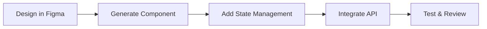
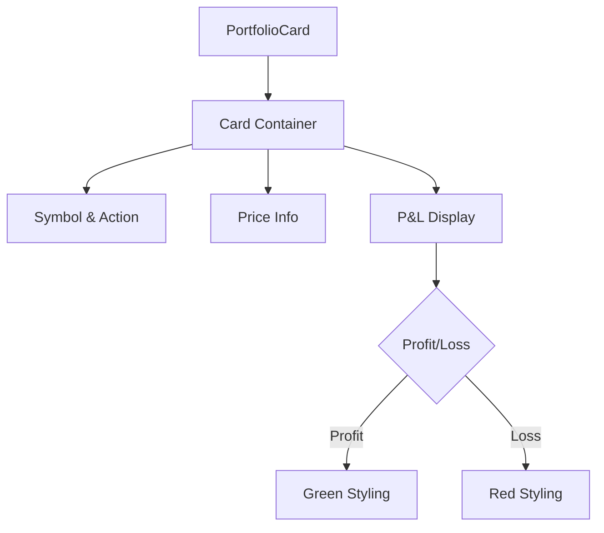
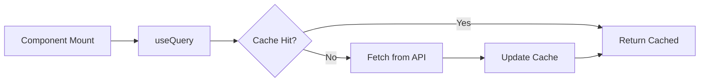
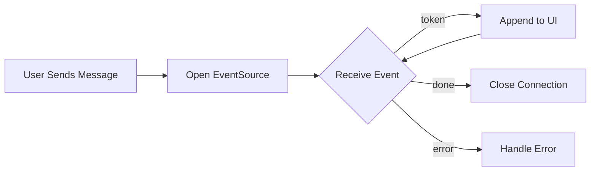
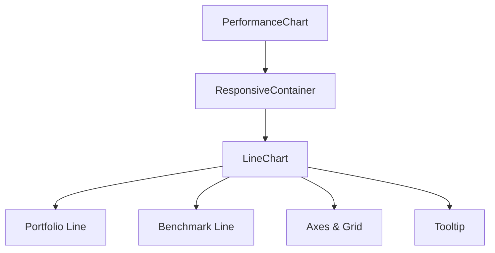
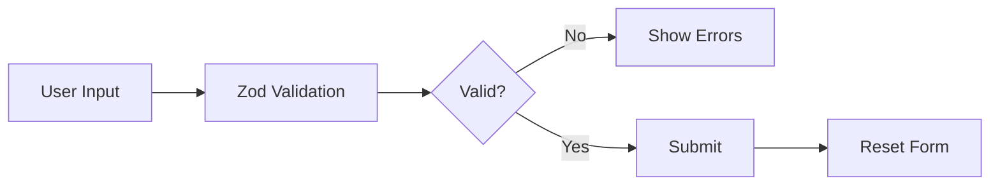
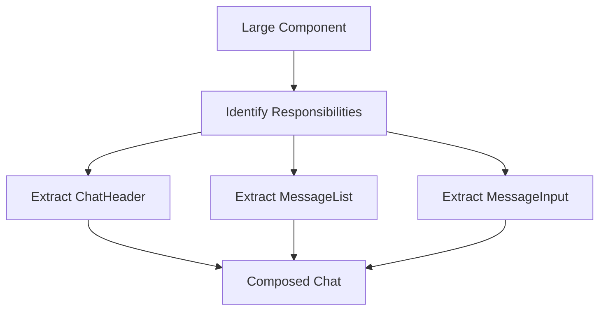
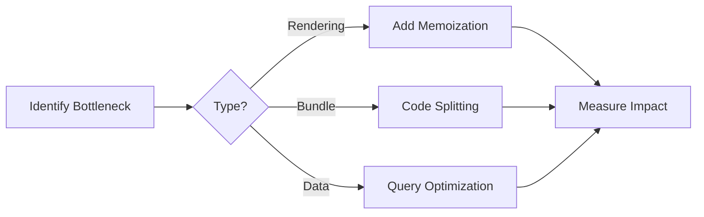

# Frontend Development AI Guide

> **Version**: 2.0
> **Last Updated**: December 22, 2025
> **Author**: Sam
> **Target Audience**: Frontend Developers

---

## 1. AI-Powered Frontend Development

### 1.1 Development Tools

```typescript
interface FrontendTools {
  claudeCode: {
    purpose: string[];
    useCases: string[];
  };
  figmaMCP: {
    purpose: string[];
    useCases: string[];
  };
  githubCopilot: {
    purpose: string[];
    useCases: string[];
  };
}

const tools: FrontendTools = {
  claudeCode: {
    purpose: ["React components", "Hooks", "State management", "Architecture"],
    useCases: ["Component creation", "SSE streaming", "Form validation", "Chart integration"]
  },
  figmaMCP: {
    purpose: ["UI/UX design"],
    useCases: ["Design system creation", "Component design", "Prototype review"]
  },
  githubCopilot: {
    purpose: ["Real-time code suggestions"],
    useCases: ["Inline completion", "Refactoring", "Test generation"]
  }
};
```

### 1.2 Development Workflow



---

## 2. Common Development Tasks

### 2.1 Creating a React Component

**Component Requirements**:
```typescript
interface ComponentSpec {
  name: string;
  props: {
    symbol: string;
    action: "buy" | "sell";
    entryPrice: number;
    currentPrice: number;
  };
  styling: {
    framework: "Tailwind CSS";
    components: "shadcn/ui";
  };
  features: {
    responsive: boolean;
    calculations: string[];
    conditionalStyling: boolean;
  };
}
```

**Component Architecture**:


**Prompt Template**:
```
Create a React component for Shadow Portfolio card with the following:

Requirements:
- Show coin symbol, action (buy/sell), price, current P&L
- Use shadcn/ui Card component
- Use Tailwind CSS for styling
- Props: { symbol: string, action: 'buy' | 'sell', entryPrice: number, currentPrice: number }
- Calculate P&L automatically
- Green for profit, red for loss
- Mobile responsive

Example:
┌─────────────────────────────┐
│ BTC                         │
│ Buy @ $43,250               │
│ Current: $44,100            │
│ P&L: +$850 (+1.96%)         │
└─────────────────────────────┘
```

**Expected Implementation**:
```tsx
import { Card, CardContent } from '@/components/ui/card';
import { cn } from '@/lib/utils';

interface PortfolioCardProps {
  symbol: string;
  action: 'buy' | 'sell';
  entryPrice: number;
  currentPrice: number;
}

export function PortfolioCard({ symbol, action, entryPrice, currentPrice }: PortfolioCardProps) {
  const pnl = currentPrice - entryPrice;
  const pnlPercent = ((pnl / entryPrice) * 100).toFixed(2);
  const isProfit = pnl > 0;

  return (
    <Card>
      <CardContent className="p-4">
        <div className="flex justify-between items-start">
          <div>
            <h3 className="text-lg font-bold">{symbol}</h3>
            <p className="text-sm text-gray-600">
              {action === 'buy' ? 'Buy' : 'Sell'} @ ${entryPrice.toLocaleString()}
            </p>
            <p className="text-sm text-gray-600">
              Current: ${currentPrice.toLocaleString()}
            </p>
          </div>
        </div>

        <div className={cn(
          'mt-4 flex justify-between items-center',
          isProfit ? 'text-green-600' : 'text-red-600'
        )}>
          <span className="font-bold">
            P&L: {isProfit ? '+' : ''}${pnl.toFixed(2)} ({isProfit ? '+' : ''}{pnlPercent}%)
          </span>
        </div>
      </CardContent>
    </Card>
  );
}
```

---

### 2.2 Using TanStack Query

**Data Fetching Architecture**:
```typescript
interface QueryHookSpec {
  hookName: string;
  endpoint: string;
  method: "GET" | "POST" | "PUT" | "DELETE";
  refetchInterval?: number;
  caching: {
    staleTime: number;
    cacheTime: number;
  };
  mutations: {
    enabled: boolean;
    invalidateQueries: string[];
  };
}
```

**Query Flow**:


**Prompt Template**:
```
Create a custom React hook for fetching shadow trades using TanStack Query:

Requirements:
- Hook name: useShadowTrades
- API endpoint: GET /api/shadow-trades
- Use axios
- Automatic refetch every 60 seconds
- Return trades, isLoading, error
- Include mutation hook for creating trades (useMutation)

Example usage:
const { trades, isLoading } = useShadowTrades();
const { mutate } = useCreateShadowTrade();
```

**Expected Implementation**:
```tsx
import { useQuery, useMutation, useQueryClient } from '@tanstack/react-query';
import axios from 'axios';

interface ShadowTrade {
  id: string;
  symbol: string;
  action: 'buy' | 'sell';
  price: number;
  createdAt: string;
}

export function useShadowTrades() {
  return useQuery({
    queryKey: ['shadow-trades'],
    queryFn: async () => {
      const { data } = await axios.get<ShadowTrade[]>('/api/shadow-trades');
      return data;
    },
    refetchInterval: 60 * 1000  // 60 seconds
  });
}

export function useCreateShadowTrade() {
  const queryClient = useQueryClient();

  return useMutation({
    mutationFn: async (trade: Omit<ShadowTrade, 'id' | 'createdAt'>) => {
      const { data } = await axios.post('/api/shadow-trades', trade);
      return data;
    },
    onSuccess: () => {
      queryClient.invalidateQueries({ queryKey: ['shadow-trades'] });
    }
  });
}
```

---

### 2.3 Building SSE Chat Component

**SSE Streaming Requirements**:
```typescript
interface StreamingChatSpec {
  protocol: "Server-Sent Events";
  api: "EventSource";
  stateManagement: {
    streaming: "Zustand";
    messages: "TanStack Query";
  };
  features: {
    tokenByToken: boolean;
    typingIndicator: boolean;
    autoScroll: boolean;
    errorHandling: boolean;
  };
}
```

**Streaming Flow**:


**Prompt Template**:
```
Create a React chat component with Server-Sent Events (SSE) streaming:

Requirements:
- Use EventSource for SSE
- Display streaming message token by token
- Show typing indicator while streaming
- Auto-scroll to bottom
- Handle connection errors
- Use Zustand for temporary streaming state

UI:
┌──────────────────────────────┐
│ [User Message]               │
│ [Assistant Message...]▋      │  ← Streaming
│ [Send Input]                 │
└──────────────────────────────┘
```

**Expected Implementation**:
```tsx
import { useState, useRef, useEffect } from 'react';
import { useStreamingStore } from '@/store/streaming.store';

export function ChatWindow({ chatId }: { chatId: string }) {
  const { streamingMessage, setStreamingMessage, clearStreamingMessage } = useStreamingStore();
  const [isStreaming, setIsStreaming] = useState(false);
  const messagesEndRef = useRef<HTMLDivElement>(null);
  const eventSourceRef = useRef<EventSource | null>(null);

  const sendMessage = async (content: string) => {
    clearStreamingMessage();
    setIsStreaming(true);

    const url = `/api/chats/${chatId}/messages?message=${encodeURIComponent(content)}`;
    eventSourceRef.current = new EventSource(url);

    eventSourceRef.current.onmessage = (event) => {
      const data = JSON.parse(event.data);

      if (data.type === 'token') {
        setStreamingMessage((prev) => prev + data.content);
      } else if (data.type === 'done') {
        setIsStreaming(false);
        clearStreamingMessage();
        eventSourceRef.current?.close();
      }
    };

    eventSourceRef.current.onerror = () => {
      setIsStreaming(false);
      clearStreamingMessage();
      eventSourceRef.current?.close();
    };
  };

  // Auto-scroll
  useEffect(() => {
    messagesEndRef.current?.scrollIntoView({ behavior: 'smooth' });
  }, [streamingMessage]);

  return (
    <div className="flex flex-col h-screen">
      <div className="flex-1 overflow-y-auto p-4">
        {/* Static messages */}
        {/* ... */}

        {/* Streaming message */}
        {streamingMessage && (
          <div className="bg-gray-100 rounded-lg p-4">
            <p>{streamingMessage}<span className="animate-pulse">▋</span></p>
          </div>
        )}

        <div ref={messagesEndRef} />
      </div>

      <MessageInput onSend={sendMessage} disabled={isStreaming} />
    </div>
  );
}
```

---

### 2.4 Creating a Chart Component

**Chart Requirements**:
```typescript
interface ChartSpec {
  library: "Recharts";
  chartType: "Line";
  data: {
    xAxis: "date";
    yAxis: "value";
    series: ["portfolio", "benchmark"];
  };
  features: {
    tooltip: boolean;
    legend: boolean;
    responsive: boolean;
    valueFormatting: boolean;
  };
}
```

**Chart Architecture**:


**Prompt Template**:
```
Create a performance chart using Recharts:

Requirements:
- Show portfolio value over time
- Compare with benchmark (BTC)
- Two lines: Portfolio (blue), BTC (orange)
- X-axis: dates, Y-axis: value ($)
- Tooltip showing values
- Responsive (mobile-friendly)
- Data: { date: string, portfolio: number, benchmark: number }[]
```

**Expected Implementation**:
```tsx
import { LineChart, Line, XAxis, YAxis, CartesianGrid, Tooltip, Legend, ResponsiveContainer } from 'recharts';

interface PerformanceData {
  date: string;
  portfolio: number;
  benchmark: number;
}

interface PerformanceChartProps {
  data: PerformanceData[];
}

export function PerformanceChart({ data }: PerformanceChartProps) {
  return (
    <ResponsiveContainer width="100%" height={400}>
      <LineChart data={data}>
        <CartesianGrid strokeDasharray="3 3" />
        <XAxis
          dataKey="date"
          tickFormatter={(date) => new Date(date).toLocaleDateString('en-US', { month: 'short', day: 'numeric' })}
        />
        <YAxis
          tickFormatter={(value) => `$${value.toLocaleString()}`}
        />
        <Tooltip
          formatter={(value: number) => `$${value.toLocaleString()}`}
          labelFormatter={(date) => new Date(date).toLocaleDateString()}
        />
        <Legend />
        <Line
          type="monotone"
          dataKey="portfolio"
          stroke="#3b82f6"
          strokeWidth={2}
          name="Your Portfolio"
        />
        <Line
          type="monotone"
          dataKey="benchmark"
          stroke="#f59e0b"
          strokeWidth={2}
          name="BTC Benchmark"
        />
      </LineChart>
    </ResponsiveContainer>
  );
}
```

---

### 2.5 Form Validation with React Hook Form

**Form Validation Requirements**:
```typescript
interface FormSpec {
  library: "react-hook-form";
  validation: {
    schema: "Zod";
    rules: {
      symbol: ["required", "enum"];
      action: ["required", "enum"];
      price: ["required", "positive"];
    };
  };
  features: {
    errorMessages: boolean;
    submitHandling: boolean;
    resetOnSuccess: boolean;
    disableWhileSubmitting: boolean;
  };
}
```

**Form Validation Flow**:


**Prompt Template**:
```
Create a form for creating shadow trades:

Requirements:
- Use react-hook-form
- Validation: symbol (required, one of BTC/ETH/SOL/BNB/DOGE/XRP), action (buy/sell), price (positive number)
- Show error messages
- Submit handler
- Disable submit while submitting
- Reset form after success
```

**Expected Implementation**:
```tsx
import { useForm } from 'react-hook-form';
import { zodResolver } from '@hookform/resolvers/zod';
import { z } from 'zod';

const schema = z.object({
  symbol: z.enum(['BTC', 'ETH', 'SOL', 'BNB', 'DOGE', 'XRP']),
  action: z.enum(['buy', 'sell']),
  price: z.number().positive('Price must be positive')
});

type FormData = z.infer<typeof schema>;

export function CreateTradeForm() {
  const { register, handleSubmit, formState: { errors, isSubmitting }, reset } = useForm<FormData>({
    resolver: zodResolver(schema)
  });

  const onSubmit = async (data: FormData) => {
    await axios.post('/api/shadow-trades', data);
    reset();
  };

  return (
    <form onSubmit={handleSubmit(onSubmit)} className="space-y-4">
      <div>
        <label>Symbol</label>
        <select {...register('symbol')}>
          <option value="">Select...</option>
          <option value="BTC">Bitcoin</option>
          <option value="ETH">Ethereum</option>
          {/* ... */}
        </select>
        {errors.symbol && <p className="text-red-500 text-sm">{errors.symbol.message}</p>}
      </div>

      <div>
        <label>Action</label>
        <select {...register('action')}>
          <option value="">Select...</option>
          <option value="buy">Buy</option>
          <option value="sell">Sell</option>
        </select>
        {errors.action && <p className="text-red-500 text-sm">{errors.action.message}</p>}
      </div>

      <div>
        <label>Price</label>
        <input
          type="number"
          step="0.01"
          {...register('price', { valueAsNumber: true })}
        />
        {errors.price && <p className="text-red-500 text-sm">{errors.price.message}</p>}
      </div>

      <button type="submit" disabled={isSubmitting}>
        {isSubmitting ? 'Creating...' : 'Create Trade'}
      </button>
    </form>
  );
}
```

---

## 3. AI-Assisted Code Review

### 3.1 Review Checklist

```typescript
interface FrontendReviewCriteria {
  performance: {
    checks: [
      "Unnecessary re-renders",
      "Missing memoization (useMemo, useCallback)",
      "Large component bundles"
    ];
  };
  accessibility: {
    checks: [
      "ARIA labels",
      "Keyboard navigation",
      "Screen reader support"
    ];
  };
  ux: {
    checks: [
      "Loading states",
      "Error states",
      "Empty states"
    ];
  };
  codeQuality: {
    checks: [
      "Component composition",
      "Prop drilling",
      "Naming conventions"
    ];
  };
}
```

### 3.2 Code Review Prompt

```
Review this React component for:

1. Performance:
   - Unnecessary re-renders
   - Missing memoization (useMemo, useCallback)
   - Large component bundles

2. Accessibility:
   - ARIA labels
   - Keyboard navigation
   - Screen reader support

3. UX:
   - Loading states
   - Error states
   - Empty states

4. Code Quality:
   - Component composition
   - Prop drilling
   - Naming conventions

Code:
[Paste component code]
```

---

## 4. Best Practices

### 4.1 Component Composition

**Component Design Patterns**:
```typescript
interface CompositionPattern {
  bad: {
    approach: "Giant monolithic component";
    issues: ["Hard to test", "Poor reusability", "Difficult to maintain"];
  };
  good: {
    approach: "Small, focused components";
    benefits: ["Easy to test", "Highly reusable", "Simple to understand"];
  };
}
```

**Refactoring Flow**:


**Prompt for Refactoring**:
```
Refactor this component into smaller, reusable parts:
- Extract ChatHeader
- Extract MessageList
- Extract MessageInput

[Paste large component]
```

---

### 4.2 State Management

**State Management Strategy**:
```typescript
interface StateStrategy {
  zustand: {
    purpose: "UI state";
    useCases: [
      "Modal visibility",
      "Sidebar state",
      "Theme preferences"
    ];
  };
  tanstackQuery: {
    purpose: "Server state";
    useCases: [
      "API data fetching",
      "Caching",
      "Real-time updates"
    ];
  };
}
```

**Zustand Store Prompt**:
```
Create a Zustand store for UI state:
- sidebarOpen (boolean)
- toggleSidebar
- currentModal ('none' | 'settings' | 'portfolio')
- openModal, closeModal
```

**TanStack Query Prompt**:
```
Create TanStack Query hooks for:
- useChats (list chats)
- useMessages (get messages)
- useCreateChat (mutation)
```

---

### 4.3 TypeScript Types

**Type Generation Requirements**:
```typescript
interface TypeGenerationSpec {
  source: "API Response";
  output: "TypeScript Interfaces";
  features: {
    nested: boolean;
    optional: boolean;
    unions: boolean;
  };
}
```

**Type Generation Prompt**:
```
Generate TypeScript types from this API response:

{
  "id": "chat-123",
  "title": "Bitcoin 투자 상담",
  "createdAt": "2024-01-15T10:30:00Z",
  "messages": [
    {
      "id": "msg-123",
      "role": "user",
      "content": "비트코인 지금 어때?",
      "createdAt": "2024-01-15T10:30:00Z"
    }
  ]
}
```

**Expected Types**:
```typescript
interface Chat {
  id: string;
  title: string;
  createdAt: string;
  messages: Message[];
}

interface Message {
  id: string;
  role: "user" | "assistant";
  content: string;
  createdAt: string;
}
```

---

## 5. Performance Optimization

### 5.1 Optimization Checklist

```typescript
interface PerformanceOptimization {
  rendering: {
    techniques: [
      "useMemo for expensive calculations",
      "useCallback for function props",
      "React.memo for pure components"
    ];
  };
  bundleSize: {
    techniques: [
      "Code splitting with lazy()",
      "Dynamic imports",
      "Tree shaking"
    ];
  };
  dataFetching: {
    techniques: [
      "TanStack Query caching",
      "Prefetching",
      "Background refetch"
    ];
  };
}
```

### 5.2 Optimization Flow



---

**Document Version**: 2.0
**Last Updated**: December 22, 2025
**Stack**: React 18.3 + Vite 5 + TypeScript
**Maintainer**: Sam (dev@5010.tech)

_"Between the zeros and ones"_
