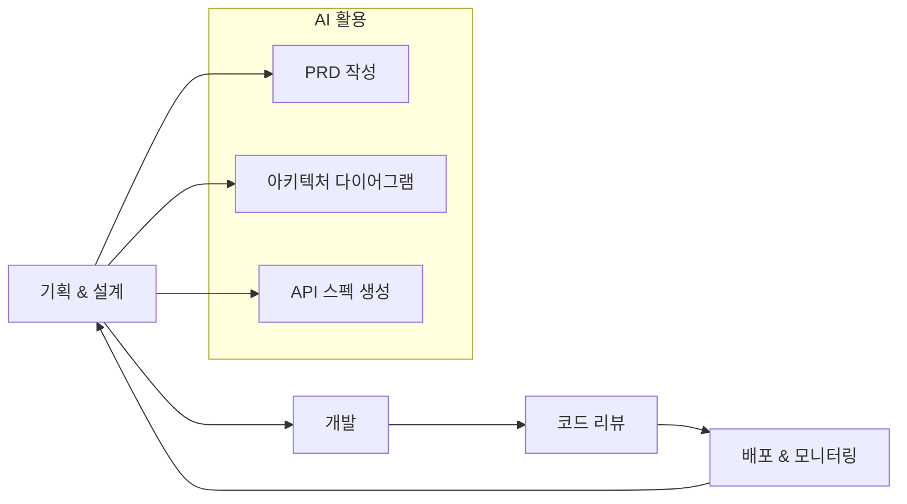
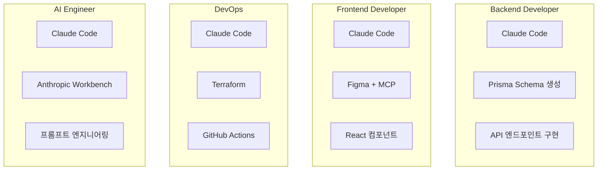
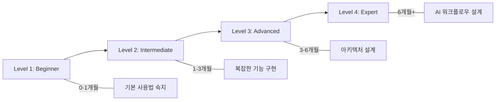

# AI-Native 시대의 기술팀 구성 전략 가이드

> **문서 버전**: 1.0
> **최종 수정**: 2025년 12월 19일
> **작성자**: Sam
> **대상 독자**: 개발팀, 경영진

---

## Executive Summary

### Vision

**"AI를 도구가 아닌 팀원으로, 10배 빠른 개발 속도로 세계 최고의 제품을 만든다"**

### 핵심 원칙

```typescript
interface AIDevelopmentPrinciples {
  aiFirst: "모든 개발 과정에 AI 활용";
  humanAICollab: "AI는 보조자가 아닌 파트너";
  qualityOverSpeed: "빠르지만 품질 타협 없음";
  continuousLearning: "AI 도구 진화에 맞춰 성장";
}
```

---

## AI가 가져온 개발 패러다임 전환

| 영역 | 전통적 방식 | AI-Native 방식 | 변화율 |
|------|------------|---------------|--------|
| **기능 개발** | 1 feature/주 | 5 features/주 | 5x |
| **버그 수정** | 2시간/버그 | 30분/버그 | 4x |
| **코드 리뷰** | 1시간/PR | 20분/PR | 3x |
| **문서화 완성도** | 30% | 90% | 3x |

---

## AI Development Stack

### 개발 도구

| 도구 | 용도 | 모델 | 비용 |
|------|------|------|------|
| **Claude Code** | 코드 생성, 리팩토링, 디버깅 | Sonnet 4 | $20/월 |
| **GitHub Copilot** | 코드 리뷰, 실시간 제안 | Codex | $10/월 |
| **Figma + MCP** | UI/UX 디자인 | - | Figma 플랜 |

**총 개발자당 비용**: $30/월 (10배 생산성 증가 대비 극히 저렴)

### AI 모델 선택 기준

| 작업 유형 | 추천 모델 | 이유 |
|----------|----------|------|
| **복잡한 아키텍처 설계** | Claude Sonnet 4 | 긴 컨텍스트, 뛰어난 추론 |
| **빠른 코드 생성** | Claude Sonnet 4 | 속도, 정확성 |
| **UI/UX 디자인** | Figma + MCP | 디자인 시스템 연동 |
| **코드 리뷰** | GitHub Copilot | PR 통합, 빠른 피드백 |

---

## AI-Native Development Workflow



### 1. 기획 & 설계 단계

#### AI 활용
- Claude에게 PRD (Product Requirements Document) 작성 요청
- 아키텍처 다이어그램 생성 (Mermaid)
- API 스펙 자동 생성

#### 예시 프롬프트
```
"Sage.ai의 섀도우 포트폴리오 기능을 위한 백엔드 API를 설계해줘.
요구사항:
- Nest.js + Prisma
- RESTful API
- 사용자당 최대 3개 포트폴리오
- 수익률 자동 계산
- PostgreSQL 스키마 포함

응답 형식: OpenAPI 3.0 스펙 + Prisma Schema"
```

### 2. 개발 단계

#### Claude Code 워크플로우

**Step 1: 전체 컨텍스트 이해**
```
"Read all files in src/modules/portfolio and summarize the architecture"
```

**Step 2: 기능 구현**
```
"Implement a new endpoint POST /api/shadow-trades that:
1. Validates user input (symbol, action, price)
2. Checks user tier (max 3 portfolios for Pro)
3. Saves to database via Prisma
4. Returns created trade with current price from CoinGecko
Use existing patterns from src/modules/market"
```

**Step 3: 통합 테스트**
```
"Write E2E tests for the shadow trades flow using Supertest"
```

### 3. 코드 리뷰 단계

#### AI Code Review Checklist

**Claude에게 체크 요청**:
```
"Review this PR for:
1. Security vulnerabilities (SQL injection, XSS, auth bypass)
2. Performance issues (N+1 queries, memory leaks)
3. Code quality (SOLID principles, naming conventions)
4. Test coverage (unit, integration, E2E)
5. Documentation (JSDoc, README updates)

Provide specific line numbers and suggestions."
```

#### Human Review 포인트
- AI가 놓칠 수 있는 비즈니스 로직 검증
- UX/UI 최종 확인
- 보안 취약점 재검증

### 4. 배포 & 모니터링

#### AI 활용
- 배포 스크립트 자동 생성 (Terraform, GitHub Actions)
- 로그 분석 및 에러 패턴 감지
- 성능 최적화 제안

---

## AI Pair Programming Best Practices

### DO's

```typescript
// ❌ 나쁜 예
const badPrompt = "Create a user service";

// ✅ 좋은 예
const goodPrompt = `Create a NestJS user service that:
  - Uses Prisma for DB access
  - Implements Auth.js session management
  - Includes pagination (20 items per page)
  - Follows our existing pattern in src/modules/chat/chat.service.ts`;
```

1. **구체적인 컨텍스트 제공**
2. **작은 단위로 반복** - 한 번에 한 기능만 요청, 각 단계 검증 후 다음 진행
3. **코드 리뷰 요청** - Performance, Security, Readability
4. **테스트 우선 작성** - "First write tests for this feature, then implement the code"

### DON'Ts

1. **블라인드 신뢰 금지** - AI 코드는 반드시 검증, 특히 보안 관련 코드
2. **너무 큰 변경 요청**
   ```
   ❌ "Refactor the entire codebase to use a new architecture pattern"
   ✅ "Refactor src/modules/portfolio to separate domain logic from infrastructure"
   ```
3. **컨텍스트 없는 질문**
   ```
   ❌ "Why is this slow?"
   ✅ "This API endpoint takes 5s to respond. Here's the code [paste code].
       The query logs show N+1 problem. How can I optimize using Prisma?"
   ```

---

## Team Collaboration with AI

### 역할별 AI 활용



#### Backend Developer
- **Primary**: Claude Code (아키텍처, 복잡한 로직, CRUD 생성)
- **활용**: Prisma schema 생성, API 엔드포인트 구현, 멀티 에이전트 시스템

#### Frontend Developer
- **Primary**: Claude Code (React 코드, 상태 관리)
- **Design**: Figma + MCP (사용자가 직접 디자인)
- **활용**: shadcn/ui 커스터마이징, TanStack Query 설정, 채팅 UI 구현

#### DevOps / Infrastructure
- **Primary**: Claude Code (Terraform, GitHub Actions, Shell scripts)
- **활용**: ECS Fargate 배포, CI/CD 파이프라인, 모니터링 설정

#### AI Engineer
- **Primary**: Claude Code (프롬프트 엔지니어링)
- **Secondary**: Anthropic Workbench (프롬프트 테스트)
- **활용**: 멀티 에이전트 오케스트레이션, Tool 설계, 환각 방지 메커니즘

---

## AI-Generated Documentation

### 자동 문서화 전략

#### 1. Code → Documentation

**JSDoc 자동 생성**
```typescript
// AI에게 요청: "Add JSDoc comments to all functions in this file"

/**
 * Creates a new shadow trade for the user
 * @param userId - The ID of the user creating the trade
 * @param createTradeDto - The trade details (symbol, action, price)
 * @returns The created shadow trade with current price
 * @throws UnauthorizedException if user tier doesn't allow more portfolios
 * @throws BadRequestException if symbol is invalid
 */
async createTrade(userId: string, createTradeDto: CreateTradeDto) {
  // ...
}
```

#### 2. API Documentation

**OpenAPI 스펙 자동 생성**
```
"Generate OpenAPI 3.0 spec from this NestJS controller"
```

#### 3. README 자동 업데이트

**매주 업데이트**
```
"Update README.md based on recent changes:
- New endpoints in src/modules/portfolio
- Updated dependencies in package.json
- New environment variables in .env.example"
```

---

## AI Cost Management

### 비용 최적화 전략

#### 모델 선택 최적화

| 작업 | 비용 | 추천 모델 |
|------|------|----------|
| **간단한 CRUD** | 저 | Claude Sonnet 4 |
| **중간 복잡도** | 중 | Claude Sonnet 4 |
| **복잡한 아키텍처** | 고 | Claude Sonnet 4 (깊은 사고 모드) |

#### 프롬프트 효율화

```typescript
// 비효율적 (비용 높음)
const inefficient = "Explain what this code does line by line";

// 효율적 (비용 낮음)
const efficient = "Summarize this code's purpose in 2-3 sentences";
```

#### 캐싱 활용
- 같은 프롬프트 반복 금지
- 자주 쓰는 패턴은 스니펫으로 저장
- Claude의 Prompt Caching 기능 활용

### 월별 AI 비용 예산

```javascript
function calculateMonthlyCost() {
  const team = {
    claudeCode: { users: 5, price: 20 },    // $100
    githubCopilot: { users: 5, price: 10 }, // $50
    anthropicAPI: { estimate: 100 }          // $100
  };

  const total =
    (team.claudeCode.users * team.claudeCode.price) +
    (team.githubCopilot.users * team.githubCopilot.price) +
    team.anthropicAPI.estimate;

  return { total, roi: "10x+ productivity increase" };
}
// Result: $250/월
```

---

## Quality Assurance

### AI-Assisted Testing

#### 1. 테스트 자동 생성

**Unit Tests**
```
"Generate Jest unit tests for this service with:
- Happy path
- Edge cases (empty input, null values)
- Error cases
- Mocking external dependencies (Prisma, APIs)"
```

**E2E Tests**
```
"Write E2E tests for the shadow portfolio flow:
1. User logs in
2. Creates 3 portfolios (max)
3. Tries to create 4th (should fail)
4. Deletes 1 portfolio
5. Creates new one (should succeed)"
```

#### 2. 코드 품질 체크

**자동 체크리스트**
- [ ] TypeScript strict mode 통과
- [ ] ESLint 0 errors
- [ ] Prettier 포매팅 완료
- [ ] 80%+ 테스트 커버리지
- [ ] AI 코드 리뷰 완료
- [ ] Human 코드 리뷰 완료

---

## Success Metrics

### 팀 생산성 지표

| 지표 | Baseline (AI 없이) | Target (AI 활용) | 증가율 |
|------|-------------------|-----------------|--------|
| **기능 개발 속도** | 1 feature/주 | 5 features/주 | 5배 |
| **버그 수정 시간** | 2시간/버그 | 30분/버그 | 4배 빠름 |
| **코드 리뷰 시간** | 1시간/PR | 20분/PR | 3배 빠름 |
| **문서화 완성도** | 30% | 90% | 3배 증가 |

### 코드 품질 지표

```typescript
interface QualityTargets {
  testCoverage: "80%+";
  typeScriptCoverage: "95%+";
  eslintErrors: 0;
  codeSmells: "<10";
}
```

---

## Learning & Growth

### AI 도구 숙련도 로드맵



#### Phase 1: Beginner (0-1개월)
- [ ] Claude Code 기본 사용법 숙지
- [ ] GitHub Copilot 설정 및 활용
- [ ] 간단한 코드 생성 가능

#### Phase 2: Intermediate (1-3개월)
- [ ] 복잡한 기능 AI와 함께 구현
- [ ] AI 코드 리뷰 습관화
- [ ] 프롬프트 엔지니어링 기본

#### Phase 3: Advanced (3-6개월)
- [ ] 아키텍처 설계에 AI 활용
- [ ] AI 페어 프로그래밍 자동화
- [ ] 팀 내 AI 베스트 프랙티스 공유

#### Phase 4: Expert (6개월+)
- [ ] AI 도구 커스터마이징 (자체 프롬프트 라이브러리)
- [ ] AI-Native 워크플로우 설계
- [ ] 외부 컨퍼런스 발표

### 주간 학습 시간

- **AI 도구 연습**: 2시간/주
- **AI 베스트 프랙티스 세션**: 1시간/주 (팀 공유)
- **새로운 AI 도구 탐색**: 1시간/주

---

## Risk Management

### AI 활용 리스크 및 대응

| 리스크 | 발생 확률 | 영향도 | 대응 방안 |
|--------|----------|--------|----------|
| **AI 의존도 과다** | 중 | 중 | 정기적 Manual Coding 세션 |
| **보안 취약점 삽입** | 저 | 고 | 모든 AI 코드 Human Review 필수 |
| **라이선스 위반** | 저 | 고 | AI 생성 코드 라이선스 체크 |
| **코드 품질 저하** | 중 | 중 | 엄격한 코드 리뷰 기준 |

---

## Case Studies

### 사례 1: 멀티 에이전트 시스템 구현

```typescript
interface CaseStudy1 {
  beforeAI: {
    estimatedTime: "4주";
    developers: 2;
    totalHours: 320;
  };
  withAI: {
    actualTime: "1주";
    developers: "1명 + Claude Code";
    totalHours: 40;
  };
  result: "8배 빠른 개발, 품질 동일";
}
```

### 사례 2: 섀도우 포트폴리오 기능

| 작업 | AI 없이 | AI 활용 | 절감 |
|------|--------|---------|------|
| PRD 작성 | 2시간 | 30분 | 4배 |
| 백엔드 CRUD | 1일 | 2시간 | 4배 |
| UI 디자인 + 구현 | 1일 | 3시간 | 3배 |
| 테스트 자동 생성 | 4시간 | 1시간 | 4배 |
| **총계** | 2.5일 | 6.5시간 | **3배** |

---

## Conclusion

### AI Team의 핵심 가치

**"AI는 도구가 아닌 팀원이다"**

```typescript
const aiTeamValues = {
  speed: "10배 빠른 개발 속도",
  quality: "AI 코드 리뷰로 품질 향상",
  learning: "AI와 함께 성장하는 팀",
  innovation: "AI로 불가능을 가능하게"
};
```

### Next Steps

- [ ] 모든 팀원 AI 도구 온보딩 (Week 1)
- [ ] AI Pair Programming 세션 (주 1회)
- [ ] AI 베스트 프랙티스 문서 작성 (격주)
- [ ] 월별 AI 생산성 리뷰 미팅

---

**문서 끝**

_"Between the zeros and ones"_

---

## Appendix

### A. AI Tool Resources

- [Claude Code Documentation](https://docs.anthropic.com/claude-code)
- [GitHub Copilot Best Practices](https://github.com/features/copilot)
- [Figma MCP Documentation](https://www.figma.com/)

### B. Prompt Library

**자주 쓰는 프롬프트 모음**
- [링크: Internal Prompt Library]

### C. Team Guidelines

**AI 사용 가이드라인**
- [링크: AI Usage Policy]
