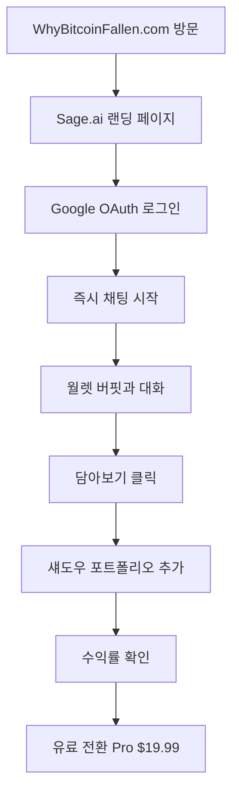
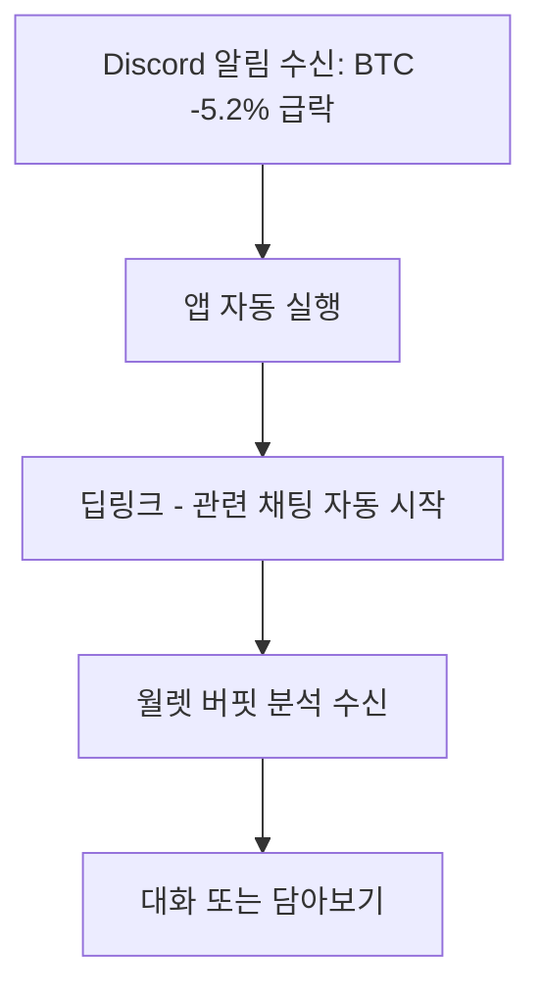
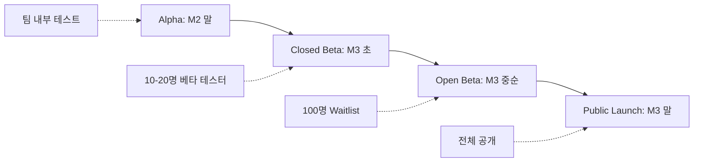

# Sage.ai MVP Definition

> **문서 버전**: 2.0
> **최종 수정**: 2025년 12월 22일
> **작성자**: Sam
> **대상 독자**: 전체 팀 (개발, 기획, 마케팅)

---

## 1. MVP Overview

### 1.1 Definition

```typescript
interface MVPDefinition {
  concept: "3개월 내 PMF(Product-Market Fit) 검증을 위한 최소 기능 제품";
  objective: "AI 투자 멘토의 핵심 가치를 검증하고, 초기 사용자로부터 피드백을 받는다";
  timeline: "3개월";
}
```

### 1.2 Success Metrics

| 지표 | 목표 (3개월 후) | 측정 방법 |
|------|----------------|----------|
| **베타 테스터** | 10-20명 | 직접 모집 |
| **WhyBitcoinFallen 방문자** | 일 1,000+ | Google Analytics |
| **Sage.ai MAU** | 500+ | 활성 사용자 수 |
| **환각률** | <1% | 사용자 신고 / 전체 응답 |
| **Shadow Portfolio 추적** | 10+ 트레이드 | DB 기록 |
| **NPS** | 40+ | 분기별 설문 |

---

## 2. Core Features (Must Have)

### 2.1 Feature 1: 월렛 버핏과의 대화

```typescript
interface ChatFeature {
  description: "Claude Sonnet 4 기반 AI 멘토와 실시간 대화";
  capabilities: [
    "시장 데이터 기반 통찰 제공",
    "워렌 버핏의 투자 철학 구현",
    "SSE 스트리밍 응답 (2초 이내 첫 토큰)"
  ];
  architecture: {
    manager: "Haiku 4 - 라우팅";
    analyst: "Haiku 4 - 데이터 수집";
    persona: "Sonnet 4 - 월렛 버핏 응답";
    risk: "Haiku 4 - 교차 검증";
  };
  scope: {
    included: [
      "6개 코인 (BTC, ETH, SOL, BNB, DOGE, XRP)",
      "Fear & Greed Index 통합",
      "실시간 시장 데이터 통합 (CoinGecko)"
    ];
    excluded: [
      "다중 페르소나 (사토시 현자, 알파 헌터 등) → Phase 2",
      "그룹 채팅 (AI끼리 토론) → Phase 2"
    ];
  };
}
```

### 2.2 Feature 2: 섀도우 포트폴리오

```typescript
interface ShadowPortfolioFeature {
  description: "AI 추천을 가상으로 추적하여 성과 검증";
  mechanism: {
    detection: "AI 시그널 감지 (buy/sell 추천)";
    tracking: "담아보기 버튼으로 사용자가 직접 선택";
    calculation: "현재가 자동 조회 및 수익률 계산";
    display: "포트폴리오 대시보드";
  };
  scope: {
    included: [
      "기본 수익률 계산 (절대 수익률, 벤치마크 대비)",
      "최대 3개 포트폴리오 (Pro 플랜)"
    ];
    excluded: [
      "복잡한 지표 (샤프 비율, MDD 등) → Phase 2",
      "거래소 API 연동 (실제 매매) → Phase 2"
    ];
  };
}
```

### 2.3 Feature 3: 능동적 분석

```typescript
interface ProactiveAnalysisFeature {
  description: "15분마다 시장 자동 분석 및 컨텍스트 생성";
  components: {
    polling: "@nestjs/schedule 주기적 폴링";
    background: "BullMQ 기반 백그라운드 작업";
    notification: "PWA Push + Discord 알림";
    deeplink: "즉시 관련 채팅 시작";
  };
  scope: {
    included: [
      "가격 급변 감지 (±5% BTC, ±7% ETH, ±10% 알트)",
      "Fear & Greed 급변 감지 (±15)"
    ];
    excluded: [
      "온체인 분석 (고래 이동 등) → Phase 2",
      "뉴스 기반 알림 → Phase 2"
    ];
  };
}
```

---

## 3. Excluded Features (Phase 2+)

### 3.1 Phase 2 (2026 Q2-Q3)

| 기능 | 이유 | 우선순위 |
|------|------|----------|
| **멀티 페르소나** | 월렛 버핏 하나로 PMF 먼저 검증 | 높음 |
| **그룹 채팅** | 1:1 대화 UX 안정화 우선 | 높음 |
| **RAG 장기 기억** | 20개 메시지로 충분 (초기) | 중간 |
| **온체인 분석** | 외부 데이터 의존도 증가 | 중간 |
| **추가 코인** | 6개로 PMF 검증 후 확장 | 낮음 |

### 3.2 Phase 3 (2027+)

```typescript
interface Phase3Features {
  expansion: [
    "주식 시장 확장",
    "실시간 거래소 WebSocket",
    "소셜 기능 (성과 공유)",
    "모바일 앱 (React Native)"
  ];
}
```

---

## 4. Technology Stack (MVP)

### 4.1 Stack Overview

```typescript
interface MVPStack {
  backend: {
    framework: "Nest.js 10.x";
    orm: "Prisma 5.x";
    database: "PostgreSQL 16 + Redis 7.x";
    async: "BullMQ 5.x";
  };
  frontend: {
    framework: "React 18.3 + Vite 5";
    state: "Zustand 4.x + TanStack Query 5.x";
    styling: "Tailwind CSS 3.x";
  };
  ai: {
    model: "Claude Sonnet 4 + Haiku 4";
    sdk: "@anthropic-ai/sdk (TypeScript)";
  };
  infrastructure: {
    container: "AWS ECS Fargate";
    static: "S3 + CloudFront";
    monitoring: "Sentry + CloudWatch";
  };
}
```

---

## 5. User Journey

### 5.1 New User Flow



### 5.2 Returning User Flow



---

## 6. Development Scope

### 6.1 Page Structure

#### WhyBitcoinFallen.com

```typescript
interface ViralSite {
  pages: 1; // SPA
  features: [
    "실시간 BTC 가격 표시",
    "Fear & Greed 게이지",
    "AI 미리보기 (월렛 버핏 한마디)",
    "Sage.ai 가입 CTA"
  ];
}
```

#### Sage.ai Landing

```typescript
interface LandingPage {
  pages: 1; // SPA
  sections: [
    "Hero 섹션",
    "3가지 핵심 기능 소개",
    "성과 카드 (섀도우 포트폴리오 예시)",
    "가입 CTA"
  ];
}
```

#### Sage.ai App

```typescript
interface MainApp {
  pages: {
    "/chat": "채팅 목록";
    "/chat/:id": "대화 상세";
    "/portfolio": "섀도우 포트폴리오";
    "/notifications": "알림 히스토리";
    "/settings": "설정";
  };
}
```

### 6.2 API Endpoints

| Method | Endpoint | 기능 |
|--------|----------|------|
| POST | `/api/auth/google` | Google OAuth |
| POST | `/api/chat` | 채팅 메시지 전송 (SSE) |
| GET | `/api/chats` | 채팅 목록 조회 |
| GET | `/api/chats/:id/messages` | 메시지 조회 |
| GET | `/api/market/price` | 가격 조회 (캐싱) |
| GET | `/api/market/fear-greed` | Fear & Greed 조회 |
| POST | `/api/shadow-trades` | 섀도우 트레이드 추가 |
| GET | `/api/shadow-trades` | 포트폴리오 조회 |
| POST | `/api/push/subscribe` | 푸시 구독 등록 |
| GET | `/api/notifications` | 알림 히스토리 |

---

## 7. Data Models (Core)

### 7.1 Prisma Schemas

```prisma
// Users
model User {
  id        String   @id @default(uuid())
  email     String   @unique
  name      String?
  image     String?
  tier      String   @default("free") // free, pro, premium
  createdAt DateTime @default(now())
}

// Chats
model Chat {
  id        String    @id @default(uuid())
  userId    String
  title     String    @default("새 대화")
  messages  Message[]
  createdAt DateTime  @default(now())
}

// Messages
model Message {
  id        String   @id @default(uuid())
  chatId    String
  role      String   // user, assistant
  content   String
  signal    Json?    // AI 시그널 (buy/sell)
  createdAt DateTime @default(now())
}

// ShadowTrades
model ShadowTrade {
  id        String   @id @default(uuid())
  userId    String
  symbol    String   // BTC, ETH, etc.
  action    String   // buy, sell
  price     Decimal
  createdAt DateTime @default(now())
}
```

---

## 8. Constraints & Trade-offs

### 8.1 Technical Constraints

```typescript
interface TechnicalConstraints {
  context: {
    limit: "20개 메시지";
    reason: "RAG 구현 복잡도";
    mitigation: "Phase 2에서 pgvector 추가";
  };
  coins: {
    limit: "6개 코인만 지원";
    reason: "API 비용, 복잡도";
    mitigation: "사용자 피드백 기반 확장";
  };
  notification: {
    limit: "순차 알림 발송";
    reason: "SNS+SQS 인프라 부담";
    mitigation: "초기 사용자 500명 이하면 충분";
  };
}
```

### 8.2 Business Constraints

```typescript
interface BusinessConstraints {
  monetization: {
    limit: "유료 플랜 없음 (MVP)";
    reason: "검증 후 런칭";
    mitigation: "Q3에 Pro/Premium 오픈";
  };
  language: {
    limit: "한/영만 지원";
    reason: "리소스 제한";
    mitigation: "Q2에 일/중 추가";
  };
  community: {
    limit: "Discord만 커뮤니티";
    reason: "초기 집중 필요";
    mitigation: "Q2에 카카오톡 추가";
  };
}
```

---

## 9. Testing Plan

### 9.1 Beta Testing

```typescript
interface BetaTestPlan {
  participants: "10-20명";
  profile: "암호화폐 투자 경험 있는 얼리어답터";
  duration: "2주";
  reward: "평생 Pro 플랜 무료";
}
```

### 9.2 Test Scenarios

```typescript
interface TestScenarios {
  basicChat: [
    "비트코인 지금 어때?",
    "이더리움 살까?",
    "포트폴리오 점검해줘"
  ];
  shadowPortfolio: [
    "AI 추천 받기",
    "담아보기 클릭",
    "수익률 확인"
  ];
  notifications: [
    "Discord 급변 알림 수신",
    "푸시 알림 수신",
    "딥링크로 채팅 시작"
  ];
}
```

### 9.3 Quality Criteria

```typescript
interface QualityCriteria {
  performance: {
    responseTime: "2초 이내 (첫 토큰)";
    hallucinationRate: "<1% (사용자 신고 기준)";
    uptime: "99% (다운타임 최소화)";
  };
  bugs: {
    p0: "0개";
    p1: "3개 이하";
  };
}
```

---

## 10. Release Plan

### 10.1 Release Stages



#### Stage Details

| Stage | 시기 | 대상 | 목적 |
|-------|------|------|------|
| **Alpha** | M2 말 | 팀 내부 | 기능 동작 확인 |
| **Closed Beta** | M3 초 | 10-20명 | 실사용 피드백 |
| **Open Beta** | M3 중순 | 100명 제한 | 서버 부하 테스트 |
| **Public Launch** | M3 말 | 전체 공개 | PMF 검증 |

---

## 11. Success Criteria & Next Steps

### 11.1 MVP Success Criteria

| 지표 | 목표 | 판단 |
|------|------|------|
| **베타 테스터 피드백** | NPS 40+ | 만족 시 다음 단계 |
| **환각률** | <1% | 기술 검증 완료 |
| **재방문율** | 40%+ | PMF 신호 |
| **섀도우 포트폴리오 사용** | 30%+ | 핵심 가치 검증 |

### 11.2 Success Path

```typescript
interface SuccessPath {
  phase2: [
    "유료 플랜 런칭",
    "멀티 페르소나 개발",
    "그룹 채팅 기능",
    "글로벌 확장 (일/중 지원)"
  ];
}
```

### 11.3 Pivot Path

```typescript
interface PivotPath {
  triggers: [
    "환각률 >5%",
    "NPS <30",
    "재방문율 <20%"
  ];
  actions: [
    "기능 재검토",
    "타겟 유저 변경",
    "비즈니스 모델 수정"
  ];
}
```

---

## Appendix

### A. MVP Scope Checklist

```typescript
interface MVPChecklist {
  included: [
    "월렛 버핏 대화",
    "섀도우 포트폴리오",
    "능동적 분석",
    "WhyBitcoinFallen.com",
    "Sage.ai 랜딩"
  ];
  excluded: [
    "멀티 페르소나",
    "그룹 채팅",
    "RAG 장기 기억",
    "온체인 분석",
    "실시간 거래소 WebSocket"
  ];
}
```

### B. Glossary

```typescript
interface Glossary {
  PMF: "Product-Market Fit - 제품-시장 적합성";
  NPS: "Net Promoter Score - 순추천고객지수";
  MAU: "Monthly Active Users - 월간 활성 사용자";
  SSE: "Server-Sent Events - 서버 전송 이벤트";
}
```

---

**문서 끝**

_"Between the zeros and ones"_
