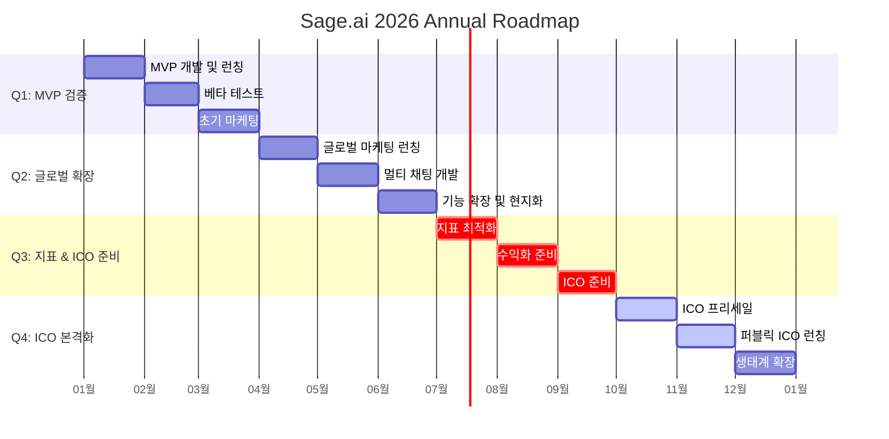

# Sage.ai - 사업 기획서

```
문서 정보
├── 버전: 2.3
├── 최종 수정일: 2025년 12월 19일
├── 작성자: Sam
└── 대상 독자: 경영진, 투자자, 비즈니스 이해관계자
```

---

## 1. 핵심 요약 (Executive Summary)

### 1.1 비전

> **"모든 개인 투자자에게 월가 수준의 AI 멘토를"**

### 1.2 문제 정의

암호화폐 투자자들은 **정보 과부하**, **신뢰할 수 없는 리딩방**, **24시간 시장 모니터링 불가능**이라는 3가지 핵심 문제에 직면해 있습니다.

### 1.3 솔루션

**월렛 버핏 (Wallet Buffett)** - 워렌 버핏의 투자 철학을 구현한 AI 멘토

```typescript
interface SageSolution {
  agentPipeline: {
    description: "에이전트 파이프라인";
    features: ["환각 제로화", "교차 검증"];
  };
  shadowPortfolio: {
    description: "섀도우 포트폴리오";
    targets: { roi: "벤치마크 +3%p", hitRate: "72.3%" };
  };
  proactiveAnalysis: {
    description: "능동적 분석";
    feature: "시장 급변 시 먼저 다가가는 멘토";
  };
  conversationalOnboarding: {
    description: "대화형 온보딩";
    feature: "설문 없이 자연스러운 대화로 프로필 파악";
  };
}
```

### 1.4 시장 기회

| 지표 | 규모 |
|------|------|
| 글로벌 암호화폐 시장 | $2.5조 → $6.3조 (2030, CAGR 9.7%) |
| AI 투자자문 시장 | $84억 → $693억 (2032, CAGR 30.3%) |
| 타겟 사용자 | 5.6억 명 (글로벌 암호화폐 투자자) |

### 1.5 타겟 고객 (3개 페르소나)

| 세그먼트 | 예시 | 자본 | 티어 | LTV |
|---------|------|------|------|-----|
| 입문자 (60%) | 민수, 27세 | 50만원 | Free | - |
| 중급자 (30%) | 지혜, 32세 | 2,000만원 | Pro $19.99/월 | $215 |
| 고급자 (10%) | 재현, 38세 | 1억원 | Premium $49.99/월 | $569 |

### 1.6 수익 모델

| Tier | 가격 | 핵심 기능 | 타겟 |
|------|------|----------|------|
| Free | $0 | 일 5회 대화 | 체험 유저 |
| Pro | $19.99/월 | 무제한 대화 + 섀도우 포트폴리오 | 입문/중급자 |
| Premium | $49.99/월 | Pro + 실시간 능동 알림 | 고급자 |

### 1.7 GTM 전략: Dual Hook

```
Dual Hook Strategy
├── 1. WhyBitcoinFallen.com (Viral Hook)
│   └── 목표: 월 방문자 10,000+ (Q1)
└── 2. Sage.ai Landing (Conversion Hook)
    └── 목표: 가입 전환율 10%+
```

### 1.8 핵심 경쟁력 (Moat)

- **월렛 버핏 페르소나** - 복제 불가능한 캐릭터 자산
- **환각 제로화** - Tool 강제 + 에이전트 파이프라인 검증
- **섀도우 포트폴리오** - 투명한 성과 추적
- **능동적 분석** - 15분마다 시장 분석, 자동 컨텍스트 생성

### 1.9 2026년 분기별 로드맵

| 분기 | 목표 | 핵심 마일스톤 |
|------|------|-------------|
| Q1 | MVP 검증 | WhyBitcoinFallen.com 런칭 + Sage.ai MVP, MAU 2,000+ |
| Q2 | 글로벌 확장 | 멀티 채팅 기능 + 4개 언어 지원, MAU 5,000+ |
| Q3 | 지표 개선 | 유료 구독 모델 런칭 + ICO 준비, MAU 15,000+ |
| Q4 | ICO & 확장 | ICO 본격화 + 생태계 구축, MAU 30,000+ |

### 1.10 2026년 말 예상 성과

| 지표 | 목표 (2026 Q4) |
|------|------|
| WhyBitcoinFallen.com 월 방문자 | 100,000+ |
| Sage.ai MAU | 30,000+ |
| 유료 구독자 | 450+ (전환율 1.5%) |
| Discord DAU | 1,000+ |
| Shadow Portfolio ROI | 목표 벤치마크 +3%p |

### 1.11 투자 하이라이트

```
투자 포인트
├── 1. 검증된 시장
│   └── 암호화폐 투자자 5.6억 명, 리딩방 사기 피해 연 1,266억원
├── 2. 차별화된 기술
│   └── 환각 제로 + 섀도우 포트폴리오로 신뢰 확보
├── 3. 강력한 해자
│   └── 페르소나 IP + 데이터 축적 + 커뮤니티 네트워크
└── 4. 확장 가능성
    └── 암호화폐 → 주식 → 부동산 → 전체 자산군
```

---

## 2. 핵심 문제 비교: 기존 시장 vs Sage.ai

### 2.1 기존 시장의 문제 해결 방식

| 구분 | 기존 솔루션 | 문제점 |
|------|------------|--------|
| 리딩방 | 텔레그램/카톡 기반 유료 투자 정보방 | 검증 불가능한 수익률, 70% 이상 바람잡이, 사기 피해 연간 1,266억원 이상 |
| 범용 AI | ChatGPT, Perplexity 등 | 실시간 시세 미반영, 투자 맥락 부재, 개인화 부족 |
| 로보어드바이저 | 알고리즘 기반 자산 배분 | 암호화폐 미지원 다수, 24시간 대응 불가, 정서적 멘토링 부재 |
| nof1.ai | AI 모델 간 실제 트레이딩 경쟁 | 관람 전용, 사용자 맞춤 조언 없음, 직접 상호작용 불가 |
| 퀀트 툴 | 기술적 분석 도구 | 높은 진입장벽, 해석 능력 필요, 정서적 지원 없음 |

### 2.2 Sage.ai의 해결 방식

| 기존 문제 | Sage.ai 솔루션 |
|----------|---------------|
| 검증 불가능한 실력 | **섀도우 포트폴리오**로 AI 조언의 수익률을 투명하게 추적 |
| 환각/허위 정보 | **에이전트 파이프라인 교차 검증** + 도구(Tool) 강제 사용으로 팩트 체크 |
| 단순 정보 나열 | **월렛 버핏 페르소나**가 투자 철학 기반 통찰 제공 |
| 수동적 대응 | **능동적 분석 시스템**으로 시장 급변 시 먼저 알림 |
| 24시간 대응 불가 | AI 기반 **24/7 즉각 응답** |
| 정서적 케어 부재 | 멘토 역할의 AI가 **멘탈 케어** 및 훈계 제공 |

---

## 3. 현황과 목표

### 3.1 현황

#### 시장 환경

**글로벌 암호화폐 시장:**
- 시장 규모: 2024년 약 2.5조 달러 → 2030년 6.3조 달러 전망 (CAGR 9.7%)
- 글로벌 사용자: 2024년 약 5.6억 명, 2025년 8.6억 명 이상 예상

**로보어드바이저 시장:**
- 시장 규모: 2024년 약 80억 달러 → 2032년 690억 달러 전망 (CAGR 30.3%)
- 밀레니얼/Z세대의 41%가 로보어드바이저 선호

#### 문제 상황

- 기존 리딩방의 사기 피해 심각 (국내 연간 1,266억원+)
- 범용 AI(GPT, GEMINI 등)는 실시간 시세 반영 부족, 투자 특화 기능 미흡
- nof1.ai 등 경쟁 서비스는 관람/실험 중심으로 실질적 조언 부재

### 3.2 목표

#### 2026년 연간 목표

```
2026년 목표
├── WhyBitcoinFallen.com (바이럴 사이트)
│   └── 월 방문자: 100,000+
├── Sage.ai (메인 서비스)
│   ├── MAU: 30,000+ (연말 기준)
│   ├── 유료 구독자: 450+ (전환율 1.5%)
│   └── Discord DAU: 1,000+
└── 제품
    ├── 4개 언어 지원 (한/영/일/중)
    └── 섀도우 포트폴리오 ROI 벤치마크 대비 +3%p 달성
```

---

## 4. 핵심 가치 (비전)

### 4.1 비전 선언문

> **"모든 개인 투자자에게 월가 수준의 AI 멘토를"**

### 4.2 핵심 가치

```typescript
interface CoreValues {
  trust: {
    name: "신뢰 (Trust)";
    features: [
      "환각 제로: 에이전트 파이프라인 교차 검증으로 무결점 데이터 제공",
      "투명한 성과: 섀도우 포트폴리오로 AI의 실력을 데이터로 증명"
    ];
  };
  wisdom: {
    name: "지혜 (Wisdom)";
    features: [
      "단순 정보가 아닌 통찰 제공",
      "월렛 버핏 페르소나를 통한 투자 철학 전달"
    ];
  };
  care: {
    name: "케어 (Care)";
    features: [
      "24시간 대응하는 AI 멘토",
      "시장 급변 시 먼저 다가가는 능동적 분석",
      "투자자의 멘탈 케어까지 책임"
    ];
  };
}
```

---

## 5. 문제 정의

### 5.1 정보 과부하와 '스승'의 부재

시장에 데이터는 넘쳐나지만, 이를 꿰뚫어 볼 지혜가 부족합니다. 투자자들은 단순한 정보 나열이 아닌, 혼란스러운 시장에서 **"자네, 본질을 보게"**라고 일깨워줄 멘토를 갈망합니다.

**현실:**
- ChatGPT, Perplexity 등 범용 AI: 정보 합성 능력은 뛰어나나 투자 맥락과 개인화 부족
- 리딩방: 검증 불가능한 '전문가' 난립, 신뢰 구축 실패

### 5.2 신뢰의 간극 (Trust Gap)

자칭 전문가들은 많지만, 검증된 실력을 갖춘 '진짜'는 찾기 힘듭니다.

**문제점:**
- 리딩방 인원의 70% 이상이 바람잡이
- AI가 아무리 똑똑해도, 그 조언이 실제로 부(Wealth)를 가져다주는지 검증할 시스템 부재
- nof1.ai는 AI 실력을 시험하지만, 개인 투자자에게 직접적 조언을 제공하지 않음

### 5.3 수동적인 서비스 구조

대부분의 서비스는 사용자가 물어봐야만 답합니다. 하지만 진정한 스승은 제자가 위험에 처했을 때(시장 급변) 먼저 나서서 깨우침을 주고 멘탈을 케어해 주어야 합니다.

**결과:**
- 시장 급변 시 투자자는 혼자 판단해야 함
- 패닉셀, FOMO 등 감정적 의사결정으로 인한 손실 발생

---

## 6. 솔루션: 에이전트 매니저 시스템

단순 LLM 호출이 아닌, **Claude 기반의 전문 에이전트**들이 협업하여 '월렛 버핏'이라는 하나의 인격을 완성하는 오케스트레이션 시스템입니다.

### 6.1 에이전트 오케스트레이션 (Logic Flow)

```
에이전트 플로우
│
├── [사용자 질문]
│       ↓
├── [Manager Agent] - 의도 파악 및 라우팅
│       ↓
├── [Analyst Agent] - 뉴스/가격 API로 Fact 수집
│       ↓
├── [Persona Agent] - 월렛 버핏이 철학 기반 해석
│       ↓
├── [Risk Agent] - 오류/편향 검증
│       ↓
└── [최종 응답]
```

### 6.2 전문 에이전트 구성

| 에이전트 | 모델 | 핵심 기술 | 역할 |
|---------|------|----------|------|
| Manager | Haiku 4 | Router, State Manager | 대화 흐름 조율, 적절한 에이전트 연결 |
| Analyst | Haiku 4 | Search API, Price Fetcher, Calculator | 감정 배제, 시장 현상(Fact) 수집 |
| Persona | Sonnet 4 | Style Transfer, Reasoning | **월렛 버핏**: 통찰과 가르침 전달 |
| Risk | Haiku 4 | Compliance Check, Fact Verification | 사실 오류/법적 위험 최종 확인 |

### 6.3 핵심 기능

#### 6.3.1 매매 타이밍 가이드 (Timing Guidance)

직접적인 "지금 사라/팔아라" 신호가 아닌, 시장 상황에 대한 **정성적 판단**을 제공합니다.

| 구분 | 제공 방식 | 예시 |
|------|----------|------|
| 긍정적 시점 | 조건 기반 설명 | "자네, RSI가 30 아래로 내려갔고 거래량이 줄었네. 과매도 구간에서 공포가 극에 달했을 때가 기회일 수 있지" |
| 부정적 시점 | 위험 요소 안내 | "지금은 탐욕 지수가 85를 넘었네. 모두가 흥분할 때 한 발 물러서는 게 현명하지 않겠나" |
| 중립적 시점 | 관망 제안 | "아직 방향성이 불분명하네. 성급하게 움직이기보다 좀 더 지켜보는 것이 어떻겠나" |

**법적 안전장치:**
- "~하라"가 아닌 "~할 수 있다", "~를 고려해볼 만하다" 형태의 조건부 표현 사용
- 모든 타이밍 가이드에는 기술적 지표, 온체인 데이터, 시장 심리 등 근거 명시

#### 6.3.2 시장 전망 리포트 (Market Outlook)

경제 지표 발표, 금리 결정 등 매크로 이벤트가 **사용자의 관심 종목에 미치는 영향**을 분석합니다.

| 이벤트 유형 | 분석 내용 | 제공 시점 |
|------------|----------|----------|
| 금리 결정 | FOMC 결과가 BTC/ETH에 미치는 영향 | 발표 직후 + 사전 예측 |
| 고용지표 | 비농업 고용, 실업률과 위험자산 상관관계 | 발표 당일 |
| CPI/PPI | 인플레이션 데이터와 암호화폐 가격 연동성 | 발표 직후 |
| 규제 뉴스 | SEC, 각국 규제 동향이 특정 코인에 미치는 영향 | 실시간 |
| Twitter/X | 인플루언서 발언, 트렌딩 해시태그 | 심리 분석, 루머 탐지 |
| 뉴스 API | 속보, 규제 뉴스, 기업 발표 | 팩트 기반 원인 분석 |
| 온체인 데이터 | 고래 이동, 거래소 입출금 | 대규모 매매 탐지 |
| 청산 데이터 | 롱/숏 청산 규모 | 급변동 원인 파악 |

**특징:**
- **개인화:** 사용자가 등록한 관심 종목 기준으로 맞춤 전망 제공
- **시나리오 분석:** "금리 동결 시 / 인상 시 / 인하 시" 각각의 시나리오별 전망

#### 6.3.3 포트폴리오 점검 (Portfolio Health Check)

사용자의 실제 보유 현황을 분석하여 **자산 배분, 리스크 수준, 개선 방향**을 제시합니다.

**예시: 포트폴리오 점검 결과**

| 항목 | 비중 | 금액 | 평단가 | 수익률 |
|------|------|------|--------|--------|
| BTC | 40% | $4,000 | $95,000 | +5% |
| ETH | 35% | $3,500 | $3,200 | -2% |
| SOL | 15% | $1,500 | $180 | +12% |
| 현금 | 10% | $1,000 | - | - |
| **총 자산** | **100%** | **$10,000** | - | - |

| 구분 | 내용 |
|------|------|
| 진단 | 현금 비중이 10%로 낮은 편이네. 급락 시 추가 매수 여력이 부족할 수 있어. |
| 제안 | 현금 20~30%를 유지하면 더 유연하게 대응할 수 있을 걸세. |

**기능:**
- **연동 방식:** 거래소 API 연동 또는 수동 입력
- **점검 항목:** 자산 배분 비율, 평균 매수가, 미실현 손익, 레버리지 현황, 현금 비중
- **정기 리포트:** 주간/월간 포트폴리오 변화 추적

#### 6.3.4 리스크 경고 시스템 (Risk Alert)

사용자의 투자 행태를 모니터링하여 **위험 수준이 높아지면 선제적으로 경고**합니다.

| 경고 유형 | 트리거 조건 | 경고 메시지 예시 |
|----------|------------|----------------|
| 과도한 레버리지 | 레버리지 10x 이상 | "자네, 10배 레버리지는 칼날 위를 걷는 것과 같네. 5% 역방향 움직임이면 청산이야. 정말 감당할 수 있겠나?" |
| 낮은 현금 비중 | 현금 5% 미만 | "현금이 거의 없군. 기회가 와도 잡을 총알이 없으면 구경만 해야 하네." |
| 단일 자산 집중 | 특정 자산 70%+ | "한 바구니에 모든 달걀을 담았군. 분산이 필요하지 않겠나?" |
| 손실 확대 | 미실현 손실 -30% 이상 | "손실이 커지고 있네. 손절은 부끄러운 게 아니야. 다음 기회를 위해 자본을 지키는 것도 전략이지." |
| FOMO 패턴 | 급등 직후 매수 시도 | "모두가 뛰어들 때 함께 뛰어드는 건 위험하네. 한 발 물러서서 생각해보게." |

**알림 설정:**
- **채널:** 앱 푸시, Discord, 카카오톡
- **강도 조절:** 사용자 설정에 따라 경고 민감도 조절 가능

#### 6.3.5 섀도우 포트폴리오 (Shadow Portfolio)

월렛 버핏의 조언을 가상으로 추적하여 **AI의 실력을 투명하게 검증**하는 시스템입니다.

**예시: 월렛 버핏의 섀도우 포트폴리오 (목표 성과)**

| 항목 | 내용 |
|------|------|
| 시작일 | 2025.01.15 |
| 초기 자본 | $10,000 (가상) |
| 목표 수익률 | 벤치마크 +3%p |
| 벤치마크(BTC) | - |
| 목표 초과 수익 | +3%p |

**목표 성과 지표:**

| 지표 | 목표값 |
|------|--------|
| 총 인사이트 | 47건 이상 |
| 적중률 | 72.3% 이상 |
| 평균 보유 기간 | 12일 |
| 최대 낙폭(MDD) | -8.2% 이내 |
| 샤프 비율 | 1.84 이상 |

**작동 방식:**

| 단계 | 설명 |
|------|------|
| 1. 인사이트 발생 | 월렛 버핏이 특정 자산에 대한 견해 제시 |
| 2. 스냅샷 저장 | 해당 시점의 가격, 시장 상황 자동 기록 |
| 3. 사용자 선택 | [담기] 버튼으로 섀도우 포트폴리오에 추가 |
| 4. 추적 시작 | 가상 매수로 처리, 이후 가격 변동 추적 |
| 5. 성과 계산 | 수익률, 벤치마크 대비 성과, 적중률 산출 |
| 6. 투명 공개 | 전체 기록을 대시보드에서 공개 |

**포트폴리오 구성 규칙:**
- 가상 자본: $100,000 (고정)
- 단일 포지션 한도: 최대 20%
- 최대 포지션 수: 10개
- 벤치마크: BTC 단순 보유 전략
- 리밸런싱: 월 1회 자동 점검

**공개 지표:**

| 지표 | 설명 | 목표 |
|------|------|------|
| 절대 수익률 | 시작 대비 총 수익 | 양수 유지 |
| 초과 수익률 | BTC 벤치마크 대비 | +3%p 이상 |
| 적중률 | 수익 실현 인사이트 비율 | 65% 이상 |
| MDD | 최대 낙폭 | -15% 이내 |
| 샤프 비율 | 위험 대비 수익 | 1.5 이상 |

#### 6.3.6 능동적 분석 시스템 (Engagement Moat)

- 사용자가 묻기 전에 먼저 다가가는 서비스
- 시장 급변 시 즉각적인 멘탈 케어
- 높은 재방문율과 충성도 유도

**시스템 작동 방식:**

```
능동적 분석 시스템
├── 정해진 인터벌(15분)마다 시장 데이터를 각 에이전트에게 제공
├── 사용자의 입력 없이도 미리 시장을 분석하고 요약 (자동 컨텍스트 생성)
├── 이전 분석 데이터를 기반으로 연속적인 분석 진행
├── 컨텍스트 압축 기능
│   ├── 15분 분석 4개 → 1시간 분석 1개로 압축
│   ├── 1시간 분석 4개 → 4시간 분석 1개로 압축
│   └── 4시간 분석 6개 → 1일 분석 1개로 압축
└── 페르소나들이 사전에 판단하고 중요한 인사이트를 사용자에게 능동 전달
```

### 6.4 사용자 여정 (User Journey Map)

**예시: "지금 비트코인 가격이 왜 급락했나요?" 알림 푸시를 받고 접속했을 때**

```
사용자 여정
├── [푸시 알림 수신]
│       ↓
├── [앱/웹 접속]
│       ↓
├── [시황 이슈 분석 화면]
│   ├── 3줄 요약 즉시 표시
│   └── 원인/영향/전망 구조화된 설명
│       ↓
├── [사용자 추가 질문]
│   └── "내 포트폴리오는 괜찮아?"
│       ↓
├── [포트폴리오 점검 실행]
│   ├── 리스크 수준 진단
│   └── 대응 방안 제시
│       ↓
└── [행동 유도]
    ├── 섀도우 포트폴리오에 조언 담기
    └── Discord 커뮤니티에서 토론 참여
```

**고객 세그먼트별 핵심 시나리오:**
- **초보 투자자:** 용어 설명 → 기본 분석 → 교육 콘텐츠
- **중급 투자자:** 심층 분석 → 포트폴리오 점검 → 타이밍 가이드
- **고급 투자자:** 매크로 분석 → 시나리오 시뮬레이션 → 고급 지표

---

## 7. 시장 기회

### 7.1 글로벌 암호화폐 시장

| 지표 | 2024년 | 2030년 전망 | CAGR |
|------|--------|-------------|------|
| 시장 규모 | $2.5조 | $6.3조 | 9.7% |
| 사용자 수 | 5.6억 명 | 11억 명+ | - |
| 거래 플랫폼 시장 | $270억 | $889억 (2033) | 11.2% |

### 7.2 AI 투자자문 시장 (로보어드바이저)

| 지표 | 2024년 | 2032년 전망 | CAGR |
|------|--------|-------------|------|
| 시장 규모 | $84억 | $693억 | 30.3% |
| 관리 자산 | $1조+ | $2조+ (2027) | - |

### 7.3 타겟 시장 규모 (TAM/SAM/SOM)

```
시장 규모 분석
├── TAM (Total Addressable Market)
│   └── 글로벌 암호화폐 투자자 5.6억 명
├── SAM (Serviceable Available Market)
│   └── AI 투자 도구에 관심 있는 투자자 약 1억 명 (밀레니얼/Z세대 중심)
└── SOM (Serviceable Obtainable Market)
    └── 초기 타겟 4개 권역(한중일+영미권) 유료 전환 가능 사용자 약 500만 명
```

### 7.4 지역별 암호화폐 채택 현황

| 지역 | 사용자 수 (2024) | 점유율 |
|------|-----------------|--------|
| 인도 | 1.07억 명 | 1위 |
| 미국 | 5,300만 명 | 2위 |
| 인도네시아 | 3,900만 명 | 3위 |
| 중국 | 5,900만 명 | 주요 시장 |
| 일본 | 1,000만 명+ | 선진 시장 |
| 한국 | 500만 명+ | 활발한 거래 |

---

## 8. 고객 세그먼트

### 8.1 Primary Target: 암호화폐 개인 투자자

#### 인구통계
- **연령:** 25-45세 (밀레니얼 + Z세대)
- 밀레니얼/Z세대의 50%가 암호화폐 투자 경험 보유
- 밀레니얼의 41%가 로보어드바이저 선호

#### 행동 특성
- 24시간 시장을 따라가기 어려움
- FOMO, 패닉셀 등 감정적 의사결정 경험
- 정보 과부하로 인한 판단 어려움
- 신뢰할 수 있는 멘토/가이드 필요

#### Pain Points
- "비트코인이 왜 떨어졌는지 빨리 알고 싶다"
- "지금 사야 하나 팔아야 하나 결정이 어렵다"
- "혼자 판단하기 무섭다"
- "리딩방은 믿을 수 없다"

### 8.2 Secondary Target: 투자 입문자

#### 특성
- 암호화폐에 관심 있지만 시작 방법을 모름
- 복잡한 차트/분석 도구에 거부감
- 친근하고 이해하기 쉬운 설명 필요

### 8.3 글로벌 타겟 권역

| 권역 | 특성 | 진입 전략 |
|------|------|----------|
| 한국 | 활발한 거래, 리딩방 문화 익숙 | 한국어 최적화, 카카오 연동 |
| 일본 | 규제 명확, 보수적 투자 성향 | 신뢰/안정성 강조, 일본어 지원 |
| 중국 | 최대 사용자 풀, 규제 리스크 | 해외 서버, 중국어 지원 |
| 영미권 | 가장 큰 시장 점유율, 규제 정비 중 | 영어 기본, 미국/유럽 확장 |

---

## 9. 경쟁 환경

### 9.1 직접 경쟁

| 경쟁사 | 유형 | 강점 | 약점 |
|--------|------|------|------|
| 리딩방 (국내) | 유료 정보방 | 커뮤니티 형성, 즉각적 신호 | 사기 다수, 검증 불가, 바람잡이 70%+ |
| nof1.ai | AI 트레이딩 경쟁 플랫폼 | 실제 자금 운용, 온체인 투명성 | 관람 전용, 개인 조언 없음, 상호작용 불가 |

### 9.2 간접 경쟁

| 경쟁사 | 유형 | 강점 | 약점 |
|--------|------|------|------|
| ChatGPT | 범용 AI | 범용성, 대중적 인지도, 창의적 응답 | 실시간 시세 부족, 투자 특화 X, 개인화 부족 |
| Perplexity | AI 검색 엔진 | 실시간 웹 검색, 출처 명시 | 투자 조언 특화 X, 페르소나 없음 |
| 로보어드바이저 | 자동 자산 배분 | 검증된 알고리즘, 규제 준수 | 암호화폐 미지원 다수, 24시간 대응 X, 정서적 케어 없음 |

### 9.3 경쟁 포지셔닝 맵

| 분류 | 정보 제공 중심 | 조언/멘토링 중심 |
|------|---------------|-----------------|
| 개인화/맞춤형 | 리딩방 | **Sage.ai** |
| 범용/일반적 | Perplexity, ChatGPT | nof1.ai |

**포지셔닝 요약:**
- Sage.ai는 "개인화 + 멘토링" 영역에서 독보적 위치 확보
- 리딩방 대비: 검증된 AI로 신뢰도 우위
- 범용 AI 대비: 투자 특화 페르소나로 차별화
- nof1.ai 대비: 직접적인 1:1 상호작용 제공

---

## 10. 경쟁력 / 해자 (Moat)

### 10.1 핵심 경쟁력

```typescript
interface CompetitiveAdvantages {
  personaMoat: {
    name: "월렛 버핏 페르소나 (Persona Moat)";
    features: [
      "단순 정보 제공이 아닌 철학 기반 멘토링",
      "워렌 버핏의 투자 원칙(안전마진, 해자, 장기투자)을 AI로 구현",
      "친근하면서도 권위 있는 말투로 신뢰 형성",
      "경쟁사가 쉽게 복제하기 어려운 캐릭터 자산"
    ];
  };
  trustMoat: {
    name: "환각 제로화 시스템 (Trust Moat)";
    features: [
      "에이전트 파이프라인 교차 검증 아키텍처",
      "Tool 강제 사용으로 수치 오류 원천 차단",
      "금융 분야에서 가장 중요한 정확성 확보"
    ];
  };
  validationMoat: {
    name: "섀도우 포트폴리오 (Validation Moat)";
    features: [
      "AI 조언의 성과를 투명하게 추적/공개",
      "'말만 하는 AI'가 아닌 실력이 검증된 AI",
      "경쟁사 대비 명확한 차별점"
    ];
  };
  engagementMoat: {
    name: "능동적 분석 시스템 (Engagement Moat)";
    features: [
      "사용자가 묻기 전에 먼저 다가가는 서비스",
      "시장 급변 시 즉각적인 멘탈 케어",
      "높은 재방문율과 충성도 유도"
    ];
  };
}
```

### 10.2 방어 가능한 해자

| 해자 유형 | 설명 | 방어력 |
|----------|------|--------|
| 데이터 해자 | 섀도우 포트폴리오 누적 데이터 | 시간이 지날수록 강화 |
| 네트워크 해자 | Discord/오픈채팅 커뮤니티 | 사용자 간 상호작용으로 이탈 방지 |
| 컨텍스트 해자 | 능동적 분석 시스템 | 경쟁사 모방 어려움 |
| 브랜드 해자 | 월렛 버핏 캐릭터 인지도 | IP화 가능 |
| 전환 비용 | 개인화된 조언 히스토리 | 다른 서비스로 이전 시 손실 |

---

## 11. 비즈니스 모델 / GTM 전략

### 11.1 수익 모델

#### Freemium 구독 모델

| 티어 | 가격 | 기능 |
|------|------|------|
| Free | $0 | 기본 대화 (일 5회), 뉴스 요약 |
| Pro | $19.99/월 | 무제한 대화, 심층 분석, 섀도우 포트폴리오 3개 |
| Premium | $49.99/월 | Pro 전체 + 실시간 능동 알림, 무제한 포트폴리오, 우선 응답 |

#### 향후 수익원

- **Contextual Ads:** 대화 맥락을 해치지 않는 자연스러운 광고
- **API 라이선스:** B2B 파트너십 (거래소, 자산운용사)

### 11.2 GTM 전략: Dual Hook Strategy

#### Phase 0-A: Viral Hook - WhyBitcoinFallen.com

**컨셉:** 넷플릭스 `fast.com` 벤치마킹

**기능:**
- 접속 즉시 "오늘 비트코인이 왜 떨어졌는지" 3줄 요약 + 실시간 차트
- 다국어 지원 (한/영, Q2부터 일/중 추가)

**목적:** 대중의 궁금증(Why)을 즉시 해소하며 브랜드 인지도 확보

**목표:** 월 방문자 10,000+ (Q1)

#### Phase 0-B: Conversion Hook - Sage.ai Landing Page

**컨셉:** "어제 월렛 버핏의 말을 들었다면..."

**기능:**
- 대시보드 카드 UI로 과거 조언의 수익률 시각화
- 예: "어제 '공포에 사라'고 했을 때 담았던 DOGE, 오늘 +15%"

**목적:** 구루의 실력을 직관적으로 보여주어 가입 유도

**목표:** 가입 전환율 10%+

### 11.3 GTM Funnel

```
GTM Funnel
├── [Awareness]
│   └── Google 검색 "비트코인 왜 떨어졌어"
│       ↓
├── [Interest]
│   └── WhyBitcoinFallen.com 방문
│   └── "전세계 투자자들과 함께 투자하기" 클릭
│       ↓
├── [Desire]
│   └── Sage.ai 랜딩
│   └── "어제 투자했다면 +15%" 카드 → FOMO 발생
│       ↓
├── [Action]
│   └── 회원가입 → 월렛 버핏과 1:1 문답 시작
│       ↓
└── [Retention]
    └── Discord 알림 → 웹 재방문 → 유료 전환
```

### 11.4 커뮤니티 전략

| 채널 | 역할 | 2026년 말 목표 |
|------|------|---------------|
| Discord | 주요 허브, 능동 알림 전달 | DAU 1,000+ |
| 카카오 오픈채팅 | 국내 보조 채널 | 한국어 커뮤니티 형성 |
| Twitter/X | 바이럴 콘텐츠 배포 | 팔로워 10,000+ |

---

## 12. 성공 지표 (KPI)

### 12.1 AAARRR 프레임워크 기반 KPI

| 단계 | 지표 | 2026년 말 목표 | 측정 방법 |
|------|------|---------------|----------|
| Awareness | WhyBitcoinFallen.com 월 방문자 | 100,000+ | 바이럴 사이트 월 UV |
| Acquisition | Sage.ai 랜딩 방문 | 300+/일 | 랜딩 페이지 UV |
| Activation | 가입 전환율 | 10%+ | 랜딩 → 가입 |
| Retention | Sage.ai MAU | 30,000+ | 월간 활성 사용자 |
| Revenue | 유료 구독자 | 450+ | Free → Pro/Premium (전환율 1.5%) |
| Referral | NPS | 50+ | 분기별 설문 |

### 12.2 핵심 성과 지표

| 카테고리 | 지표 | 2026년 말 목표 | 설명 |
|---------|------|---------------|------|
| Engagement | 평균 세션 시간 | 5분+ | 깊은 대화 유도 |
| Trust | 환각 발생률 | <1% | Fact 오류 비율 |
| Performance | Shadow Portfolio ROI | 벤치마크 +3%p | 시장 대비 초과 수익률 |
| Community | Discord DAU | 1,000+ | 커뮤니티 활성도 |

---

## 13. 위험 평가 / 규제 대응

### 13.1 위험 매트릭스

| 위험 유형 | 발생 확률 | 영향도 | 우선순위 |
|----------|----------|--------|----------|
| 금융 환각 | 중 | 매우 높음 | Critical |
| 법적 리스크 | 중 | 높음 | High |
| 경쟁사 진입 | 높음 | 중 | Medium |
| 흥미 저하 | 중 | 중 | Medium |

### 13.2 위험별 완화 전략

#### 금융 환각 (Financial Hallucination)

**Risk:** 권위 있는 월렛 버핏의 말이 틀렸을 때 치명적 신뢰 하락

**Mitigation:**
- **Tool 강제:** 수치 계산은 LLM이 아닌 Calculator 도구 사용 의무화
- **Analyst 분리:** 월렛 버핏은 '해석'만, '팩트 체크'는 별도 에이전트
- **Risk Agent:** 최종 교차 검증으로 오류 필터링

#### 법적 리스크 (Regulatory)

**Risk:** 미등록 투자자문업 오인

**Mitigation:**
- **시장 선택:** 초기에는 투자자문업 규제가 느슨한 암호화폐 시장 집중
- **가상 트래킹:** 실제 매매가 아닌 '지혜의 검증' 과정임을 명시
- **Disclaimer:** 모든 조언은 '교육적 목적', AI 페르소나임을 시스템적 명시
- **프롬프트 제한:** 직접적 매매 신호("지금 사세요") 제공 금지

#### 국가별 규제 대응

| 국가 | 규제 현황 | 대응 전략 |
|------|----------|----------|
| 한국 | 가상자산사업자 신고제 | 투자자문 회피, 정보 제공으로 포지셔닝 |
| 일본 | 암호자산 규제 명확 | 금융청 가이드라인 준수 |
| 미국 | SEC 규제 강화 추세 | Disclaimer 강화, 증권성 회피 |
| 중국 | 암호화폐 거래 금지 | 해외 서버, 정보 제공으로 한정 |

#### 흥미 저하 (Boredom)

**Risk:** 뻔한 훈계만 반복하여 이탈

**Mitigation:**
- **Provocative Prompting:** 날카로운 비판 능력 부여
  - 예: "자네, 그건 투자가 아니라 도박일세. 정신 차리게."
- 다양한 시장 상황에 맞는 멘트 라이브러리 구축

---

## 14. 로드맵 (2026년 연간)

### 14.1 Q1 2026: MVP 검증 및 초기 마케팅 (1월 - 3월)

**목표:** GTM 전략(Dual Hook) 실행 및 MVP 검증, 초기 사용자 확보

| 월 | 단계 | 마일스톤 및 핵심 과업 |
|---|------|---------------------|
| 1월 | MVP 개발 | WhyBitcoinFallen.com 개발 및 런칭 (Vite + React, 한/영), Sage.ai 랜딩 페이지(Waitlist) 개발, Claude API 연동 및 Manager/Analyst 에이전트 구현, 섀도우 포트폴리오 엔진 개발 |
| 2월 | 베타 테스트 | 클로즈드 베타 테스트(CBT) 진행, 환각(Hallucination) 테스트 및 개선, Discord 커뮤니티 개설 및 운영 시작, 에이전트 파이프라인 오케스트레이션 고도화 |
| 3월 | 초기 마케팅 | 퍼블릭 베타 오픈 (Waitlist 우선 초대), 섀도우 포트폴리오 성과 마케팅 시작, 능동적 분석 시스템 구현, 초기 사용자 피드백 기반 UX 개선 |

**Q1 산출물:**
- WhyBitcoinFallen.com 라이브 (한/영 동시 지원)
- WhyBitcoinFallen.com 월 방문자: 10,000+
- Sage.ai MVP 베타 버전 (한/영 UI)
- Sage.ai MAU: 2,000+
- Waitlist 1,000명 이상 확보
- Discord 커뮤니티 DAU: 200+
- 환각률: 1% 미만

### 14.2 Q2 2026: 글로벌 마케팅 & 멀티 채팅 기능 (4월 - 6월)

**목표:** 글로벌 시장 진출 및 멀티 채팅 기능 구현으로 사용성 강화

| 월 | 단계 | 마일스톤 및 핵심 과업 |
|---|------|---------------------|
| 4월 | 글로벌 런칭 | 영미권 본격 마케팅 (Product Hunt, Reddit, Twitter), 영문 뉴스 소스 및 온체인 데이터 확장, 글로벌 인플루언서 파트너십 구축 |
| 5월 | 멀티 채팅 개발 | 멀티 채팅 기능 설계 및 개발, 채팅방별 컨텍스트 관리 시스템 구현, 일본어/중국어 UI 현지화 시작 |
| 6월 | 기능 확장 | 멀티 채팅 베타 런칭, 일본어/중국어 버전 런칭, 국가별 커뮤니티 확장 (Telegram/Line) |

**Q2 산출물:**
- WhyBitcoinFallen.com 월 방문자: 20,000+
- Sage.ai MAU: 20,000+
- 멀티 채팅 기능 정식 오픈
- 4개 언어 지원 (한/영/일/중)
- Discord DAU: 500+

### 14.3 Q3 2026: 지표 개선 & ICO 준비 (7월 - 9월)

**목표:** 핵심 지표 최적화 및 토큰 이코노미 설계, ICO 준비 완료

| 월 | 단계 | 마일스톤 및 핵심 과업 |
|---|------|---------------------|
| 7월 | 지표 최적화 | Retention 개선 (목표: 40%+), NPS 향상 작업 (목표: 40점+), 에이전트 정확도 고도화, 응답 속도 최적화 |
| 8월 | 수익화 준비 | 유료 구독 모델 설계 (Pro/Premium), 결제 모듈 연동, 토큰 이코노미 설계 시작, 법률/회계 자문 확보 |
| 9월 | ICO 준비 | 백서(Whitepaper) 작성, 토큰 스마트 컨트랙트 개발, ICO 플랫폼 선정 및 계약, 마케팅 자료 제작 |

**Q3 산출물:**
- WhyBitcoinFallen.com 월 방문자: 50,000+
- Sage.ai MAU: 40,000+
- 유료 구독자: 500+ (전환율 1.25%)
- Retention: 40%+
- NPS: 40점+
- ICO 백서 및 법적 준비 완료
- Discord DAU: 800+

### 14.4 Q4 2026: ICO 본격화 & 마케팅 부스팅 (10월 - 12월)

**목표:** ICO 성공적 진행 및 대규모 마케팅으로 생태계 확장

| 월 | 단계 | 마일스톤 및 핵심 과업 |
|---|------|---------------------|
| 10월 | ICO 프리세일 | 프리세일 진행 (Early Adopter 대상), 토큰 상장 준비, 대규모 마케팅 캠페인 시작 |
| 11월 | ICO 본격화 | 퍼블릭 ICO 런칭, 글로벌 마케팅 부스팅 (유료 광고, PR), 거래소 상장 협의 |
| 12월 | 생태계 확장 | 토큰 유틸리티 구현 (거버넌스, 스테이킹 등), B2B API 파트너십 확보, 2027년 로드맵 발표 |

**Q4 산출물:**
- WhyBitcoinFallen.com 월 방문자: 100,000+
- Sage.ai MAU: 30,000+
- 유료 구독자: 450+ (전환율 1.5%)
- ICO 완료 및 토큰 상장
- B2B 파트너: 2-3개 확보
- Discord DAU: 1,000+

### 14.5 2026년 연간 타임라인 시각화



### 14.6 주요 이정표 (Key Milestones)

| 분기 | 이정표 | 핵심 성공 지표 (KPI) |
|------|--------|---------------------|
| Q1 | MVP 검증 완료 | WhyBitcoinFallen 월 방문자: 10,000+, Sage.ai MAU: 2,000+, 유료 구독자: 30+, 환각률: 1% 미만, Discord DAU: 200+ |
| Q2 | 글로벌 확장 | WhyBitcoinFallen 월 방문자: 20,000+, Sage.ai MAU: 5,000+, 유료 구독자: 75+, 4개 언어 지원, Discord DAU: 500+ |
| Q3 | 지표 개선 & ICO 준비 | WhyBitcoinFallen 월 방문자: 50,000+, Sage.ai MAU: 15,000+, 유료 구독자: 225+, Retention: 40%+, NPS: 50+, Discord DAU: 800+ |
| Q4 | ICO & 생태계 확장 | WhyBitcoinFallen 월 방문자: 100,000+, Sage.ai MAU: 30,000+, 유료 구독자: 450+, ICO 완료, B2B 파트너: 2-3개, Discord DAU: 1,000+ |

### 14.7 분기별 주요 Focus

```
분기별 Focus
├── Q1: 제품 검증 (Product-Market Fit)
│   ├── 핵심 기능 구현 및 안정화
│   ├── 초기 사용자 확보 및 피드백 수집
│   └── 바이럴 마케팅을 통한 오가닉 성장
│
├── Q2: 시장 확장 (Market Expansion)
│   ├── 글로벌 마케팅 본격화
│   ├── 멀티 채팅으로 사용성 강화
│   └── 다국어 지원으로 시장 다변화
│
├── Q3: 비즈니스 모델 완성 (Business Model)
│   ├── 핵심 지표 최적화로 투자 유치 준비
│   ├── 수익화 모델 런칭
│   └── ICO 법적/기술적 준비 완료
│
└── Q4: 생태계 구축 (Ecosystem Building)
    ├── ICO 성공적 진행
    ├── 토큰 이코노미 가동
    └── 장기 성장 기반 마련
```

---

## 부록: 2026년 핵심 지표 요약표

### A. 트래픽 지표

| 지표 | Q1 | Q2 | Q3 | Q4 (연말 목표) |
|------|----|----|----|--------------:|
| WhyBitcoinFallen 월 방문자 | 10,000+ | 20,000+ | 50,000+ | 100,000+ |
| Sage.ai MAU | 2,000+ | 5,000+ | 15,000+ | 30,000+ |

### B. 수익화 지표

| 지표 | Q1 | Q2 | Q3 | Q4 (연말 목표) |
|------|----|----|----|--------------:|
| 유료 구독자 | 30+ | 75+ | 225+ | 450+ |
| 전환율 | 1.5% | 1.5% | 1.5% | 1.5% |

### C. 커뮤니티 지표

| 지표 | Q1 | Q2 | Q3 | Q4 (연말 목표) |
|------|----|----|----|--------------:|
| Discord DAU | 200+ | 500+ | 800+ | 1,000+ |
| Waitlist | 1,000+ | - | - | - |

### D. 제품 지표

| 지표 | Q1 | Q2 | Q3 | Q4 |
|------|----|----|----|----|
| 지원 언어 | 한/영 | 한/영/일/중 | 한/영/일/중 | 한/영/일/중 |
| 환각률 | <1% | <1% | <1% | <1% |
| Retention | - | - | 40%+ | 40%+ |
| NPS | - | - | 40점+ | 40점+ |

---

**문서 끝**

_"Between the zeros and ones"_
