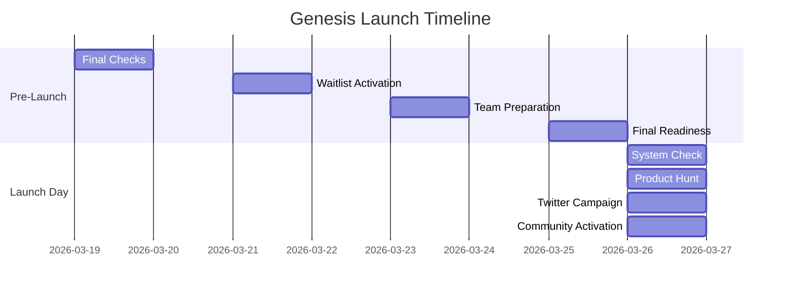
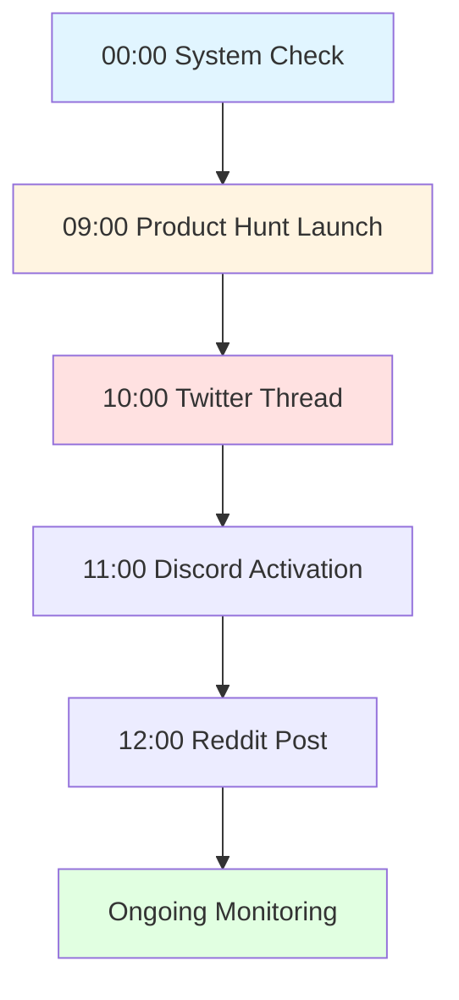
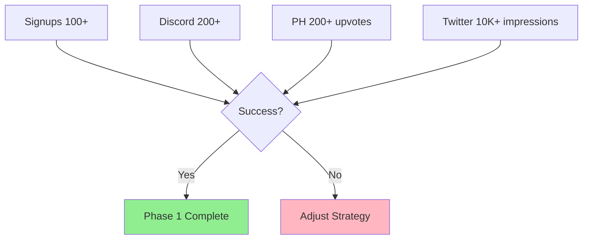
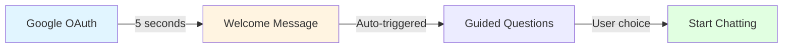
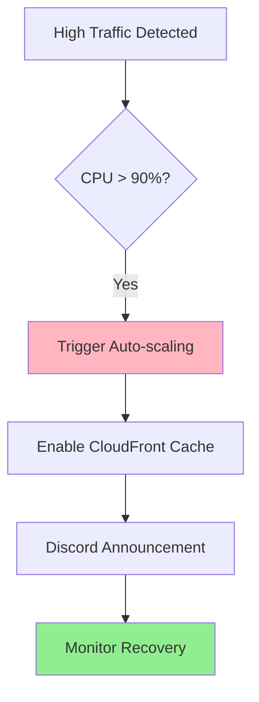
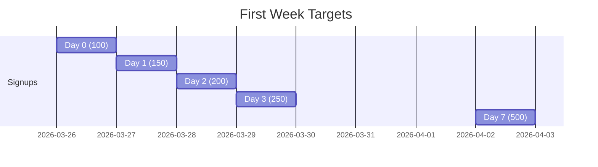
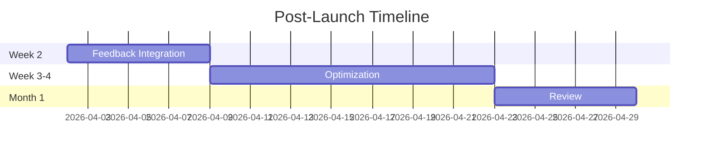

# Sage.ai Genesis Operations

> **Document Version**: 1.0
> **Last Updated**: 2025년 12월 19일
> **Author**: Sam
> **Target Audience**: Operations Team, Management

---

## 1. Genesis Phase Overview

### 1.1 Timeline

```typescript
interface GenesisTimeline {
  dDay: 'MVP Public Launch Day';
  phase: 'M3 Week 12';
  duration: string;
}
```

**D-Day**: MVP Public Launch Day (M3 Week 12)

### 1.2 Objectives

```typescript
interface GenesisObjectives {
  uptime: {
    target: string;
    metric: 'Service availability';
  };
  onboarding: {
    target: number;
    metric: 'First 100 users';
  };
  viralMoment: {
    target: string;
    platform: 'Product Hunt';
  };
  community: {
    target: string;
    platform: 'Discord';
  };
}
```

1. **Zero-Downtime Launch** - 99%+ uptime
2. **First 100 Users** - Successful onboarding
3. **Viral Moment** - Product Hunt top 5
4. **Community Activation** - Discord 200+ members

---

## 2. Pre-Launch (D-7 to D-1)

### 2.1 Launch Timeline



### 2.2 D-7: Final Checks

```typescript
interface PreLaunchChecks {
  technical: {
    production: boolean;
    database: boolean;
    monitoring: boolean;
    security: boolean;
  };
  content: {
    discord: boolean;
    twitter: boolean;
    productHunt: boolean;
    blog: boolean;
  };
}
```

#### 2.2.1 Technical Checklist

**Infrastructure**:
- [ ] Production deployment complete (ECS Fargate)
- [ ] Database migration tested
- [ ] Sentry alerts tested
- [ ] CloudWatch dashboard verified
- [ ] SSL certificate validity confirmed
- [ ] DNS configuration verified

#### 2.2.2 Content Checklist

**Marketing Materials**:
- [ ] Discord channels finalized
- [ ] Twitter launch tweets scheduled (Buffer/Hootsuite)
- [ ] Product Hunt page draft written
- [ ] Blog posts final review

### 2.3 D-5: Waitlist Activation

```typescript
interface WaitlistActivation {
  emailCampaign: {
    recipients: number;
    content: string;
  };
  earlyAccess: {
    inviteCodes: boolean;
    discordInvite: boolean;
  };
}
```

**Tasks**:
- [ ] Send waitlist emails (100 recipients)
- [ ] Generate early access invite codes
- [ ] Share Discord invite links

### 2.4 D-3: Team Preparation

```typescript
interface TeamReadiness {
  onCall: {
    coverage: '24/7';
    channels: string[];
  };
  emergency: {
    runbook: boolean;
    communicationTest: boolean;
  };
}
```

**Preparation**:
- [ ] 24-hour on-call system established
- [ ] Emergency Runbook reviewed
- [ ] Communication channels tested (Slack/Discord)

### 2.5 D-1: Final Readiness

```typescript
interface FinalReadiness {
  qa: boolean;
  betaFeedback: boolean;
  pressKit: boolean;
  socialMedia: boolean;
}
```

**Final Steps**:
- [ ] Final QA testing
- [ ] Beta tester feedback implemented
- [ ] Press Kit prepared (logo, screenshots, copy)
- [ ] Launch tweets final review

---

## 3. Launch Day (D-Day)

### 3.1 Launch Flow



### 3.2 00:00 - System Health Check

```typescript
interface SystemHealth {
  apiHealth: string;
  database: string;
  cache: string;
  monitoring: string;
}
```

```bash
# Health Check
curl https://api.sage.ai/health

# Database Connection
psql $DATABASE_URL -c "SELECT 1"

# Redis Connection
redis-cli -u $REDIS_URL ping

# CloudWatch Metrics
aws cloudwatch get-metric-statistics --namespace AWS/ECS ...
```

### 3.3 09:00 - Product Hunt Launch

```typescript
interface ProductHuntLaunch {
  post: {
    title: string;
    tagline: string;
    description: string;
    screenshots: string[];
  };
  engagement: {
    upvoteSchedule: string[];
    commentResponse: boolean;
  };
}
```

**Post Template**:
```
Title: Sage.ai - Your 24/7 AI Investment Mentor

Tagline: Warren Buffett's wisdom + Claude AI + Real-time market data

Description:
Meet Wallet Buffett (월렛 버핏) - an AI investment mentor that:
[Checkmark] Gives you data-driven insights (zero hallucination)
[Checkmark] Tracks AI recommendations with Shadow Portfolios
[Checkmark] Alerts you when markets move

Built for crypto investors who want more than just price alerts.

Tech Stack: Nest.js + Claude Sonnet 4 + React

Try it free: https://app.sage.ai

[Screenshot 1: Chat with Wallet Buffett]
[Screenshot 2: Shadow Portfolio]
[Screenshot 3: Market Alert]
```

**Engagement Plan**:
- 09:00: Post launch
- 09:30: Team upvote (5 people)
- 10:00: Beta tester upvote request
- 12:00: Active comment responses
- 15:00: Mid-rank check, Twitter share
- 18:00: Final rank verification

### 3.4 10:00 - Twitter Launch Thread

```typescript
interface TwitterThread {
  tweets: {
    number: number;
    content: string[];
  };
  hashtags: string[];
  engagement: {
    replyRate: string;
    retweetGoal: number;
  };
}
```

**Thread Content** (7 tweets):

```
[Rocket] Introducing Sage.ai

Your 24/7 AI investment mentor for crypto

Imagine having Warren Buffett as your personal advisor.
Now imagine he never sleeps, knows real-time market data,
and NEVER hallucinates.

That's Wallet Buffett (월렛 버핏)

[Thread] 1/7

---

[Robot] Powered by Claude Sonnet 4

We built a multi-agent system that:
- Fetches real-time data (CoinGecko, Fear & Greed)
- Cross-validates every number
- Gives you insights, not just information

Zero hallucination rate in 2-week beta test.

2/7

---

[Chart] Shadow Portfolios

"Can AI really make money?"

Track it yourself with Shadow Portfolios.
- Click "Add to Portfolio" on AI recommendations
- See real-time performance
- Compare vs benchmark (BTC)

Transparent. Verifiable. Trustworthy.

3/7

---

[Bell] Proactive Analysis

Markets move fast. We've got you covered.

15-min auto analysis detects:
- ±5% BTC moves
- ±7% ETH moves
- Fear & Greed shifts

Get notified via:
- Push (PWA)
- Discord

Never miss a moment.

4/7

---

[Free] Free to start

- 6 coins (BTC, ETH, SOL, BNB, DOGE, XRP)
- Unlimited chats
- 1 Shadow Portfolio

Pro ($19.99/mo):
- 3 Shadow Portfolios
- Priority alerts

Premium ($49.99/mo):
- All features + API access

5/7

---

[Lab] Built by a team of 5

- AI-native development (Claude Code)
- 3 months from idea to launch
- Tech stack: Nest.js + React + Claude 4

We're shipping fast and iterating based on your feedback.

6/7

---

Try Sage.ai today [Down Arrow]

https://app.sage.ai

Join our Discord:
https://discord.gg/sage-ai

Questions? I'm here! [Raised Hand]

7/7

#SageAI #CryptoInvesting #AI
```

### 3.5 11:00 - Discord Activation

```typescript
interface DiscordActivation {
  announcement: {
    channel: '#announcements';
    content: string;
  };
  engagement: {
    channel: '#general-chat';
    feedbackRequest: boolean;
  };
}
```

**Announcements Channel**:
```
@everyone

[Party] We're LIVE! [Party]

Sage.ai is now publicly available!

Join us in building the future of AI-powered investing.

[Link] https://app.sage.ai

Let's go! [Rocket]
```

**General Chat**:
```
Hey everyone! [Wave]

We'd love to hear your first impressions.

What do you think about Wallet Buffett's advice?
Any features you'd like to see?

Drop your thoughts in #feedback!
```

### 3.6 12:00 - Reddit Post

```typescript
interface RedditPost {
  subreddit: 'r/cryptocurrency';
  title: string;
  body: string;
  engagement: {
    commentResponse: boolean;
    updateFrequency: string;
  };
}
```

**Post to r/cryptocurrency**:
```
Title: [Product Launch] Built an AI investment mentor with zero hallucination

Body:
Hey r/cryptocurrency,

After 3 months of development, we're launching Sage.ai today.

**What it is:**
An AI mentor (Wallet Buffett) that gives you investment insights
based on real-time market data + Warren Buffett's philosophy.

**Key features:**
- Zero hallucination (multi-agent validation)
- Shadow Portfolios (track AI recommendations)
- Proactive alerts (15-min market analysis)

**Tech:**
- Nest.js backend
- Claude Sonnet 4 + Haiku 4
- React frontend

**Try it:** https://app.sage.ai (free to start)

Feedback welcome! We're here to answer questions.
```

---

## 4. First 24 Hours Monitoring

### 4.1 Metrics Dashboard

```typescript
interface MetricsDashboard {
  signups: {
    target: number;
    actual?: number;
  };
  discord: {
    target: number;
    actual?: number;
  };
  productHunt: {
    target: number;
    actual?: number;
  };
  twitter: {
    target: number;
    actual?: number;
  };
  downtime: {
    target: number;
    actual?: number;
  };
}
```



| Metric | Target | Actual | Status |
|--------|--------|--------|--------|
| **Signups** | 100+ | - | - |
| **Discord Members** | 200+ | - | - |
| **Product Hunt Upvotes** | 200+ | - | - |
| **Twitter Impressions** | 10,000+ | - | - |
| **Downtime** | 0 | - | - |

### 4.2 Real-Time Monitoring

```typescript
interface MonitoringSchedule {
  frequency: '15 minutes';
  checks: string[];
}
```

**Every 15 minutes**:
- Check Sentry errors
- Check ECS task health
- Check RDS connections
- Check Redis memory
- Check API response times

### 4.3 On-Call Rotation

```typescript
interface OnCallRotation {
  shifts: {
    morning: { engineer: string; backup: string };
    day: { engineer: string; backup: string };
    evening: { engineer: string; backup: string };
  };
}
```

| Time | On-Call Engineer | Backup |
|------|------------------|--------|
| 00:00-08:00 | DevOps Lead | CTO |
| 08:00-16:00 | Backend Lead | CEO |
| 16:00-24:00 | Frontend Lead | CTO |

---

## 5. User Onboarding

### 5.1 First-Time User Experience (FTUE)



```typescript
interface FTUE {
  step1: {
    method: 'Google OAuth';
    duration: string;
    immediateAccess: boolean;
  };
  step2: {
    welcomeMessage: string;
    automated: boolean;
  };
  step3: {
    guidedQuestions: string[];
    optional: boolean;
  };
}
```

**Step 1: Google OAuth (5 seconds)**
- One-click login
- Immediate chat access

**Step 2: Welcome Message (Automated)**
```
[Wave] 안녕하세요! 월렛 버핏입니다.

자네, 암호화폐 투자에 관심이 있군요.

저는 워렌 버핏의 투자 철학을 바탕으로
암호화폐 시장을 분석하는 AI 멘토입니다.

무엇이 궁금한가요?
```

**Step 3: Guided Questions (Optional)**
```
[Light Bulb] 이런 질문을 해보세요:

- "비트코인 지금 어때?"
- "이더리움 살까?"
- "포트폴리오 점검해줘"
```

### 5.2 Activation Emails

```typescript
interface ActivationEmails {
  day0: {
    trigger: 'Immediate';
    subject: string;
    content: string;
  };
  day3: {
    trigger: 'If inactive';
    subject: string;
    content: string;
  };
}
```

**Day 0 (Immediate)**:
```
Subject: Welcome to Sage.ai!

Hi [Name],

Welcome to Sage.ai! [Party]

You're now part of a community of smart investors who use AI
to make better decisions.

Here's how to get started:
1. Ask Wallet Buffett about any of the 6 coins we support
2. Try the "Add to Portfolio" feature on AI recommendations
3. Enable notifications to never miss market moves

Questions? Reply to this email or join our Discord.

- The Sage.ai Team
```

**Day 3 (If inactive)**:
```
Subject: Try this: Ask Wallet Buffett about Bitcoin

Hi [Name],

We noticed you haven't had a chance to chat with Wallet Buffett yet.

Here's a quick starter:

"What do you think about Bitcoin right now?"

Click here to try: [Link to chat with pre-filled message]

- The Sage.ai Team
```

---

## 6. Crisis Response

### 6.1 Incident Scenarios

```typescript
interface IncidentScenarios {
  serverOverload: {
    symptoms: string[];
    actions: string[];
  };
  aiHallucination: {
    symptoms: string[];
    actions: string[];
  };
  databaseIssue: {
    symptoms: string[];
    actions: string[];
  };
}
```

### 6.2 Scenario 1: Server Overload



**Symptoms**:
- API response time > 5s
- ECS tasks CPU > 90%

**Actions**:
1. Trigger auto-scaling (increase to 10 tasks)
2. Enable CloudFront aggressive caching
3. Discord announcement: "We're experiencing high traffic. Scaling up..."

### 6.3 Scenario 2: AI Hallucination Detected

**Symptoms**:
- User reports wrong price data
- Risk Agent flags mismatch

**Actions**:
1. Immediately disable affected message
2. Send apology DM to user
3. Fix prompt/validation
4. Re-deploy within 1 hour

### 6.4 Scenario 3: Database Connection Pool Exhausted

**Symptoms**:
- "Too many connections" errors
- Cannot create new chats

**Actions**:
1. Increase RDS max_connections (temporary fix)
2. Identify connection leaks in code
3. Deploy fix
4. Scale RDS instance if needed

---

## 7. First Week Goals

### 7.1 Weekly Targets

```typescript
interface WeeklyTargets {
  day: number;
  signups: number;
  discordMembers: number;
  productHuntRank?: number;
}
```



| Day | Signups | Discord Members | Product Hunt Rank |
|-----|---------|-----------------|-------------------|
| **D+0** | 100 | 200 | Top 5 |
| **D+1** | 150 | 300 | Top 10 |
| **D+2** | 200 | 350 | - |
| **D+3** | 250 | 400 | - |
| **D+7** | 500 | 500 | - |

### 7.2 Daily Standup

```typescript
interface DailyStandup {
  time: '09:00';
  agenda: string[];
}
```

**Time**: Every day 09:00

**Agenda**:
- Yesterday's key metrics review
- User feedback summary
- Critical bugs status
- Today's priorities

---

## 8. Post-Launch (D+7 to D+30)

### 8.1 Timeline Overview



### 8.2 Week 2: Feedback Integration

```typescript
interface FeedbackIntegration {
  classification: ['Feature', 'Bug', 'UX'];
  prioritization: {
    top3: string[];
    roadmap: boolean;
  };
  communication: {
    weeklyUpdate: boolean;
  };
}
```

**Tasks**:
- [ ] Classify user feedback (Feature / Bug / UX)
- [ ] Prioritize top 3 requests for roadmap
- [ ] Publish weekly update blog post

### 8.3 Week 3-4: Optimization

```typescript
interface Optimization {
  performance: {
    responseTime: string;
    target: string;
  };
  quality: {
    hallucinationRate: string;
    target: string;
  };
  conversion: {
    funnelAnalysis: boolean;
  };
}
```

**Tasks**:
- [ ] Performance tuning (target: response time < 2 seconds)
- [ ] Re-measure hallucination rate (target: < 1%)
- [ ] Conversion funnel analysis

### 8.4 Month 1 Review

```typescript
interface MonthlyReview {
  metrics: {
    MAU: { achieved: boolean; target: number };
    NPS: { achieved: boolean; target: number };
  };
  analysis: {
    productMarketFit: boolean;
  };
  planning: {
    phase2: boolean;
  };
}
```

**Tasks**:
- [ ] Verify MAU 500+ achievement
- [ ] Verify NPS 40+ achievement
- [ ] Analyze Product-Market Fit signals
- [ ] Plan Phase 2 roadmap

---

**Document End**

_"Between the zeros and ones"_
