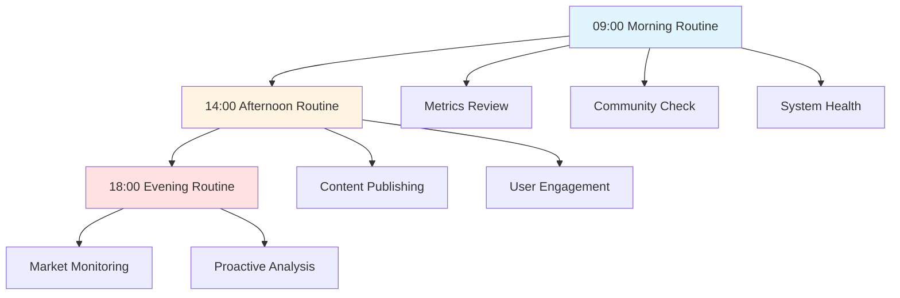
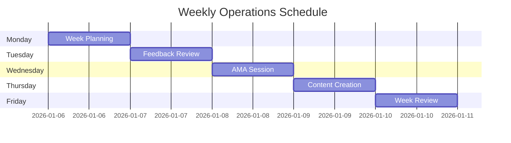
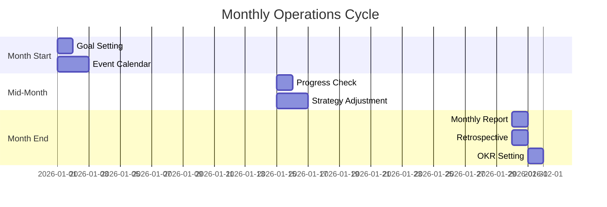
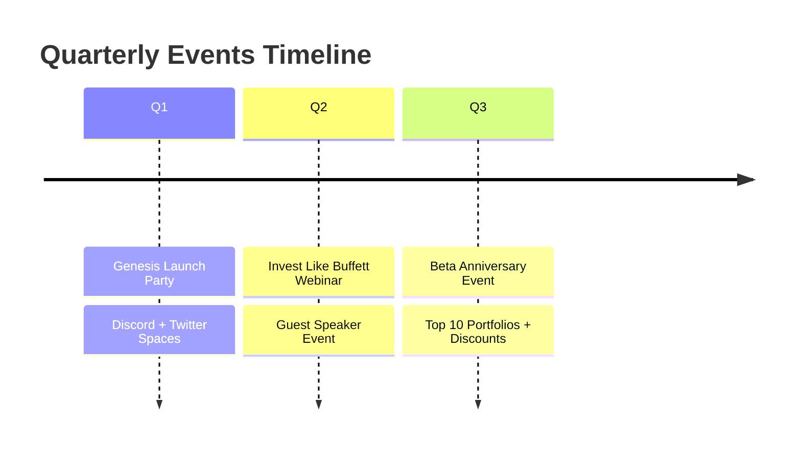
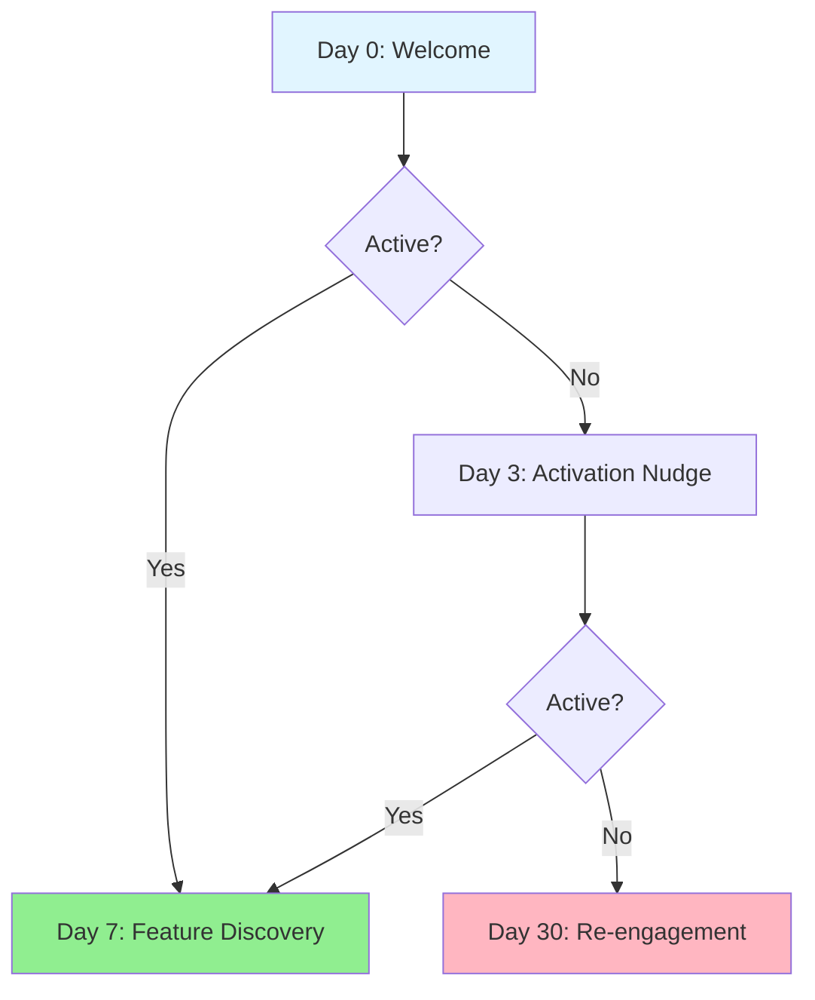
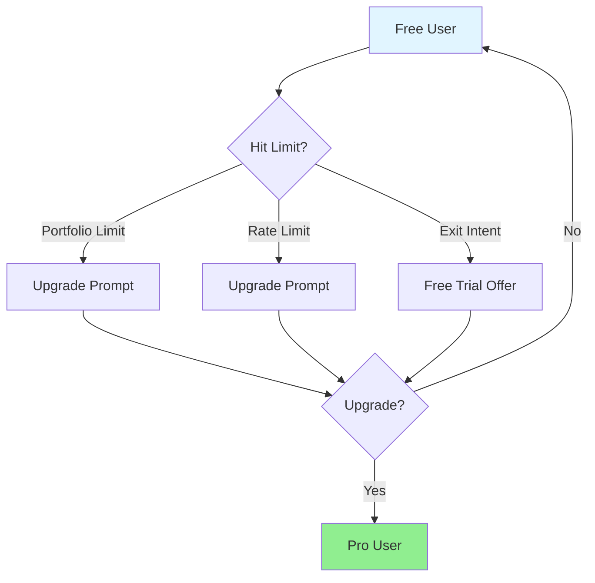
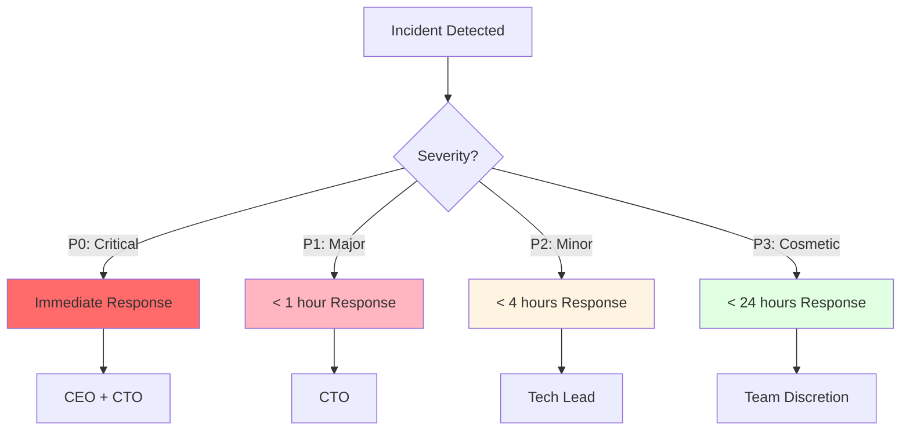

# Sage.ai Live Ops Playbook

> **Document Version**: 1.0
> **Last Updated**: 2025년 12월 19일
> **Author**: Sam
> **Target Audience**: Operations Team, Community Managers

---

## 1. Live Ops Overview

### 1.1 Definition

```typescript
interface LiveOpsDefinition {
  concept: 'Real-time service operations after launch';
  focus: ['User engagement', 'Retention', 'Monetization', 'Community'];
}
```

**Live Ops (Live Operations)**: Post-launch real-time operations to continuously improve user engagement, retention, and monetization

### 1.2 Goals

```typescript
interface LiveOpsGoals {
  engagement: {
    metric: 'DAU/MAU ratio';
    target: string;
  };
  retention: {
    metrics: {
      D7: string;
      D30: string;
    };
  };
  monetization: {
    metric: 'Free to Pro conversion';
    target: string;
  };
  community: {
    metric: 'Discord DAU';
    target: number;
  };
}
```

1. **Engagement** - User activation (DAU/MAU 30%+)
2. **Retention** - Revisit rate increase (D7 40%+, D30 20%+)
3. **Monetization** - Paid conversion (Free → Pro 5%+)
4. **Community** - Community growth (Discord DAU 1,000+)

---

## 2. Daily Operations

### 2.1 Daily Workflow



### 2.2 Morning Routine (09:00-10:00)

```typescript
interface MorningRoutine {
  metricsReview: {
    kpis: ['MAU', 'DAU', 'Signups', 'Churn'];
    dashboardURL: string;
  };
  communityCheck: {
    discord: string[];
    twitter: string[];
  };
  systemHealth: {
    sentry: boolean;
    cloudwatch: boolean;
  };
}
```

#### 2.2.1 Metrics Review

**Daily Dashboard Check**:
- MAU / DAU
- New signups
- Churn rate
- Discord activity
- Twitter mentions
- Sentry errors

**Dashboard URL**: https://analytics.sage.ai/daily

#### 2.2.2 Community Check

**Discord**:
- #general-chat activity check
- #feedback new feedback review
- #help unanswered questions check

**Twitter**:
- @SageAI mentions check
- DM responses
- Trending topics check

#### 2.2.3 System Health

**Sentry**:
- Last 24 hours error count
- Critical issues check

**CloudWatch**:
- API response time
- ECS CPU/Memory
- RDS connections

### 2.3 Afternoon Routine (14:00-15:00)

```typescript
interface AfternoonRoutine {
  contentPublishing: {
    twitter: number;
    discord: boolean;
    blog: string;
  };
  userEngagement: {
    discordAMA: string;
    twitterPolls: boolean;
    testimonialRetweets: boolean;
  };
}
```

#### 2.3.1 Content Publishing

- Twitter posts (1-2)
- Discord market updates
- Blog posts (2 per week)

#### 2.3.2 User Engagement

- Discord AMA (weekly, Wednesday)
- Twitter polls/questions
- User testimonial retweets

### 2.4 Evening Routine (18:00-19:00)

```typescript
interface EveningRoutine {
  marketMonitoring: {
    volatilityDetection: {
      BTC: string;
      ETH: string;
    };
    fearGreedChange: boolean;
    newsCheck: boolean;
  };
  proactiveAnalysis: {
    discordAlert: boolean;
    twitterPost: boolean;
    pwaPush: boolean;
  };
}
```

#### 2.4.1 Market Monitoring

- Volatility detection (±5% BTC, ±7% ETH)
- Fear & Greed changes
- Major news check

#### 2.4.2 Proactive Analysis Alerts

- Discord alerts on volatility
- Twitter emergency analysis posts
- PWA Push notifications

---

## 3. Weekly Operations

### 3.1 Weekly Schedule



```typescript
interface WeeklyOperations {
  monday: {
    task: 'Week Planning';
    activities: string[];
  };
  tuesday: {
    task: 'User Feedback Review';
    activities: string[];
  };
  wednesday: {
    task: 'AMA Session';
    time: string;
    format: string;
  };
  thursday: {
    task: 'Content Creation Day';
    deliverables: string[];
  };
  friday: {
    task: 'Week Review';
    metrics: string[];
  };
}
```

### 3.2 Monday: Week Planning

**Tasks**:
- [ ] Set weekly goals (MAU, signups, Discord activity)
- [ ] Review content calendar
- [ ] Plan events (challenges, promotions)

### 3.3 Tuesday: User Feedback Review

**Tasks**:
- [ ] Organize #feedback channel
- [ ] Select top 3 feedback items
- [ ] Discuss priorities with development team

### 3.4 Wednesday: AMA Session (Discord)

```typescript
interface AMASession {
  time: '20:00-21:00 KST';
  channel: '#wallet-buffett-qa';
  format: {
    announcement: string;
    questionCollection: boolean;
    liveAnswers: boolean;
  };
}
```

**Time**: 20:00-21:00 KST

**Format**:
```
@everyone

[Microphone] Weekly AMA with Wallet Buffett [Microphone]

오늘 밤 8시, 월렛 버핏과 함께하는 Q&A 시간!

질문 있으신 분들은 #wallet-buffett-qa에 남겨주세요.

See you there! [Rocket]
```

**Example Questions**:
- "지금 비트코인 매수 타이밍인가요?"
- "섀도우 포트폴리오 수익률이 마이너스인데 어떻게 하나요?"
- "알트코인 추천해주세요"

### 3.5 Thursday: Content Creation Day

**Tasks**:
- [ ] Write blog post (1)
- [ ] Prepare Twitter thread (for weekend)
- [ ] YouTube script (Phase 2+)

### 3.6 Friday: Week Review

**Tasks**:
- [ ] Review weekly metrics
  - MAU / DAU achievement rate
  - Conversion rate
  - Churn rate
  - Discord activity
- [ ] Define next week action items

---

## 4. Monthly Operations

### 4.1 Monthly Timeline



```typescript
interface MonthlyOperations {
  monthStart: {
    day: 1;
    tasks: string[];
  };
  midMonth: {
    day: 15;
    tasks: string[];
  };
  monthEnd: {
    day: 30;
    tasks: string[];
  };
}
```

### 4.2 Month Start (Day 1)

**Tasks**:
- [ ] Set monthly goals
- [ ] Finalize event calendar
- [ ] Allocate marketing budget

### 4.3 Mid-Month (Day 15)

**Tasks**:
- [ ] Check progress status
- [ ] Adjust strategy if needed
- [ ] Draft next month's plan

### 4.4 Month End (Day 30)

**Tasks**:
- [ ] Write monthly report
- [ ] Team retrospective
- [ ] Set next month OKRs

---

## 5. Events & Campaigns

### 5.1 Monthly Investment Challenge

```typescript
interface MonthlyChallenge {
  concept: 'Shadow Portfolio ROI competition';
  timeline: 'Month 1st - End of month';
  rules: string[];
  prizes: {
    first: string;
    second: string;
    third: string;
  };
}
```

**Concept**: Shadow Portfolio ROI competition

**Timeline**: Every month 1st - End of month

**Rules**:
1. Register in Discord #challenges channel
2. Only shadow trades based on Wallet Buffett advice
3. Top 3 ROI winners receive rewards

**Prizes**:
- 1st: Pro plan 1 year free
- 2nd: Pro plan 6 months free
- 3rd: Pro plan 3 months free

**Announcement (Discord)**:
```
@everyone

[Trophy] Monthly Investment Challenge [Trophy]

This month's theme: "Buy the Fear, Sell the Greed"

Rules:
1. Sign up in this channel
2. Use Wallet Buffett's advice
3. Track with Shadow Portfolios

Top 3 ROI winners get Pro Plan FREE!

Join now: [Down Arrow]
```

### 5.2 Weekly Twitter Engagement

```typescript
interface WeeklyTwitterContent {
  monday: {
    type: 'Market Recap';
    format: string;
  };
  wednesday: {
    type: 'Wallet Buffett Wisdom';
    format: string;
  };
  friday: {
    type: 'User Spotlight';
    format: string;
  };
}
```

#### 5.2.1 Monday: Market Recap

```
[Chart] Last Week in Crypto

BTC: $43,250 → $45,100 (+4.3%)
ETH: $2,280 → $2,450 (+7.5%)
Fear & Greed: 25 → 35 (Fear → Neutral)

What's your play this week? [Thinking]

Vote below! [Down Arrow]
```

#### 5.2.2 Wednesday: Wallet Buffett Wisdom

```
[Light Bulb] Wallet Buffett says:

"자네, 시장이 공포에 질렸을 때가
바로 기회일세."

BTC Fear & Greed: 25 (Extreme Fear)

Historically, buying at this level has led to
+47% average returns in 6 months.

Are you buying the fear? [Thinking]
```

#### 5.2.3 Friday: User Spotlight

```
[Star] User Spotlight [Star]

Meet @john_doe, who used Wallet Buffett's advice
to achieve +23% returns this month!

Here's his strategy:
- Buy when Fear & Greed < 30
- DCA (Dollar-Cost Averaging)
- HODL for 3+ months

Want to be featured? Share your wins in our Discord!
```

### 5.3 Quarterly Events

```typescript
interface QuarterlyEvents {
  Q1: {
    event: 'Genesis Launch Party';
    platform: string[];
  };
  Q2: {
    event: 'Invest Like Buffett Webinar';
    speaker: string;
  };
  Q3: {
    event: 'Beta Anniversary Event';
    celebration: string[];
  };
}
```



**Q1: Genesis Launch Party (Virtual)**
- **Date**: Launch Day
- **Platform**: Discord + Twitter Spaces
- **Agenda**: CEO Welcome, Product Demo, Team AMA, Giveaway (10 Pro plans)

**Q2: "Invest Like Buffett" Webinar**
- **Date**: TBD
- **Speaker**: Crypto expert guest
- **Topic**: Applying Warren Buffett's philosophy to crypto

**Q3: Beta Anniversary Event**
- **Date**: 3 months after launch
- **Celebration**: Beta tester appreciation, Top 10 Shadow Portfolios, Special discount (50% off Pro plan)

---

## 6. Community Management

### 6.1 Discord Moderation

```typescript
interface DiscordModeration {
  responseSLA: {
    help: string;
    feedback: string;
    general: string;
  };
  guidelines: {
    allowed: string[];
    notAllowed: string[];
    enforcement: string[];
  };
}
```

#### 6.1.1 Response Time SLA

| Channel | Response Time |
|---------|--------------|
| #help | < 2시간 |
| #feedback | < 24시간 |
| #general-chat | Best effort |

#### 6.1.2 Moderation Guidelines

**Allowed**:
- Investment discussions
- Sage.ai feedback
- Market analysis sharing

**Not Allowed**:
- Spam
- Direct investment solicitation ("Buy X coin now!")
- Other service promotion
- Profanity, defamation

**Enforcement**: Warning → Mute (1 day) → Kick → Ban

### 6.2 Twitter Engagement

```typescript
interface TwitterEngagement {
  positiveMentions: {
    responseTemplate: string;
  };
  featureRequests: {
    responseTemplate: string;
  };
  complaints: {
    responseTemplate: string;
  };
}
```

#### 6.2.1 Reply Strategy

**Positive Mentions**:
```
User: "Sage.ai is amazing! Just made my first shadow portfolio"
Reply: "That's awesome! [Party] Let us know how it performs. We're here to help!"
```

**Feature Requests**:
```
User: "Can you add Dogecoin support?"
Reply: "Thanks for the suggestion! We're focusing on the top 6 coins for MVP,
but Dogecoin is on our roadmap for Q2. Stay tuned!"
```

**Complaints**:
```
User: "AI gave me wrong price data"
Reply: "Oh no! That shouldn't happen. Can you DM us the details?
We take accuracy very seriously and want to fix this ASAP."
```

---

## 7. User Retention Strategies

### 7.1 Email Campaign Flow



```typescript
interface EmailCampaigns {
  day0: {
    trigger: 'Signup';
    subject: string;
  };
  day3: {
    trigger: 'Inactive user';
    subject: string;
  };
  day7: {
    trigger: 'Active user';
    subject: string;
  };
  day30: {
    trigger: 'Churned user';
    subject: string;
  };
}
```

### 7.2 Email Templates

#### 7.2.1 Day 0: Welcome Email

```
Subject: Welcome to Sage.ai! [Party]

Hi [Name],

Welcome! Here's how to get the most out of Sage.ai:

1. Chat with Wallet Buffett
2. Enable notifications
3. Try Shadow Portfolios

Happy investing!
```

#### 7.2.2 Day 3: Activation Nudge

```
Subject: Try asking Wallet Buffett this...

Hi [Name],

Quick question for Wallet Buffett:

"What do you think about Bitcoin right now?"

[Click to chat] →

See what he says!
```

#### 7.2.3 Day 7: Feature Discovery

```
Subject: Did you know? Shadow Portfolios track AI recommendations

Hi [Name],

You can track Wallet Buffett's recommendations with Shadow Portfolios!

Just click "Add to Portfolio" on any AI buy/sell signal.

[Learn more] →
```

#### 7.2.4 Day 30: Re-engagement

```
Subject: We miss you! Here's what you missed...

Hi [Name],

You haven't visited in a while. Here's what's new:

- BTC is up 12% this month
- Fear & Greed hit "Extreme Greed" (time to be cautious?)
- 500+ investors joined our Discord

Come back and say hi! [Wave]

[Chat with Wallet Buffett] →
```

### 7.3 Push Notifications

```typescript
interface PushNotifications {
  marketAlert: {
    trigger: string;
    template: string;
  };
  portfolioUpdate: {
    trigger: string;
    template: string;
  };
  inactivity: {
    trigger: string;
    template: string;
  };
}
```

#### 7.3.1 Trigger 1: Market Alert

```
Title: [Alert] BTC -5.2%
Body: Bitcoin just dropped -5.2%. Wallet Buffett says: "자네, 공포가 기회일세."
Action: Tap to analyze
```

#### 7.3.2 Trigger 2: Portfolio Update

```
Title: [Chart Up] Your Shadow Portfolio +8.5%
Body: Your BTC position is up 8.5% since you added it!
Action: View portfolio
```

#### 7.3.3 Trigger 3: Inactivity (7 days)

```
Title: [Speech Balloon] Wallet Buffett misses you
Body: Market moved a lot this week. Want to chat?
Action: Ask Wallet Buffett
```

---

## 8. Monetization Tactics

### 8.1 Conversion Funnel



```typescript
interface MonetizationTactics {
  inAppPrompts: {
    portfolioLimit: string;
    rateLimit: string;
  };
  exitIntent: {
    trigger: string;
    offer: string;
  };
}
```

### 8.2 Free to Pro Conversion

#### 8.2.1 In-App Prompts

**Trigger**: User creates 2nd shadow portfolio (Free tier limit: 1)

```
[Lock] Upgrade to Pro

You've reached the limit of 1 Shadow Portfolio on Free tier.

Upgrade to Pro for:
- 3 Shadow Portfolios
- Priority alerts
- Advanced analytics

[Upgrade to Pro - $19.99/mo] →
```

**Trigger**: User asks 11th question in 1 minute (Rate limit)

```
[Hourglass] Slow down there, investor!

You've hit the Free tier limit of 10 questions per minute.

Upgrade to Pro for unlimited chats.

[Upgrade to Pro - $19.99/mo] →
```

#### 8.2.2 Exit Intent (Web)

**Trigger**: User moves mouse to close tab

```
Wait! Before you go...

Try Pro FREE for 7 days

- Unlimited chats
- 3 Shadow Portfolios
- No credit card required

[Start Free Trial] →
```

---

## 9. Analytics & Reporting

### 9.1 Key Metrics Queries

```typescript
interface AnalyticsQueries {
  dailyActiveUsers: string;
  newSignups: string;
  churnRate: string;
}
```

```sql
-- Daily Active Users (DAU)
SELECT COUNT(DISTINCT user_id)
FROM messages
WHERE DATE(created_at) = CURRENT_DATE;

-- New Signups
SELECT COUNT(*)
FROM users
WHERE DATE(created_at) = CURRENT_DATE;

-- Churn Rate (D30)
SELECT
  COUNT(DISTINCT u.id) AS churned_users,
  (COUNT(DISTINCT u.id) * 100.0 / total.count) AS churn_rate
FROM users u
LEFT JOIN messages m ON u.id = m.user_id AND m.created_at > NOW() - INTERVAL '30 days'
CROSS JOIN (SELECT COUNT(*) AS count FROM users WHERE created_at < NOW() - INTERVAL '30 days') total
WHERE u.created_at < NOW() - INTERVAL '30 days'
  AND m.id IS NULL;
```

### 9.2 Weekly Report Format

```typescript
interface WeeklyReport {
  period: string;
  keyMetrics: {
    MAU: { value: number; change: string };
    DAU: { value: number; ratio: string };
    signups: { value: number; change: string };
    churnRate: { value: string; change: string };
  };
  monetization: {
    conversions: number;
    conversionRate: string;
    MRR: string;
  };
  community: {
    discordMembers: { value: number; change: string };
    discordDAU: { value: number; ratio: string };
    twitterFollowers: { value: number; change: string };
  };
  feedback: string[];
  bugs: string[];
  nextWeekFocus: string[];
}
```

**Example**:
```
Week [N] Report (YYYY-MM-DD ~ YYYY-MM-DD)

[Chart] Key Metrics:
- MAU: 1,250 (+15% WoW)
- DAU: 375 (DAU/MAU: 30%)
- New Signups: 150 (+10% WoW)
- Churn Rate: 5% (-1% WoW)

[Money] Monetization:
- Pro Conversions: 5 (conversion rate: 3.3%)
- MRR: $99.95

[Speech Balloon] Community:
- Discord Members: 450 (+50 WoW)
- Discord DAU: 120 (DAU/Members: 26.7%)
- Twitter Followers: 850 (+100 WoW)

[Memo] Top Feedback:
1. "Add more coins (ADA, DOT)"
2. "Mobile app needed"
3. "Love the shadow portfolio feature!"

[Bug] Critical Bugs:
- None this week [Checkmark]

[Target] Next Week Focus:
- Launch Monthly Investment Challenge
- Publish blog post on Shadow Portfolios
- Improve onboarding flow (target: +20% activation)
```

---

## 10. Incident Response

### 10.1 Severity Levels

```typescript
interface IncidentSeverity {
  P0: {
    description: string;
    responseTime: string;
    escalation: string[];
  };
  P1: {
    description: string;
    responseTime: string;
    escalation: string[];
  };
  P2: {
    description: string;
    responseTime: string;
    escalation: string[];
  };
  P3: {
    description: string;
    responseTime: string;
    escalation: string[];
  };
}
```



| Level | Description | Response Time | Escalation |
|-------|-------------|--------------|------------|
| **P0** | Service down, data loss | Immediate | CEO + CTO |
| **P1** | Major feature broken (chat, portfolio) | < 1 hour | CTO |
| **P2** | Minor feature broken (notifications) | < 4 hours | Tech Lead |
| **P3** | Cosmetic issues | < 24 hours | Team discretion |

### 10.2 Communication Templates

```typescript
interface IncidentCommunication {
  initial: {
    discord: string;
    twitter: string;
  };
  resolution: {
    discord: string;
    twitter: string;
  };
}
```

#### 10.2.1 P0/P1 Incident

**Discord #announcements**:
```
[Warning] Service Issue

We're currently experiencing [issue description].

Our team is actively working on a fix.

ETA: [time]

We'll update you every 30 minutes.

Thank you for your patience!
```

**Twitter**:
```
[Tool] We're aware of an issue affecting [feature].

Our team is on it and working on a fix.

We'll keep you updated. Sorry for the inconvenience!
```

#### 10.2.2 Resolution Announcement

```
[Checkmark] Issue Resolved

[Feature] is now back to normal.

What happened: [brief explanation]
What we did: [fix description]

Thank you for your patience!
```

---

**Document End**

_"Between the zeros and ones"_
