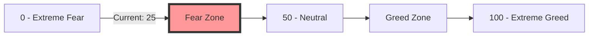
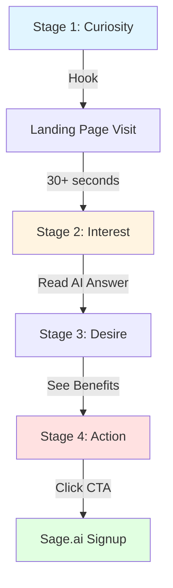
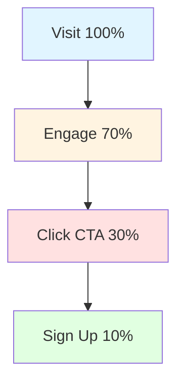
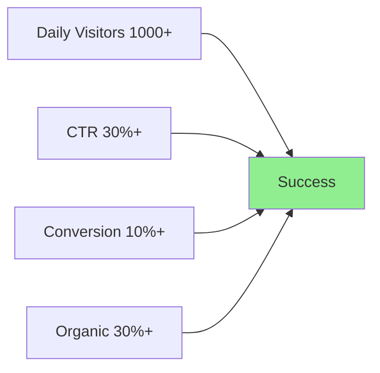

# WhyBitcoinFallen.com - Mystery Campaign

> **Document Version**: 1.0
> **Last Updated**: 2025년 12월 19일
> **Author**: Sam
> **Target Audience**: Marketing Team, Management

---

## 1. Campaign Overview

### 1.1 Concept

**"왜 비트코인이 떨어졌을까요?"** - 누구나 한 번쯤 궁금해하는 질문에 AI가 즉시 답변

### 1.2 Objectives

```typescript
interface CampaignObjectives {
  viralReach: {
    metric: 'Daily visitors';
    target: number;
  };
  conversion: {
    metric: 'Sage.ai signup rate';
    target: string;
  };
  brandAwareness: {
    metric: 'SNS shares';
    target: string;
  };
  timeline: string;
}
```

| Goal | Metric | Target (3 months) |
|------|--------|-------------------|
| **Viral Reach** | Daily visitors | 1,000+ |
| **Conversion** | Sage.ai signup rate | 10% |
| **Brand Awareness** | SNS shares | 100+ shares/day |

---

## 2. Landing Page Design

### 2.1 Page Structure

```typescript
interface LandingPageSections {
  hero: {
    realtimeBTCPrice: boolean;
    change24h: boolean;
    cta: string;
  };
  aiAnswer: {
    persona: string;
    contentSource: string[];
    ctaButton: string;
  };
  fearGreedGauge: {
    visualization: boolean;
    historicalInsight: boolean;
  };
  finalCTA: {
    benefits: string[];
    actionButton: string;
  };
}
```

### 2.2 Hero Section

```
━━━━━━━━━━━━━━━━━━━━━━━━━━━━━━━━
[Chart Down] 비트코인, 어제보다 -5.2% 떨어졌습니다

왜일까요?

[AI에게 물어보기 →]
━━━━━━━━━━━━━━━━━━━━━━━━━━━━━━━━
```

**Elements**:
- Real-time BTC price
- 24-hour change (red/green)
- Simple CTA button

### 2.3 AI Answer Section

```
━━━━━━━━━━━━━━━━━━━━━━━━━━━━━━━━
월렛 버핏이 답합니다:

"자네, 비트코인이 현재 $43,250에 거래되고 있네.
어제보다 -5.2% 하락했군.

시장은 공포에 질렸어 (Fear & Greed 지수 25).
하지만 기억하게, 남들이 두려워할 때가 바로 기회일세.

지난 데이터를 보면, Fear 지수 20-30 구간에서 매수한
투자자들은 평균 6개월 후 +47% 수익을 올렸지.

물론, 과거가 미래를 보장하지는 않아.
하지만 장기 관점으로 접근한다면 어떨까?"

[더 자세한 분석이 궁금하다면? Sage.ai 시작하기 →]
━━━━━━━━━━━━━━━━━━━━━━━━━━━━━━━━
```

### 2.4 Fear & Greed Gauge



```
━━━━━━━━━━━━━━━━━━━━━━━━━━━━━━━━
현재 시장 심리

Extreme Fear                    Extreme Greed
    25  ●━━━━━━━━━━━━━━━━━━━━○  100

[Light Bulb] 역사적으로 "Extreme Fear" 구간에서 매수한 사람들은
   평균 3개월 후 +35% 수익을 기록했습니다.
━━━━━━━━━━━━━━━━━━━━━━━━━━━━━━━━
```

### 2.5 CTA Section

```typescript
interface CTASection {
  headline: string;
  subheadline: string;
  benefits: string[];
  actionButton: string;
}
```

```
━━━━━━━━━━━━━━━━━━━━━━━━━━━━━━━━
24/7 AI 투자 멘토가 필요하신가요?

월렛 버핏과 함께 더 현명한 투자를

[Checkmark] 환각 제로 - 오직 데이터에 기반한 분석
[Checkmark] 섀도우 포트폴리오로 AI 추천 검증
[Checkmark] 급변 시 자동 알림

[무료로 시작하기 →]
━━━━━━━━━━━━━━━━━━━━━━━━━━━━━━━━
```

---

## 3. Technical Implementation

### 3.1 Real-Time BTC Price

```typescript
// lib/coingecko.ts
interface BTCPriceData {
  price: number;
  change24h: number;
}

export async function getBTCPrice(): Promise<BTCPriceData> {
  const response = await fetch(
    'https://api.coingecko.com/api/v3/simple/price?ids=bitcoin&vs_currencies=usd&include_24hr_change=true'
  );

  const data = await response.json();

  return {
    price: data.bitcoin.usd,
    change24h: data.bitcoin.usd_24h_change
  };
}
```

### 3.2 AI Response Generation

```typescript
// lib/generateAnswer.ts
import Anthropic from '@anthropic-ai/sdk';

interface MarketData {
  price: number;
  change24h: number;
  fearGreed: number;
}

export async function generateAnswer(
  price: number,
  change24h: number,
  fearGreed: number
): Promise<string> {
  const client = new Anthropic({ apiKey: process.env.ANTHROPIC_API_KEY });

  const prompt = `You are Wallet Buffett (월렛 버핏), an AI investment mentor.

Current data:
- BTC price: $${price.toLocaleString()}
- 24h change: ${change24h.toFixed(2)}%
- Fear & Greed Index: ${fearGreed}

Explain why Bitcoin's price moved in 3-4 sentences.
Use your signature tone: "자네", "~일세"
Focus on data and market psychology.`;

  const message = await client.messages.create({
    model: 'claude-sonnet-4-20250514',
    max_tokens: 300,
    messages: [{ role: 'user', content: prompt }]
  });

  return message.content[0].text;
}
```

### 3.3 Caching Strategy

```typescript
interface CachingConfig {
  revalidate: number; // seconds
  staleWhileRevalidate: number;
}

// Refresh every 5 minutes
export const revalidate = 300;

export async function getStaticProps() {
  const btc = await getBTCPrice();
  const fearGreed = await getFearGreedIndex();
  const aiAnswer = await generateAnswer(btc.price, btc.change24h, fearGreed.value);

  return {
    props: { btc, fearGreed, aiAnswer },
    revalidate: 300
  };
}
```

---

## 4. SEO Optimization

### 4.1 Meta Tags

```typescript
interface SEOMetadata {
  title: string;
  description: string;
  ogTags: {
    title: string;
    description: string;
    image: string;
    type: string;
  };
  twitterCard: {
    card: string;
    title: string;
    description: string;
    image: string;
  };
}
```

```html
<head>
  <title>비트코인 왜 떨어졌어요? - AI가 알려드립니다</title>
  <meta name="description" content="실시간 AI 분석으로 비트코인 가격 변동 이유를 알아보세요. 월렛 버핏과 함께하는 현명한 투자." />

  <!-- OG Tags -->
  <meta property="og:title" content="비트코인 왜 떨어졌어요?" />
  <meta property="og:description" content="AI가 실시간으로 분석해드립니다" />
  <meta property="og:image" content="https://whybitcoinfallen.com/og-image.png" />
  <meta property="og:type" content="website" />

  <!-- Twitter Card -->
  <meta name="twitter:card" content="summary_large_image" />
  <meta name="twitter:title" content="비트코인 왜 떨어졌어요?" />
  <meta name="twitter:description" content="AI가 실시간으로 분석해드립니다" />
  <meta name="twitter:image" content="https://whybitcoinfallen.com/twitter-card.png" />
</head>
```

### 4.2 Target Keywords

```typescript
interface KeywordStrategy {
  primary: string[];
  secondary: string[];
  longTail: string[];
}
```

**Keywords**:
- 비트코인 하락 이유
- 비트코인 왜 떨어짐
- 암호화폐 시장 분석
- AI 투자 조언
- 월렛 버핏

---

## 5. Viral Marketing Strategy

### 5.1 Reddit Seeding

```typescript
interface RedditStrategy {
  subreddits: string[];
  postTemplate: {
    title: string;
    body: string;
  };
  timing: string;
}
```

**Subreddits**:
- r/cryptocurrency
- r/Bitcoin
- r/CryptoMarkets
- r/korea (Korean version)

**Post Template**:
```
Title: "Made a simple site that explains why Bitcoin is falling - using AI"

Body:
Got tired of guessing why BTC price moves, so I built this:
https://whybitcoinfallen.com

It uses AI (Claude) to analyze current price + Fear & Greed Index
and gives you a quick explanation in Warren Buffett's investing philosophy.

Feedback welcome!
```

### 5.2 Twitter Strategy

```typescript
interface TwitterStrategy {
  viralHook: string;
  engagementTactics: string[];
  frequency: string;
}
```

**Viral Hook**:
```
비트코인 -5.2% 떨어졌는데 이유가 궁금하다면?

AI가 실시간으로 분석해드립니다:
https://whybitcoinfallen.com

#Bitcoin #Crypto #AI
```

**Engagement Tactics**:
- Daily automated tweets on price movements
- Mention crypto influencers
- "What do you think?" questions to drive comments

### 5.3 Discord/Telegram

```typescript
interface CommunityStrategy {
  platforms: ['Discord', 'Telegram'];
  messageTemplate: string;
  targetCommunities: string[];
}
```

**Crypto Community Sharing**:
```
Hey everyone! Made a fun little tool:

[Robot] WhyBitcoinFallen.com

Real-time AI analysis of why BTC price is moving
Based on Warren Buffett's investing philosophy
100% free, no signup

Try it and let me know what you think!
```

---

## 6. Conversion Funnel

### 6.1 Funnel Flow



### 6.2 Funnel Stages

```typescript
interface ConversionFunnel {
  stage1: {
    name: 'Curiosity';
    hook: string;
    engagement: string;
    goal: string;
  };
  stage2: {
    name: 'Interest';
    value: string;
    trust: string;
    goal: string;
  };
  stage3: {
    name: 'Desire';
    benefit: string[];
    socialProof: string;
    goal: string;
  };
  stage4: {
    name: 'Action';
    frictionReduction: string;
    incentive: string;
    goal: string;
  };
}
```

**Stage 1: Curiosity (Landing)**
- **Hook**: "왜 비트코인이 떨어졌어요?"
- **Engagement**: Real-time price + AI answer
- **Goal**: Stay on page for 30+ seconds

**Stage 2: Interest (Read AI Answer)**
- **Value**: Data-driven insights provided
- **Trust**: Fear & Greed indicator visualization
- **Goal**: Read AI answer to the end

**Stage 3: Desire (See CTA)**
- **Benefit**: "24/7 AI mentor", "Zero hallucination", "Shadow Portfolio"
- **Social Proof**: "1,000+ investors using"
- **Goal**: Click CTA button

**Stage 4: Action (Sign Up)**
- **Friction Reduction**: Google OAuth one-click signup
- **Incentive**: "First month Pro features free"
- **Goal**: Complete Sage.ai signup

---

## 7. Analytics & Tracking

### 7.1 Key Metrics

```typescript
interface AnalyticsEvents {
  pageView: {
    event: 'page_view';
    params: { page_title: string };
  };
  aiAnswerRead: {
    event: 'ai_answer_read';
    params: { duration_seconds: number };
  };
  ctaClick: {
    event: 'cta_click';
    params: { button_location: string };
  };
  signupConversion: {
    event: 'signup_conversion';
    params: { source: string };
  };
}
```

```javascript
// Google Analytics Events
gtag('event', 'page_view', { page_title: 'WhyBitcoinFallen Home' });
gtag('event', 'ai_answer_read', { duration_seconds: 45 });
gtag('event', 'cta_click', { button_location: 'hero' });
gtag('event', 'signup_conversion', { source: 'whybitcoinfallen' });
```

### 7.2 Conversion Tracking



| Funnel Step | Event | Target Conversion |
|-------------|-------|-------------------|
| **Visit** | page_view | 100% |
| **Engage** | ai_answer_read | 70% |
| **Click CTA** | cta_click | 30% |
| **Sign Up** | signup_conversion | 10% |

---

## 8. A/B Testing

### 8.1 Test Configuration

```typescript
interface ABTest {
  testId: string;
  variants: {
    variantA: string;
    variantB: string;
  };
  hypothesis: string;
  metric: string;
}
```

### 8.2 Test 1: Headline

**Variant A**: "비트코인 왜 떨어졌어요?"
**Variant B**: "AI가 알려주는 비트코인 급락 이유"

**Hypothesis**: B will have higher click-through rate with AI emphasis

### 8.3 Test 2: CTA Text

**Variant A**: "무료로 시작하기"
**Variant B**: "월렛 버핏과 대화하기"

**Hypothesis**: B will have higher conversion rate with persona emphasis

---

## 9. Launch Checklist

### 9.1 Technical Setup

```typescript
interface LaunchChecklist {
  infrastructure: string[];
  analytics: string[];
  content: string[];
  testing: string[];
  marketing: string[];
}
```

**Infrastructure**:
- [ ] Domain purchase and DNS setup
- [ ] SSL certificate setup (Let's Encrypt)
- [ ] CloudFront CDN configuration
- [ ] API rate limiting setup

**Analytics**:
- [ ] Google Analytics setup
- [ ] Event tracking implementation
- [ ] Conversion funnel configuration

**Content**:
- [ ] OG image creation (1200x630px)
- [ ] Twitter Card image creation (1200x675px)
- [ ] Copy finalization and proofreading

**API Integration**:
- [ ] CoinGecko API key issuance
- [ ] Alternative.me API testing
- [ ] Claude API call testing

**Testing**:
- [ ] Mobile responsiveness testing
- [ ] Loading speed optimization (< 2 seconds)
- [ ] Cross-browser compatibility

**Marketing**:
- [ ] Reddit account karma building (spam prevention)
- [ ] Twitter account creation and profile setup
- [ ] Discord community preparation

---

## 10. Success Criteria (3 months)

### 10.1 Key Performance Indicators

```typescript
interface SuccessCriteria {
  traffic: {
    dailyVisitors: number;
    avgEngagementTime: string;
  };
  conversion: {
    ctaClickRate: string;
    signupConversionRate: string;
  };
  viral: {
    socialShares: string;
    organicSearchTraffic: string;
  };
}
```



| Metric | Target | Measurement Method |
|--------|--------|-------------------|
| **Daily Visitors** | 1,000+ | Google Analytics |
| **Avg Engagement Time** | 1 minute+ | GA Engagement Time |
| **CTA Click Rate** | 30%+ | Event tracking |
| **Signup Conversion Rate** | 10%+ | Signup event / page_view |
| **SNS Shares** | 100+ shares/day | Share button tracking |
| **Organic Search Traffic** | 30% | GA Acquisition |

---

**Document End**

_"Between the zeros and ones"_
