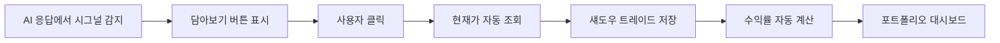
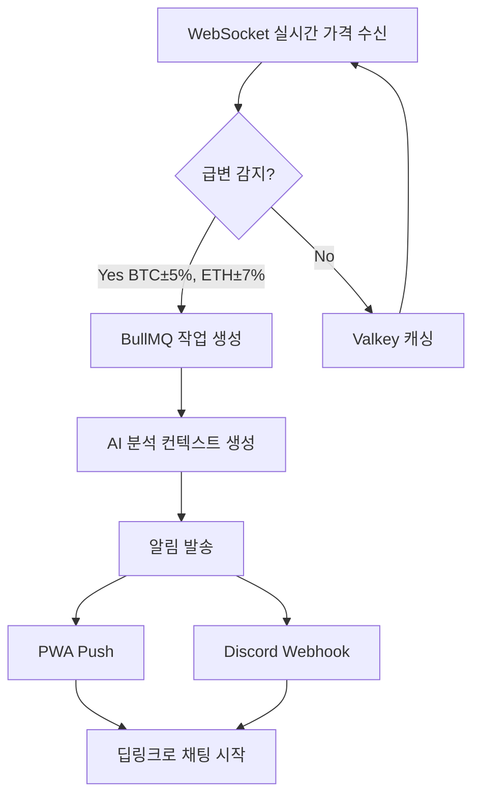

# Sage.ai Product Specification

> **문서 버전**: 1.0
> **최종 수정**: 2025년 12월 22일
> **작성자**: Sam
> **대상 독자**: 제품팀, 개발팀, 디자인팀

---

## 1. Product Overview

### 1.1 Product Vision

**"모든 개인 투자자에게 월가 수준의 AI 멘토를"**

Sage.ai는 워렌 버핏의 투자 철학을 구현한 AI 멘토 '월렛 버핏'이 24시간 암호화폐 투자를 돕는 플랫폼입니다.

### 1.2 Core Value Proposition

```typescript
interface ValueProposition {
  primary: "신뢰할 수 있는 AI 투자 멘토";
  differentiators: [
    "환각 제로 - 검증된 데이터만 제공",
    "투명한 성과 - 섀도우 포트폴리오로 추적 가능",
    "능동적 케어 - 실시간 시장 모니터링 및 즉시 알림"
  ];
}
```

### 1.3 Target Users

| 세그먼트 | 특성 | 니즈 |
|---------|------|------|
| **초보 투자자** | 암호화폐 경험 1년 미만 | 신뢰할 수 있는 가이드 |
| **직장인 투자자** | 시간 부족, 정보 과부하 | 효율적인 시장 분석 |
| **경험자** | 투자 경험 있음, 의사결정 보조 필요 | 다양한 관점, 리스크 검증 |

---

## 2. Core Features

### 2.1 Feature 1: Chat with Wallet Buffett (월렛 버핏과의 대화)

#### Overview

```typescript
interface ChatFeature {
  id: "F001";
  name: "월렛 버핏과의 대화";
  description: "Claude Sonnet 4 기반 AI 멘토와 실시간 대화";
  priority: "P0 - Must Have";
}
```

#### Capabilities

| 기능 | 설명 | 기술 구현 |
|------|------|----------|
| **실시간 스트리밍** | 2초 이내 첫 토큰 응답 | Nest.js SSE |
| **시장 데이터 통합** | 실시간 가격, Fear & Greed | Binance/Gate.io WebSocket, Alternative.me |
| **투자 철학 기반 해석** | 워렌 버핏 스타일 통찰 | Claude Sonnet 4 Persona |
| **환각 방지** | 수치는 Tool에서만 | Multi-agent cross-validation |

#### Multi-Agent Architecture

```
[사용자 질문]
    ↓
[Manager Agent] - Haiku 4
    ├─ 의도 파악 (market_query, advice, portfolio_review)
    └─ 적절한 에이전트로 라우팅
    ↓
[Analyst Agent] - Haiku 4
    ├─ WebSocket 실시간 가격 수신 (Binance/Gate.io)
    ├─ Alternative.me API 호출 (Fear & Greed)
    └─ 팩트 데이터 수집
    ↓
[Persona Agent] - Sonnet 4
    ├─ 월렛 버핏 페르소나 적용
    ├─ 팩트 기반 해석 생성
    └─ 투자 철학 반영한 조언
    ↓
[Risk Agent] - Haiku 4
    ├─ 수치 오류 검증
    ├─ 편향 체크
    └─ 최종 응답 승인
    ↓
[최종 응답] → SSE 스트리밍
```

#### User Stories

```gherkin
Feature: 월렛 버핏과의 대화

Scenario: 시장 상황 질문
  Given 사용자가 로그인되어 있다
  When "비트코인 지금 어때?" 라고 질문한다
  Then 2초 이내에 스트리밍 응답이 시작된다
  And 응답에는 현재 BTC 가격이 포함된다
  And 응답에는 Fear & Greed Index가 포함된다
  And 월렛 버핏 스타일의 해석이 제공된다

Scenario: 매수/매도 조언
  Given 사용자가 "이더리움 살까?" 라고 질문한다
  When AI가 buy/sell 시그널을 포함한 응답을 한다
  Then "담아보기" 버튼이 표시된다
  And 사용자가 클릭하면 섀도우 포트폴리오에 추가된다
```

#### Scope

| 포함 | 제외 (Phase 2+) |
|------|-----------------|
| 6개 코인 (BTC, ETH, SOL, BNB, DOGE, XRP) | 추가 코인 |
| Fear & Greed Index | 온체인 분석 |
| 실시간 가격 데이터 | 뉴스 기반 분석 |
| 월렛 버핏 페르소나 | 멀티 페르소나 |
| 1:1 대화 | 그룹 채팅 |

---

### 2.2 Feature 2: Shadow Portfolio (섀도우 포트폴리오)

#### Overview

```typescript
interface ShadowPortfolioFeature {
  id: "F002";
  name: "섀도우 포트폴리오";
  description: "AI 추천을 가상으로 추적하여 성과 검증";
  priority: "P0 - Must Have";
}
```

#### Mechanism



#### Signal Detection

```typescript
interface TradeSignal {
  symbol: "BTC" | "ETH" | "SOL" | "BNB" | "DOGE" | "XRP";
  action: "buy" | "sell";
  confidence: "high" | "medium" | "low";
  reasoning: string;
}

// AI 응답에서 시그널 추출 예시
// "자네, 지금 비트코인은 공포 구간(Fear 25)에 있네.
//  장기 관점에서 분할 매수를 고려해볼 만하다네."
// → { symbol: "BTC", action: "buy", confidence: "medium" }
```

#### Performance Metrics

| 지표 | 계산 방식 | 표시 |
|------|----------|------|
| **절대 수익률** | (현재가 - 진입가) / 진입가 × 100 | +12.5% |
| **벤치마크 대비** | 포트폴리오 수익률 - BTC 수익률 | +3.2%p |
| **승률** | 수익 트레이드 / 전체 트레이드 | 72% |

#### User Stories

```gherkin
Feature: 섀도우 포트폴리오

Scenario: 트레이드 추가
  Given AI가 "이더리움 매수 고려" 시그널을 제공한다
  When 사용자가 "담아보기" 버튼을 클릭한다
  Then 현재 ETH 가격으로 섀도우 트레이드가 생성된다
  And 포트폴리오에 새 항목이 추가된다

Scenario: 수익률 확인
  Given 사용자가 섀도우 트레이드를 보유하고 있다
  When 포트폴리오 페이지를 방문한다
  Then 각 트레이드의 수익률이 표시된다
  And 전체 포트폴리오 성과가 표시된다
  And 벤치마크(BTC) 대비 성과가 표시된다
```

#### Scope

| 포함 | 제외 (Phase 2+) |
|------|-----------------|
| 절대 수익률 | 샤프 비율 |
| 벤치마크 대비 수익률 | MDD (Maximum Drawdown) |
| 최대 3개 포트폴리오 (Pro) | 거래소 API 연동 |
| 기본 통계 (승률) | 고급 분석 도구 |

---

### 2.3 Feature 3: Proactive Analysis (능동적 분석)

#### Overview

```typescript
interface ProactiveAnalysisFeature {
  id: "F003";
  name: "능동적 분석";
  description: "실시간 시장 모니터링 및 급변 시 자동 분석";
  priority: "P0 - Must Have";
}
```

#### System Architecture



#### Alert Triggers

```typescript
interface AlertTriggers {
  priceChange: {
    BTC: "±5%",
    ETH: "±7%",
    altcoins: "±10%"
  };
  fearGreed: {
    change: "±15 포인트",
    extremes: "10 이하 또는 90 이상"
  };
}
```

#### Notification Channels

| 채널 | 용도 | 기술 |
|------|------|------|
| **PWA Push** | 개인 알림 | Web Push API (VAPID) |
| **Discord** | 커뮤니티 알림 | Webhook |
| **In-App** | 알림 히스토리 | PostgreSQL |

#### Deep Link Structure

```typescript
interface DeepLink {
  format: "/chat/new?context={contextId}";
  example: "/chat/new?context=btc_crash_20231215_1430";
  behavior: "새 채팅 시작 + AI가 먼저 분석 제공";
}
```

#### User Stories

```gherkin
Feature: 능동적 분석

Scenario: 급락 알림 수신
  Given 사용자가 알림을 허용했다
  When BTC가 5% 이상 급락한다
  Then 사용자에게 PWA Push 알림이 발송된다
  And Discord #market-alerts 채널에 메시지가 전송된다

Scenario: 딥링크로 채팅 시작
  Given 사용자가 "BTC -5.2% 급락" 알림을 수신했다
  When 알림을 클릭한다
  Then Sage.ai 앱이 열린다
  And 관련 컨텍스트가 포함된 새 채팅이 시작된다
  And 월렛 버핏이 먼저 상황 분석을 제공한다
```

#### Scope

| 포함 | 제외 (Phase 2+) |
|------|-----------------|
| 가격 급변 감지 (실시간 WebSocket) | 온체인 분석 (고래 이동) |
| Fear & Greed 급변 | 뉴스 기반 알림 |
| PWA Push + Discord | SMS, 이메일 |
| Binance/Gate.io 이중화 | 추가 거래소 연동 |

---

## 3. User Interface

### 3.1 Page Structure

#### 3.1.1 WhyBitcoinFallen.com (바이럴 사이트)

```typescript
interface ViralSite {
  purpose: "바이럴 유입 → Sage.ai 전환";
  pages: 1; // SPA
  components: [
    "실시간 BTC 가격 표시",
    "Fear & Greed 게이지 (시각화)",
    "AI 미리보기 (월렛 버핏 한마디)",
    "Sage.ai 가입 CTA 버튼"
  ];
  conversionTarget: "10%+ CTR to Sage.ai";
}
```

#### 3.1.2 Sage.ai Landing

```typescript
interface LandingPage {
  purpose: "제품 소개 → 회원가입 전환";
  sections: [
    "Hero - 핵심 가치 제안",
    "Features - 3가지 핵심 기능",
    "Demo - 섀도우 포트폴리오 예시",
    "Social Proof - 성과 카드",
    "CTA - Google 로그인"
  ];
  conversionTarget: "15%+ 가입 전환율";
}
```

#### 3.1.3 Sage.ai App

```typescript
interface MainApp {
  routes: {
    "/chat": "채팅 목록";
    "/chat/new": "새 대화 시작";
    "/chat/:id": "대화 상세";
    "/portfolio": "섀도우 포트폴리오";
    "/notifications": "알림 히스토리";
    "/settings": "설정";
  };
  navigation: "Bottom Tab (모바일) / Sidebar (데스크톱)";
}
```

### 3.2 Key UI Components

#### Chat Interface

```typescript
interface ChatUI {
  messageList: {
    userBubble: "오른쪽 정렬, 브랜드 색상";
    aiBubble: "왼쪽 정렬, 월렛 버핏 아바타";
    signalCard: "buy/sell 시그널 + 담아보기 버튼";
  };
  inputArea: {
    textInput: "멀티라인 지원";
    sendButton: "비활성화 시 그레이아웃";
    typingIndicator: "AI 응답 중 표시";
  };
}
```

#### Portfolio Dashboard

```typescript
interface PortfolioUI {
  summary: {
    totalValue: "전체 포트폴리오 가치";
    totalReturn: "총 수익률 (%, 금액)";
    benchmarkComparison: "BTC 대비 성과";
  };
  tradeList: {
    item: "코인, 액션, 진입가, 현재가, 수익률";
    sortOptions: ["최신순", "수익률순", "코인별"];
  };
}
```

---

## 4. Technical Requirements

### 4.1 Performance Targets

| 지표 | 목표 | 측정 방법 |
|------|------|----------|
| **첫 토큰 응답** | 2초 이내 | SSE 첫 데이터 수신 시점 |
| **컨텍스트 로드** | 0.5초 이내 | 최근 20개 메시지 조회 |
| **페이지 로드** | 2초 이내 | Lighthouse FCP |
| **UI 프레임** | 60 FPS | 스크롤, 애니메이션 |

### 4.2 Reliability Targets

| 지표 | 목표 | 측정 방법 |
|------|------|----------|
| **환각률** | <1% | 사용자 신고 / 전체 응답 |
| **업타임** | 99% | CloudWatch 모니터링 |
| **에러율** | <0.1% | Sentry 에러 트래킹 |

### 4.3 Context Management

```typescript
interface ContextManagement {
  strategy: "최근 20개 메시지만 유지";
  reason: "MVP 단순화, RAG는 Phase 2";
  implementation: {
    storage: "PostgreSQL messages 테이블";
    query: "ORDER BY createdAt DESC LIMIT 20";
    tokenBudget: "~4000 tokens 예상";
  };
}
```

---

## 5. Data Models

### 5.1 Core Entities

```prisma
// User - 사용자
model User {
  id            String        @id @default(uuid())
  email         String        @unique
  name          String?
  image         String?
  tier          UserTier      @default(FREE)
  pushToken     String?       // PWA Push 토큰
  createdAt     DateTime      @default(now())
  updatedAt     DateTime      @updatedAt
  chats         Chat[]
  shadowTrades  ShadowTrade[]
  notifications Notification[]
}

enum UserTier {
  FREE
  PRO
  PREMIUM
}

// Chat - 대화
model Chat {
  id        String    @id @default(uuid())
  userId    String
  user      User      @relation(fields: [userId], references: [id])
  title     String    @default("새 대화")
  messages  Message[]
  createdAt DateTime  @default(now())
  updatedAt DateTime  @updatedAt
}

// Message - 메시지
model Message {
  id        String   @id @default(uuid())
  chatId    String
  chat      Chat     @relation(fields: [chatId], references: [id])
  role      Role
  content   String
  signal    Json?    // TradeSignal if detected
  createdAt DateTime @default(now())
}

enum Role {
  USER
  ASSISTANT
}

// ShadowTrade - 섀도우 트레이드
model ShadowTrade {
  id        String   @id @default(uuid())
  userId    String
  user      User     @relation(fields: [userId], references: [id])
  symbol    String   // BTC, ETH, etc.
  action    Action
  entryPrice Decimal
  exitPrice  Decimal?
  status    TradeStatus @default(OPEN)
  createdAt DateTime @default(now())
  closedAt  DateTime?
}

enum Action {
  BUY
  SELL
}

enum TradeStatus {
  OPEN
  CLOSED
}

// Notification - 알림
model Notification {
  id        String   @id @default(uuid())
  userId    String
  user      User     @relation(fields: [userId], references: [id])
  type      NotificationType
  title     String
  body      String
  contextId String?  // 딥링크용
  isRead    Boolean  @default(false)
  createdAt DateTime @default(now())
}

enum NotificationType {
  PRICE_ALERT
  FEAR_GREED_ALERT
  SYSTEM
}
```

---

## 6. API Specification

### 6.1 Chat APIs

| Method | Endpoint | 설명 |
|--------|----------|------|
| POST | `/api/chat` | 새 메시지 전송 (SSE 응답) |
| GET | `/api/chats` | 채팅 목록 조회 |
| GET | `/api/chats/:id` | 채팅 상세 조회 |
| GET | `/api/chats/:id/messages` | 메시지 목록 조회 |
| DELETE | `/api/chats/:id` | 채팅 삭제 |

### 6.2 Market APIs

| Method | Endpoint | 설명 |
|--------|----------|------|
| GET | `/api/market/prices` | 6개 코인 가격 조회 |
| GET | `/api/market/price/:symbol` | 특정 코인 가격 |
| GET | `/api/market/fear-greed` | Fear & Greed Index |

### 6.3 Portfolio APIs

| Method | Endpoint | 설명 |
|--------|----------|------|
| POST | `/api/shadow-trades` | 섀도우 트레이드 생성 |
| GET | `/api/shadow-trades` | 트레이드 목록 조회 |
| PATCH | `/api/shadow-trades/:id/close` | 트레이드 청산 |
| GET | `/api/portfolio/stats` | 포트폴리오 통계 |

### 6.4 Notification APIs

| Method | Endpoint | 설명 |
|--------|----------|------|
| POST | `/api/push/subscribe` | 푸시 구독 등록 |
| DELETE | `/api/push/unsubscribe` | 푸시 구독 해제 |
| GET | `/api/notifications` | 알림 히스토리 |
| PATCH | `/api/notifications/:id/read` | 알림 읽음 처리 |

---

## 7. Analytics & Metrics

### 7.1 Key Metrics

```typescript
interface KeyMetrics {
  acquisition: {
    wbf_visitors: "WhyBitcoinFallen 월 방문자";
    wbf_to_sage_ctr: "WBF → Sage.ai 클릭률";
    signup_conversion: "가입 전환율";
  };
  engagement: {
    dau: "일 활성 사용자";
    mau: "월 활성 사용자";
    messages_per_user: "사용자당 일 메시지 수";
    session_duration: "평균 세션 시간";
  };
  retention: {
    d1_retention: "D1 리텐션";
    d7_retention: "D7 리텐션";
    d30_retention: "D30 리텐션";
  };
  feature: {
    shadow_portfolio_usage: "섀도우 포트폴리오 사용률";
    notification_opt_in: "알림 옵트인율";
    signal_follow_rate: "시그널 담아보기율";
  };
  quality: {
    hallucination_rate: "환각률";
    response_time_p95: "응답 시간 P95";
    error_rate: "에러율";
  };
}
```

### 7.2 Success Criteria (MVP)

| 지표 | 목표 (3개월 후) |
|------|----------------|
| WhyBitcoinFallen 월 방문자 | 10,000+ |
| Sage.ai MAU | 2,000+ |
| 베타 테스터 NPS | 40+ |
| 환각률 | <1% |
| 섀도우 포트폴리오 사용률 | 30%+ |

---

## 8. Pricing Tiers

### 8.1 Tier Structure

| Tier | 가격 | 기능 |
|------|------|------|
| **Free** | $0 | 일 10회 대화, 1개 포트폴리오 |
| **Pro** | $19.99/월 | 무제한 대화, 3개 포트폴리오, 우선 응답 |
| **Premium** | $49.99/월 | 모든 기능 + 그룹 채팅 (Phase 2) |

### 8.2 Feature Matrix

| 기능 | Free | Pro | Premium |
|------|------|-----|---------|
| 일 대화 횟수 | 10회 | 무제한 | 무제한 |
| 포트폴리오 개수 | 1개 | 3개 | 5개 |
| 가격 알림 | O | O | O |
| 우선 응답 | X | O | O |
| 그룹 채팅 | X | X | O (Phase 2) |

---

## 9. Roadmap

### 9.1 MVP (Month 1-3)

- 월렛 버핏과의 대화
- 섀도우 포트폴리오
- 능동적 분석 (가격/F&G)
- WhyBitcoinFallen.com
- Sage.ai 랜딩 + 앱

### 9.2 Phase 2 (2026 Q2-Q3)

- 멀티 페르소나 (사토시 현자, 알파 헌터)
- 그룹 채팅 (AI끼리 토론)
- RAG 장기 기억
- 온체인 분석
- 추가 코인 지원

### 9.3 Phase 3 (2027+)

- 주식 시장 확장
- 거래소 API 연동
- 모바일 앱 (React Native)
- 소셜 기능 (성과 공유)

---

## Appendix

### A. Glossary

| 용어 | 정의 |
|------|------|
| **섀도우 포트폴리오** | AI 추천을 가상으로 추적하는 시스템 |
| **딥링크** | 앱 내 특정 화면으로 직접 이동하는 URL |
| **Fear & Greed Index** | 시장 심리 지수 (0-100) |
| **시그널** | AI가 제공하는 매수/매도 추천 |

### B. Related Documents

- [MVP Definition](../business/mvp_definition.md) - MVP 범위 및 타임라인
- [Backend Spec](../technical/backend_spec.md) - 기술 아키텍처
- [Frontend Spec](../technical/frontend_spec.md) - UI/UX 구현
- [Branding Guide](../business/branding_guide.md) - 브랜드 가이드

---

**문서 끝**

_"자네, 투자는 마라톤일세. 스프린트가 아니라네."_ - 월렛 버핏

---

**Last Updated**: 2025년 12월 22일
**Version**: 1.0
**Maintainer**: Sam (dev@5010.tech)
