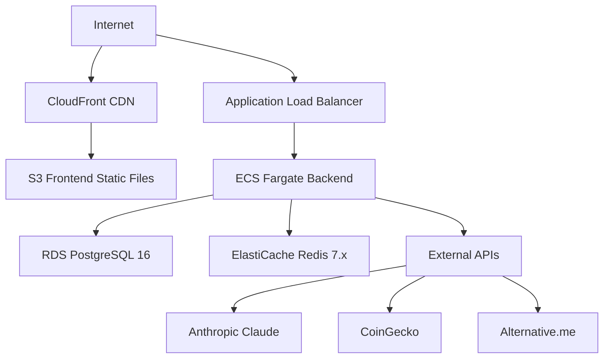
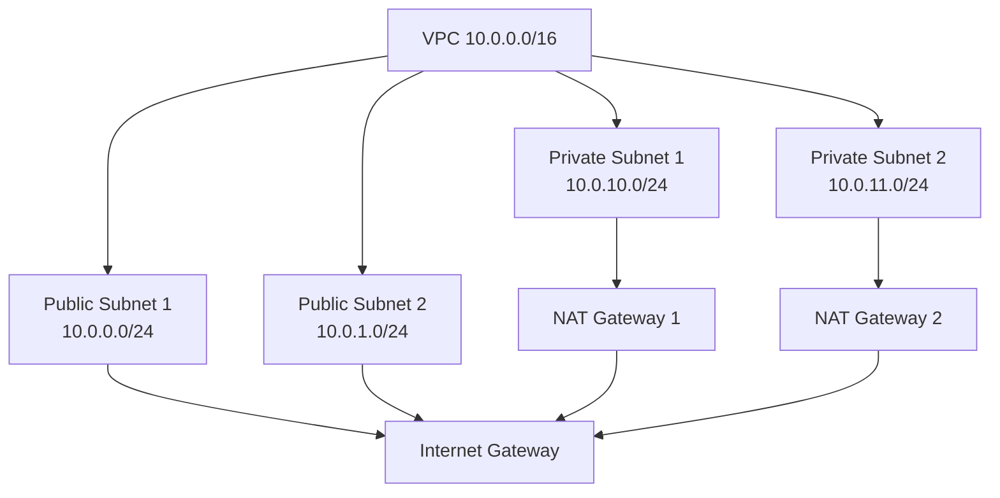
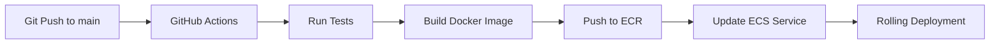

# Sage.ai Infrastructure Specification

> Document Version: 2.0
> Last Modified: 2025-12-22
> Author: Sam
> Target Audience: DevOps, Infrastructure Team

---

## 1. Infrastructure Overview

### 1.1 Architecture Diagram



### 1.2 Technology Stack

```typescript
interface InfrastructureStack {
  compute: {
    service: "AWS ECS Fargate";
    version: "1.4.0";
  };
  database: {
    service: "AWS RDS PostgreSQL";
    version: "16";
  };
  cache: {
    service: "AWS ElastiCache Redis";
    version: "7.x";
  };
  storage: {
    service: "AWS S3";
  };
  cdn: {
    service: "AWS CloudFront";
  };
  loadBalancer: {
    service: "AWS ALB";
  };
  iac: {
    tool: "Terraform";
    version: "1.6+";
  };
  cicd: {
    platform: "GitHub Actions";
  };
  monitoring: {
    services: ["Sentry", "CloudWatch"];
  };
  logging: {
    service: "CloudWatch Logs";
  };
}
```

---

## 2. Compute Layer

### 2.1 ECS Cluster Configuration

```hcl
resource "aws_ecs_cluster" "sage" {
  name = "sage-cluster"

  setting {
    name  = "containerInsights"
    value = "enabled"
  }
}
```

### 2.2 Task Definition (Backend)

```hcl
resource "aws_ecs_task_definition" "backend" {
  family                   = "sage-backend"
  network_mode             = "awsvpc"
  requires_compatibilities = ["FARGATE"]
  cpu                      = "512"   # 0.5 vCPU (MVP)
  memory                   = "1024"  # 1 GB (MVP)
  execution_role_arn       = aws_iam_role.ecs_execution.arn
  task_role_arn            = aws_iam_role.ecs_task.arn

  container_definitions = jsonencode([
    {
      name      = "backend"
      image     = "${aws_ecr_repository.backend.repository_url}:latest"
      cpu       = 512
      memory    = 1024
      essential = true

      portMappings = [
        {
          containerPort = 3000
          protocol      = "tcp"
        }
      ]

      environment = [
        { name = "NODE_ENV", value = "production" },
        { name = "DATABASE_URL", value = "postgresql://..." },
        { name = "REDIS_URL", value = "redis://..." }
      ]

      secrets = [
        {
          name      = "ANTHROPIC_API_KEY"
          valueFrom = "${aws_secretsmanager_secret.anthropic_key.arn}"
        }
      ]

      logConfiguration = {
        logDriver = "awslogs"
        options = {
          "awslogs-group"         = "/ecs/sage-backend"
          "awslogs-region"        = "us-west-2"
          "awslogs-stream-prefix" = "ecs"
        }
      }

      healthCheck = {
        command     = ["CMD-SHELL", "curl -f http://localhost:3000/health || exit 1"]
        interval    = 30
        timeout     = 5
        retries     = 3
        startPeriod = 60
      }
    }
  ])
}
```

### 2.3 Service Configuration

```hcl
resource "aws_ecs_service" "backend" {
  name            = "sage-backend"
  cluster         = aws_ecs_cluster.sage.id
  task_definition = aws_ecs_task_definition.backend.arn
  desired_count   = 2  # MVP: 2 tasks

  launch_type = "FARGATE"

  network_configuration {
    subnets         = aws_subnet.private[*].id
    security_groups = [aws_security_group.backend.id]
  }

  load_balancer {
    target_group_arn = aws_lb_target_group.backend.arn
    container_name   = "backend"
    container_port   = 3000
  }

  lifecycle {
    ignore_changes = [desired_count]
  }
}
```

### 2.4 Auto Scaling

```hcl
resource "aws_appautoscaling_target" "backend" {
  max_capacity       = 10  # Max 10 tasks
  min_capacity       = 2   # Min 2 tasks
  resource_id        = "service/${aws_ecs_cluster.sage.name}/${aws_ecs_service.backend.name}"
  scalable_dimension = "ecs:service:DesiredCount"
  service_namespace  = "ecs"
}

resource "aws_appautoscaling_policy" "backend_cpu" {
  name               = "backend-cpu-scaling"
  policy_type        = "TargetTrackingScaling"
  resource_id        = aws_appautoscaling_target.backend.resource_id
  scalable_dimension = aws_appautoscaling_target.backend.scalable_dimension
  service_namespace  = aws_appautoscaling_target.backend.service_namespace

  target_tracking_scaling_policy_configuration {
    target_value       = 70.0  # Target 70% CPU
    predefined_metric_specification {
      predefined_metric_type = "ECSServiceAverageCPUUtilization"
    }
    scale_in_cooldown  = 300
    scale_out_cooldown = 60
  }
}
```

---

## 3. Database Layer

### 3.1 RDS PostgreSQL Instance

```hcl
resource "aws_db_instance" "postgres" {
  identifier     = "sage-postgres"
  engine         = "postgres"
  engine_version = "16.1"

  instance_class    = "db.t4g.micro"  # MVP: Free tier
  allocated_storage = 20               # 20 GB (MVP)
  storage_type      = "gp3"
  storage_encrypted = true

  db_name  = "sage"
  username = "sage_admin"
  password = random_password.db_password.result

  vpc_security_group_ids = [aws_security_group.rds.id]
  db_subnet_group_name   = aws_db_subnet_group.main.name

  backup_retention_period = 7
  backup_window          = "03:00-04:00"
  maintenance_window     = "mon:04:00-mon:05:00"

  enabled_cloudwatch_logs_exports = ["postgresql", "upgrade"]

  deletion_protection = true
  skip_final_snapshot = false
  final_snapshot_identifier = "sage-postgres-final-${timestamp()}"

  tags = {
    Name        = "sage-postgres"
    Environment = "production"
  }
}
```

### 3.2 Read Replica (Phase 2+)

```hcl
resource "aws_db_instance" "postgres_replica" {
  count = var.enable_read_replica ? 1 : 0

  identifier          = "sage-postgres-replica"
  replicate_source_db = aws_db_instance.postgres.id

  instance_class = "db.t4g.micro"
}
```

---

## 4. Cache Layer

### 4.1 ElastiCache Redis Cluster

```hcl
resource "aws_elasticache_replication_group" "redis" {
  replication_group_id       = "sage-redis"
  replication_group_description = "Sage.ai Redis cluster"

  engine         = "redis"
  engine_version = "7.0"
  node_type      = "cache.t4g.micro"  # MVP: Free tier

  num_cache_clusters = 2  # 1 primary + 1 replica

  port                     = 6379
  parameter_group_name     = "default.redis7"
  subnet_group_name        = aws_elasticache_subnet_group.main.name
  security_group_ids       = [aws_security_group.redis.id]

  automatic_failover_enabled = true
  at_rest_encryption_enabled = true
  transit_encryption_enabled = true

  maintenance_window = "sun:05:00-sun:06:00"
  snapshot_window    = "03:00-04:00"
  snapshot_retention_limit = 5

  tags = {
    Name        = "sage-redis"
    Environment = "production"
  }
}
```

---

## 5. Storage & CDN

### 5.1 S3 Bucket (Frontend)

```hcl
resource "aws_s3_bucket" "frontend" {
  bucket = "sage-frontend-prod"

  tags = {
    Name        = "sage-frontend"
    Environment = "production"
  }
}

resource "aws_s3_bucket_versioning" "frontend" {
  bucket = aws_s3_bucket.frontend.id

  versioning_configuration {
    status = "Enabled"
  }
}

resource "aws_s3_bucket_public_access_block" "frontend" {
  bucket = aws_s3_bucket.frontend.id

  block_public_acls       = true
  block_public_policy     = true
  ignore_public_acls      = true
  restrict_public_buckets = true
}
```

### 5.2 CloudFront Distribution

```hcl
resource "aws_cloudfront_distribution" "frontend" {
  origin {
    domain_name = aws_s3_bucket.frontend.bucket_regional_domain_name
    origin_id   = "S3-sage-frontend"

    s3_origin_config {
      origin_access_identity = aws_cloudfront_origin_access_identity.frontend.cloudfront_access_identity_path
    }
  }

  enabled             = true
  is_ipv6_enabled     = true
  default_root_object = "index.html"

  aliases = ["app.sage.ai", "www.sage.ai"]

  default_cache_behavior {
    allowed_methods  = ["GET", "HEAD", "OPTIONS"]
    cached_methods   = ["GET", "HEAD"]
    target_origin_id = "S3-sage-frontend"

    forwarded_values {
      query_string = false
      cookies {
        forward = "none"
      }
    }

    viewer_protocol_policy = "redirect-to-https"
    min_ttl                = 0
    default_ttl            = 3600    # 1 hour
    max_ttl                = 86400   # 1 day

    compress = true
  }

  custom_error_response {
    error_code         = 404
    response_code      = 200
    response_page_path = "/index.html"
  }

  restrictions {
    geo_restriction {
      restriction_type = "none"
    }
  }

  viewer_certificate {
    acm_certificate_arn      = aws_acm_certificate.frontend.arn
    ssl_support_method       = "sni-only"
    minimum_protocol_version = "TLSv1.2_2021"
  }

  tags = {
    Name        = "sage-frontend-cdn"
    Environment = "production"
  }
}
```

---

## 6. Load Balancer

### 6.1 Application Load Balancer

```hcl
resource "aws_lb" "main" {
  name               = "sage-alb"
  internal           = false
  load_balancer_type = "application"
  security_groups    = [aws_security_group.alb.id]
  subnets            = aws_subnet.public[*].id

  enable_deletion_protection = true

  tags = {
    Name        = "sage-alb"
    Environment = "production"
  }
}

resource "aws_lb_target_group" "backend" {
  name        = "sage-backend-tg"
  port        = 3000
  protocol    = "HTTP"
  vpc_id      = aws_vpc.main.id
  target_type = "ip"

  health_check {
    path                = "/health"
    protocol            = "HTTP"
    matcher             = "200"
    interval            = 30
    timeout             = 5
    healthy_threshold   = 2
    unhealthy_threshold = 3
  }

  deregistration_delay = 30
}

resource "aws_lb_listener" "https" {
  load_balancer_arn = aws_lb.main.arn
  port              = "443"
  protocol          = "HTTPS"
  ssl_policy        = "ELBSecurityPolicy-TLS-1-2-2017-01"
  certificate_arn   = aws_acm_certificate.backend.arn

  default_action {
    type             = "forward"
    target_group_arn = aws_lb_target_group.backend.arn
  }
}
```

---

## 7. Networking

### 7.1 VPC Configuration



```hcl
resource "aws_vpc" "main" {
  cidr_block           = "10.0.0.0/16"
  enable_dns_hostnames = true
  enable_dns_support   = true

  tags = {
    Name = "sage-vpc"
  }
}

resource "aws_subnet" "public" {
  count             = 2
  vpc_id            = aws_vpc.main.id
  cidr_block        = "10.0.${count.index}.0/24"
  availability_zone = data.aws_availability_zones.available.names[count.index]

  map_public_ip_on_launch = true

  tags = {
    Name = "sage-public-${count.index + 1}"
  }
}

resource "aws_subnet" "private" {
  count             = 2
  vpc_id            = aws_vpc.main.id
  cidr_block        = "10.0.${count.index + 10}.0/24"
  availability_zone = data.aws_availability_zones.available.names[count.index]

  tags = {
    Name = "sage-private-${count.index + 1}"
  }
}
```

### 7.2 Security Groups

```typescript
interface SecurityGroups {
  alb: {
    ingress: {
      http: "Port 80 from 0.0.0.0/0";
      https: "Port 443 from 0.0.0.0/0";
    };
    egress: "All traffic";
  };
  backend: {
    ingress: "Port 3000 from ALB security group";
    egress: "All traffic";
  };
  rds: {
    ingress: "Port 5432 from Backend security group";
    egress: "None";
  };
  redis: {
    ingress: "Port 6379 from Backend security group";
    egress: "None";
  };
}
```

---

## 8. CI/CD Pipeline

### 8.1 Backend Deployment Flow



### 8.2 Backend Deployment Workflow

```yaml
name: Deploy Backend

on:
  push:
    branches: [main]
    paths: ['apps/backend/**']

jobs:
  build-and-deploy:
    runs-on: ubuntu-latest

    steps:
      - name: Checkout code
        uses: actions/checkout@v4

      - name: Configure AWS credentials
        uses: aws-actions/configure-aws-credentials@v4
        with:
          aws-access-key-id: ${{ secrets.AWS_ACCESS_KEY_ID }}
          aws-secret-access-key: ${{ secrets.AWS_SECRET_ACCESS_KEY }}
          aws-region: us-west-2

      - name: Login to Amazon ECR
        id: login-ecr
        uses: aws-actions/amazon-ecr-login@v2

      - name: Build, tag, and push image
        env:
          ECR_REGISTRY: ${{ steps.login-ecr.outputs.registry }}
          ECR_REPOSITORY: sage-backend
          IMAGE_TAG: ${{ github.sha }}
        run: |
          docker build -t $ECR_REGISTRY/$ECR_REPOSITORY:$IMAGE_TAG apps/backend
          docker tag $ECR_REGISTRY/$ECR_REPOSITORY:$IMAGE_TAG $ECR_REGISTRY/$ECR_REPOSITORY:latest
          docker push $ECR_REGISTRY/$ECR_REPOSITORY:$IMAGE_TAG
          docker push $ECR_REGISTRY/$ECR_REPOSITORY:latest

      - name: Deploy to ECS
        run: |
          aws ecs update-service \
            --cluster sage-cluster \
            --service sage-backend \
            --force-new-deployment \
            --region us-west-2
```

### 8.3 Frontend Deployment Workflow

```yaml
name: Deploy Frontend

on:
  push:
    branches: [main]
    paths: ['apps/frontend/**']

jobs:
  build-and-deploy:
    runs-on: ubuntu-latest

    steps:
      - uses: actions/checkout@v4

      - uses: actions/setup-node@v4
        with:
          node-version: '20'

      - uses: pnpm/action-setup@v2
        with:
          version: 8

      - name: Install dependencies
        run: pnpm install

      - name: Build
        run: pnpm run build
        working-directory: apps/frontend

      - name: Deploy to S3
        run: |
          aws s3 sync apps/frontend/dist s3://sage-frontend-prod --delete

      - name: Invalidate CloudFront
        run: |
          aws cloudfront create-invalidation \
            --distribution-id ${{ secrets.CLOUDFRONT_DISTRIBUTION_ID }} \
            --paths "/*"
```

---

## 9. Monitoring & Logging

### 9.1 CloudWatch Alarms

```typescript
interface CloudWatchAlarms {
  ecsCpuHigh: {
    metric: "CPUUtilization";
    threshold: "80%";
    evaluationPeriods: 2;
    period: "5 minutes";
    action: "SNS notification";
  };
  rdsCpuHigh: {
    metric: "CPUUtilization";
    threshold: "80%";
    evaluationPeriods: 2;
    period: "5 minutes";
    action: "SNS notification";
  };
  redisMemoryHigh: {
    metric: "DatabaseMemoryUsagePercentage";
    threshold: "80%";
    evaluationPeriods: 1;
    period: "5 minutes";
    action: "SNS notification";
  };
}
```

### 9.2 Sentry Configuration

```typescript
import * as Sentry from '@sentry/node';

Sentry.init({
  dsn: process.env.SENTRY_DSN,
  environment: process.env.NODE_ENV,
  tracesSampleRate: 0.1,  // 10% of transactions
  integrations: [
    new Sentry.Integrations.Http({ tracing: true }),
    new Sentry.Integrations.Prisma({ client: prisma })
  ]
});
```

---

## 10. Cost Optimization

### 10.1 Monthly Cost Estimate (MVP)

```typescript
interface MonthlyCostEstimate {
  ecsFargate: {
    resource: "2 tasks x 0.5 vCPU x 1 GB";
    cost: "$30";
  };
  rds: {
    resource: "db.t4g.micro, 20 GB storage";
    cost: "$15";
  };
  elastiCache: {
    resource: "cache.t4g.micro x 2 nodes";
    cost: "$20";
  };
  alb: {
    resource: "1 ALB";
    cost: "$20";
  };
  s3: {
    resource: "10 GB storage + 1M requests";
    cost: "$5";
  };
  cloudFront: {
    resource: "100 GB transfer";
    cost: "$10";
  };
  dataTransfer: {
    resource: "100 GB egress";
    cost: "$10";
  };
  cloudWatchLogs: {
    resource: "10 GB logs";
    cost: "$5";
  };
  total: "$115/month";
}
```

### 10.2 Cost Saving Strategies

```typescript
interface CostSavingStrategies {
  reservedInstances: {
    phase: "Phase 2+";
    savings: {
      rds: "40% reduction";
      elastiCache: "30% reduction";
    };
  };
  s3Lifecycle: {
    policy: "Logs older than 30 days move to Glacier";
  };
  cloudFrontOptimization: {
    strategy: "Increase TTL to reduce origin requests";
  };
}
```

---

## 11. Disaster Recovery

### 11.1 Backup Strategy

```typescript
interface BackupStrategy {
  rds: {
    frequency: "Daily";
    retention: "7 days";
    rpo: "24 hours";
    rto: "1 hour";
  };
  s3: {
    method: "Versioning";
    retention: "Indefinite";
    rpo: "Immediate";
    rto: "Immediate";
  };
  redis: {
    frequency: "Daily snapshot";
    retention: "5 days";
    rpo: "24 hours";
    rto: "30 minutes";
  };
}
```

### 11.2 Recovery Procedures

```bash
# RDS Restore
aws rds restore-db-instance-from-db-snapshot \
  --db-instance-identifier sage-postgres-restored \
  --db-snapshot-identifier sage-postgres-snapshot-2024-01-15

# S3 Restore (Version)
aws s3api list-object-versions \
  --bucket sage-frontend-prod \
  --prefix index.html

aws s3api get-object \
  --bucket sage-frontend-prod \
  --key index.html \
  --version-id <version-id> \
  index.html
```

---

## 12. Security

### 12.1 IAM Roles

```hcl
# ECS Execution Role (pull images, write logs)
resource "aws_iam_role" "ecs_execution" {
  name = "sage-ecs-execution-role"

  assume_role_policy = jsonencode({
    Version = "2012-10-17"
    Statement = [{
      Action = "sts:AssumeRole"
      Effect = "Allow"
      Principal = {
        Service = "ecs-tasks.amazonaws.com"
      }
    }]
  })
}

# ECS Task Role (access AWS services from app)
resource "aws_iam_role" "ecs_task" {
  name = "sage-ecs-task-role"

  assume_role_policy = jsonencode({
    Version = "2012-10-17"
    Statement = [{
      Action = "sts:AssumeRole"
      Effect = "Allow"
      Principal = {
        Service = "ecs-tasks.amazonaws.com"
      }
    }]
  })
}
```

### 12.2 Secrets Management

```hcl
resource "aws_secretsmanager_secret" "anthropic_key" {
  name = "sage/anthropic-api-key"

  tags = {
    Name = "sage-anthropic-key"
  }
}

resource "aws_secretsmanager_secret_version" "anthropic_key" {
  secret_id     = aws_secretsmanager_secret.anthropic_key.id
  secret_string = var.anthropic_api_key
}
```

---

## 13. Scaling Strategy

### 13.1 Scaling Phases

```typescript
interface ScalingPhases {
  phase1_mvp: {
    mau: "5,000";
    ecs: "2 tasks (0.5 vCPU, 1 GB each)";
    rds: "db.t4g.micro (1 vCPU, 1 GB)";
    redis: "cache.t4g.micro x2";
  };
  phase2_growth: {
    mau: "50,000";
    ecs: "5-10 tasks (auto-scaling)";
    rds: "db.t4g.small (2 vCPU, 2 GB) + Read Replica";
    redis: "cache.t4g.small x2";
  };
  phase3_scale: {
    mau: "100,000+";
    ecs: "10-20 tasks";
    rds: "db.r6g.large (2 vCPU, 16 GB) + 2 Read Replicas";
    redis: "cache.r6g.large x2";
    multiRegion: "US + Asia";
  };
}
```

---

## Appendix A: Terraform Commands

```bash
# Initialize
terraform init

# Plan
terraform plan -out=tfplan

# Apply
terraform apply tfplan

# Destroy (careful!)
terraform destroy
```

## Appendix B: AWS CLI Useful Commands

```bash
# List ECS tasks
aws ecs list-tasks --cluster sage-cluster

# Describe task
aws ecs describe-tasks --cluster sage-cluster --tasks <task-id>

# View logs
aws logs tail /ecs/sage-backend --follow
```

## Appendix C: Environment Variables

```bash
# AWS
export AWS_REGION=us-west-2
export AWS_ACCOUNT_ID=123456789012

# Terraform
export TF_VAR_anthropic_api_key="sk-ant-..."
export TF_VAR_db_password="..."
```

---

Document Version: 2.0
Last Updated: 2025-12-22
Infrastructure: AWS ECS Fargate + RDS + ElastiCache
Maintainer: Sam (dev@5010.tech)
