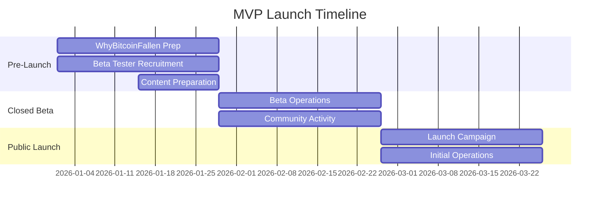
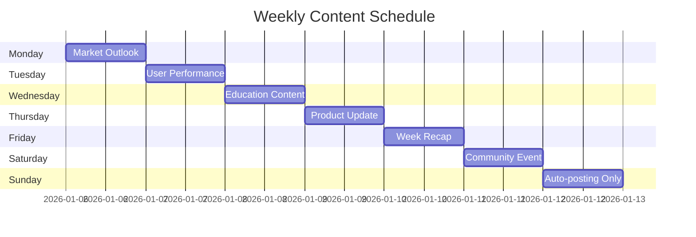
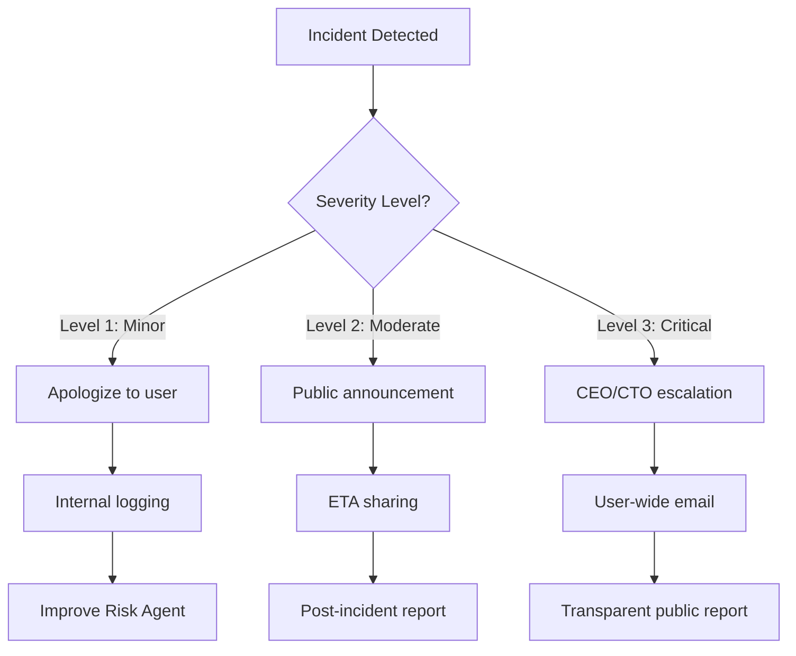

# Sage.ai Operations Roadmap

> **Document Version**: 1.0
> **Last Updated**: 2025년 12월 19일
> **Author**: Sam
> **Target Audience**: Operations Team, Marketing Team, Management

---

## 1. Operations Overview

### 1.1 Mission

**"사용자에게 신뢰할 수 있는 24/7 AI 투자 멘토 경험을 제공한다"**

### 1.2 Key Responsibilities

```typescript
interface OperationsScope {
  communityManagement: {
    platforms: ['Discord', 'Twitter/X', 'KakaoTalk'];
    activities: string[];
  };
  contentOperations: {
    channels: ['Blog', 'Social Media'];
    frequency: string;
  };
  userSupport: {
    responseTime: string;
    channels: string[];
  };
  liveOps: {
    events: string[];
    campaigns: string[];
  };
  analytics: {
    kpis: string[];
    reportingCadence: string;
  };
}
```

---

## 2. Phase 1: MVP Launch (2026 Q1)

### 2.1 Timeline Overview



### 2.2 Pre-Launch (Week 1-4)

#### 2.2.1 WhyBitcoinFallen.com Preparation

```typescript
interface PreLaunchTasks {
  landing: {
    copyFinalization: boolean;
    ogImageOptimization: boolean;
    analyticsSetup: boolean;
    seedingPrep: string[];
  };
  betaTesting: {
    discordSetup: boolean;
    applicationForm: string;
    targetSize: number;
    ndaProcess: boolean;
  };
  content: {
    blogPosts: string[];
    twitterThreads: number;
    discordTemplates: boolean;
  };
}
```

**Tasks**:
- Landing page copy finalization
- OG image and meta tag optimization
- Google Analytics setup
- Reddit and Twitter seeding preparation
- Discord server creation and channel configuration
- Beta tester application form (Google Forms)
- Target: 10-20 participants from crypto community
- NDA and feedback process establishment

**Content Preparation**:
- 3 blog posts pre-written:
  - "Introducing Wallet Buffett"
  - "The Secret of Zero-Hallucination AI Mentor"
  - "What is Shadow Portfolio?"
- Twitter launch thread series (5 posts)
- Discord announcement templates

### 2.3 Closed Beta (Week 5-8)

```typescript
interface BetaOperations {
  onboarding: {
    participants: number;
    dailyFeedback: boolean;
    bugTracking: string;
    weeklyNPS: boolean;
  };
  community: {
    dailyQA: string;
    betaSnippets: boolean;
    interviews: number;
  };
}
```

**Beta Operations**:
- 10-20 beta testers onboarding
- Daily user feedback collection
- Bug report tracking (Notion/Linear)
- Weekly beta tester survey (NPS, satisfaction)

**Community Activities**:
- Daily Q&A sessions on Discord
- Beta snippet sharing on Twitter
- Beta tester interviews (2-3 participants)

### 2.4 Public Launch (Week 9-12)

```typescript
interface LaunchCampaign {
  channels: {
    productHunt: boolean;
    reddit: string[];
    twitter: boolean;
    discord: boolean;
  };
  operations: {
    onboardingMonitoring: boolean;
    hallucinationTracking: string;
    performanceMonitoring: string;
    communityActivation: boolean;
  };
  targets: {
    MAU: number;
    NPS: number;
  };
}
```

**Launch Campaign**:
- WhyBitcoinFallen.com public release
- Product Hunt launch
- Reddit r/cryptocurrency post
- Twitter launch thread
- Discord official opening

**Initial Operations**:
- Daily user onboarding monitoring
- Hallucination rate tracking (target: <1%)
- Response time monitoring (target: 2 seconds)
- Discord community activation

**Target**: MAU 500+, NPS 40+

---

## 3. Phase 2: Growth (2026 Q2-Q3)

### 3.1 Q2: Expansion

```typescript
interface ExpansionStrategy {
  global: {
    markets: ['Japan', 'China'];
    contentLocalization: {
      frequency: string;
      postsPerMonth: number;
    };
  };
  partnerships: {
    influencers: number;
    exchanges: string[];
    mediaOutlets: string[];
  };
  events: {
    monthly: string;
    rewards: string;
  };
  target: {
    MAU: number;
  };
}
```

**Global Expansion**:
- Japanese community building (Twitter, Discord)
- Chinese community building (Weibo, WeChat)
- Multilingual content creation (4 blog posts per month)

**Partnerships**:
- Crypto influencer collaborations (3-5 influencers)
- Exchange partnerships (Binance, Coinbase, Upbit)
- Media coverage (TechCrunch, CoinDesk)

**Events**:
- Monthly "Investment Challenge with Wallet Buffett"
- Top performers rewarded with Pro plan (1 year free)

**Target**: MAU 20,000+

### 3.2 Q3: Monetization

```typescript
interface MonetizationStrategy {
  paidPlans: {
    launch: boolean;
    onboarding: string;
    paymentOptimization: string;
  };
  retention: {
    newsletter: string;
    pushCampaigns: string;
    churnPrevention: string;
  };
  contentMarketing: {
    youtube: boolean;
    podcasts: number;
  };
  targets: {
    MAU: number;
    paidSubscribers: number;
  };
}
```

**Paid Plan Launch**:
- Pro/Premium plan opening
- Onboarding email sequence (Drip Campaign)
- Stripe payment page optimization

**Retention Campaigns**:
- Weekly newsletter (market analysis + Wallet Buffett advice)
- Push notification re-engagement campaigns
- Churn prevention emails (inactive users)

**Content Marketing**:
- YouTube channel launch (investment education)
- Podcast guest appearances (3-5 times)

**Target**: MAU 40,000+, Paid subscribers 500+

---

## 4. Phase 3: Scale (2026 Q4)

### 4.1 Community Scaling

```typescript
interface CommunityScale {
  discord: {
    channelSegmentation: string[];
    moderators: number;
    weeklyAMA: boolean;
  };
  socialProof: {
    sharingFeature: boolean;
    leaderboard: boolean;
    campaignHashtag: string;
  };
  target: {
    MAU: number;
    discordDAU: number;
  };
}
```

**Discord Expansion**:
- Channel segmentation (by coin, by strategy)
- Community moderator hiring (2-3 people)
- Weekly AMA with Wallet Buffett

**Social Proof**:
- Performance sharing feature (Twitter auto-posting)
- Leaderboard (by ROI ranking)
- User testimonial campaign (#MyWalletBuffett)

### 4.2 Large-Scale Campaigns

```typescript
interface ScaleCampaigns {
  tokenLaunch?: {
    tokenomics: boolean;
    governance: boolean;
    whitepaper: boolean;
  };
  globalEvents: {
    onlineConference: string;
    offlineMeetups: string[];
  };
}
```

**ICO/Token Launch Preparation (Optional)**:
- Token economics design
- Community voting (governance)
- Whitepaper publication

**Global Events**:
- Online conference hosting ("AI & Crypto Investment Summit")
- Offline meetups (Seoul, Tokyo, Singapore)

**Target**: MAU 30,000+, Discord DAU 1,000+

---

## 5. Key Metrics (Operations KPIs)

### 5.1 Community Metrics

```typescript
interface CommunityMetrics {
  discord: {
    members: { Q1: number; Q2: number; Q3: number; Q4: number };
    DAU: { Q1: number; Q2: number; Q3: number; Q4: number };
  };
  twitter: {
    followers: { Q1: number; Q2: number; Q3: number; Q4: number };
  };
  newsletter: {
    subscribers: { Q1: number; Q2: number; Q3: number; Q4: number };
  };
}
```

| Metric | Q1 Target | Q2 Target | Q3 Target | Q4 Target |
|--------|-----------|-----------|-----------|-----------|
| **Discord Members** | 200 | 1,000 | 3,000 | 10,000 |
| **Discord DAU** | 50 | 200 | 500 | 1,000 |
| **Twitter Followers** | 500 | 2,000 | 5,000 | 10,000 |
| **Newsletter Subscribers** | 100 | 500 | 1,500 | 5,000 |

### 5.2 Content Metrics

```typescript
interface ContentMetrics {
  blogPosts: { Q1: number; Q2: number; Q3: number; Q4: number };
  tweetsPerWeek: { Q1: number; Q2: number; Q3: number; Q4: number };
  youtubeVideos: { Q1: number; Q2: number; Q3: number; Q4: number };
}
```

| Metric | Q1 | Q2 | Q3 | Q4 |
|--------|----|----|----|----|
| **Blog Posts** | 4 | 8 | 12 | 16 |
| **Tweets per Week** | 3 | 5 | 7 | 10 |
| **YouTube Videos** | 0 | 2 | 5 | 10 |

### 5.3 Support Metrics

```typescript
interface SupportMetrics {
  averageResponseTime: string;
  resolutionRate: string;
  customerSatisfaction: number;
}
```

| Metric | Target |
|--------|--------|
| **Average Response Time** | < 2시간 |
| **Resolution Rate** | > 90% |
| **Customer Satisfaction (CSAT)** | > 4.5/5.0 |

---

## 6. Community Management

### 6.1 Discord Operations

#### 6.1.1 Channel Structure

```typescript
interface DiscordStructure {
  announcements: string[];
  general: string[];
  market: string[];
  portfolio: string[];
  ai: string[];
  events: string[];
  support: string[];
}
```

**Channels**:
- **Announcements**: #announcements, #updates
- **General**: #general-chat, #introductions, #feedback
- **Market**: #market-alerts, #btc-discussion, #eth-discussion, #altcoins
- **Portfolio**: #portfolio-showcase, #strategy-discussion
- **AI**: #wallet-buffett-qa, #ai-feedback
- **Events**: #challenges, #giveaways
- **Support**: #help, #faq

#### 6.1.2 Moderation Guidelines

```typescript
interface ModerationGuidelines {
  responseTime: {
    urgent: string;
    general: string;
    feedback: string;
  };
  tone: {
    style: string;
    emojiUsage: string;
    formality: string;
  };
}
```

**Response Time**:
- Urgent inquiries (bugs, account issues): Within 1 hour
- General inquiries: Within 2 hours
- Feedback: Within 24 hours

**Tone**:
- Friendly and professional
- Appropriate emoji usage
- Avoid overly formal language on Discord

### 6.2 Twitter/X Strategy

#### 6.2.1 Content Mix

```typescript
interface TwitterContentMix {
  marketInsights: { ratio: number; example: string };
  productUpdates: { ratio: number; example: string };
  userStories: { ratio: number; example: string };
  educational: { ratio: number; example: string };
  engagement: { ratio: number; example: string };
}
```

**Daily Posts (3-5 tweets)**:

| Type | Ratio | Example |
|------|-------|---------|
| **Market Insights** | 40% | "BTC Fear & Greed 25. Buyers in this range averaged +47% returns" |
| **Product Updates** | 20% | "New feature: Check Sharpe ratio in Shadow Portfolio" |
| **User Stories** | 20% | "User @john_doe achieved +23% returns with Wallet Buffett advice" |
| **Educational** | 10% | "Warren Buffett's investment principle #1: Don't invest in what you don't understand" |
| **Engagement** | 10% | "Are you buying or selling? Vote below!" |

#### 6.2.2 Hashtag Strategy

```typescript
interface HashtagStrategy {
  branded: string[];
  industry: string[];
  conditional: string[];
}
```

- #SageAI
- #WalletBuffett
- #CryptoInvesting
- #AITrading
- #Bitcoin (only on relevant posts)

---

## 7. Content Calendar

### 7.1 Weekly Schedule

```typescript
interface WeeklyContent {
  monday: string;
  tuesday: string;
  wednesday: string;
  thursday: string;
  friday: string;
  saturday: string;
  sunday: string;
}
```



| Day | Content |
|-----|---------|
| **Monday** | Weekly market outlook (Blog + Twitter) |
| **Tuesday** | User performance sharing (Discord + Twitter) |
| **Wednesday** | Investment education content (Blog or YouTube) |
| **Thursday** | Product updates (Discord + Twitter) |
| **Friday** | Weekly recap analysis (Blog + Twitter) |
| **Saturday** | Community activities (AMA, events) |
| **Sunday** | Rest (auto-posting only) |

---

## 8. Customer Support

### 8.1 Support Channels

```typescript
interface SupportChannels {
  discord: { purpose: string; responseTime: string };
  email: { purpose: string; responseTime: string };
  twitter: { purpose: string; responseTime: string };
}
```

| Channel | Purpose | Response Time |
|---------|---------|--------------|
| **Discord #help** | General inquiries | < 2 hours |
| **Email (support@sage.ai)** | Official inquiries | < 24 hours |
| **Twitter DM** | Quick inquiries | < 4 hours |

### 8.2 Common Issues & Solutions

```typescript
interface CommonIssues {
  hallucination: {
    symptom: string;
    action: string;
  };
  portfolioMismatch: {
    symptom: string;
    action: string;
  };
  authFailure: {
    symptom: string;
    action: string;
  };
}
```

**Issue: "AI gave strange response"**
- Record as hallucination case, request Risk Agent re-validation

**Issue: "Shadow Portfolio ROI doesn't match"**
- Check price data, refresh cache

**Issue: "Cannot log in"**
- Check Auth.js session, verify cookie settings

---

## 9. Crisis Management

### 9.1 Incident Response

```typescript
interface IncidentLevels {
  level1: {
    severity: 'Minor';
    example: string;
    response: string[];
  };
  level2: {
    severity: 'Moderate';
    example: string;
    response: string[];
  };
  level3: {
    severity: 'Critical';
    example: string;
    response: string[];
  };
}
```



**Level 1: Minor (Single hallucination incident)**
- Apologize to user
- Internal log recording
- Risk Agent improvement

**Level 2: Moderate (Service down < 1 hour)**
- Discord/Twitter announcement
- Share ETA
- Post-incident report after recovery

**Level 3: Critical (Data breach, extended downtime)**
- Immediate CEO/CTO escalation
- Full user email notification
- Transparent post-incident report publication

---

## 10. Analytics & Reporting

### 10.1 Reporting Structure

```typescript
interface ReportingCadence {
  weekly: {
    metrics: string[];
    format: string;
  };
  monthly: {
    metrics: string[];
    format: string;
  };
}
```

### 10.2 Weekly Report

**Contents**:
- MAU/DAU trends
- New signups count
- Discord activity
- Twitter growth rate
- Key feedback summary

### 10.3 Monthly Report

**Contents**:
- All KPI achievement rates
- User cohort analysis
- Churn analysis
- Next month action items

---

**Document End**

_"Between the zeros and ones"_
